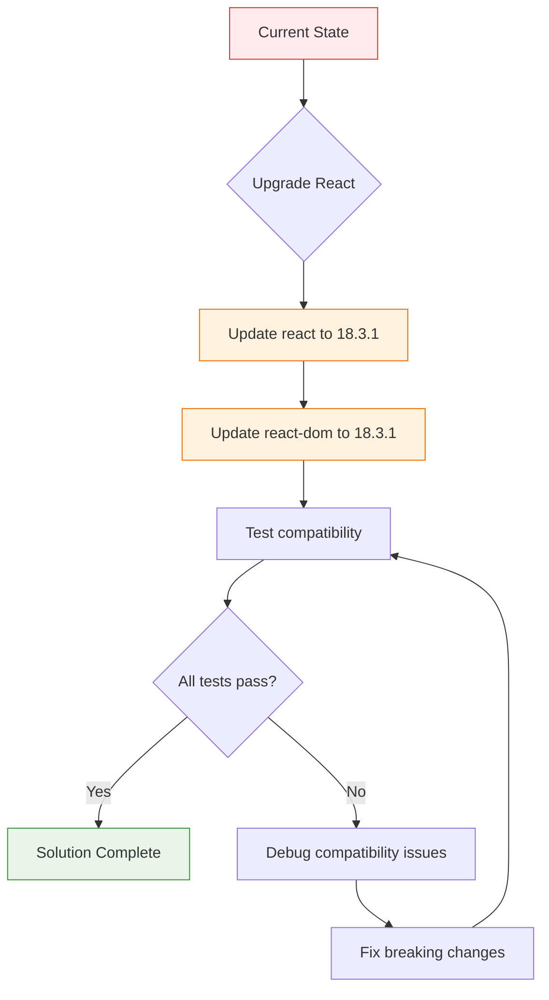
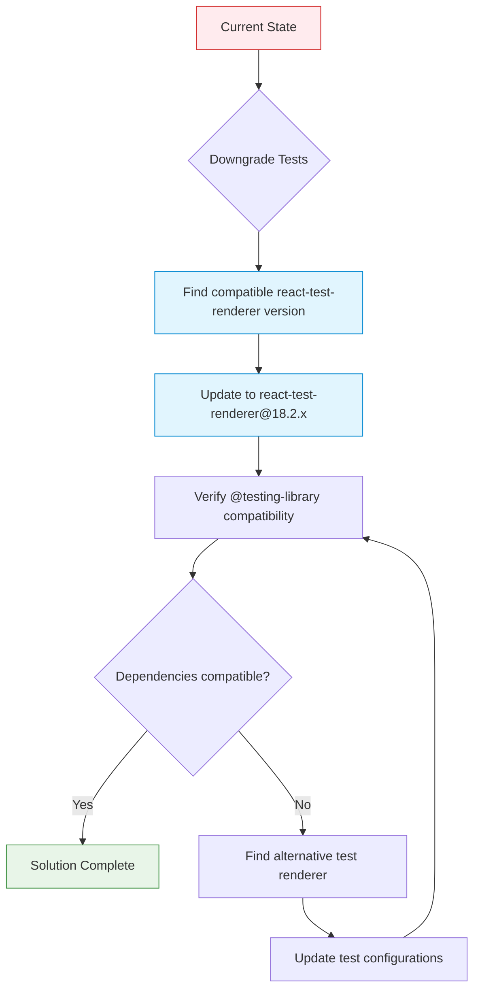
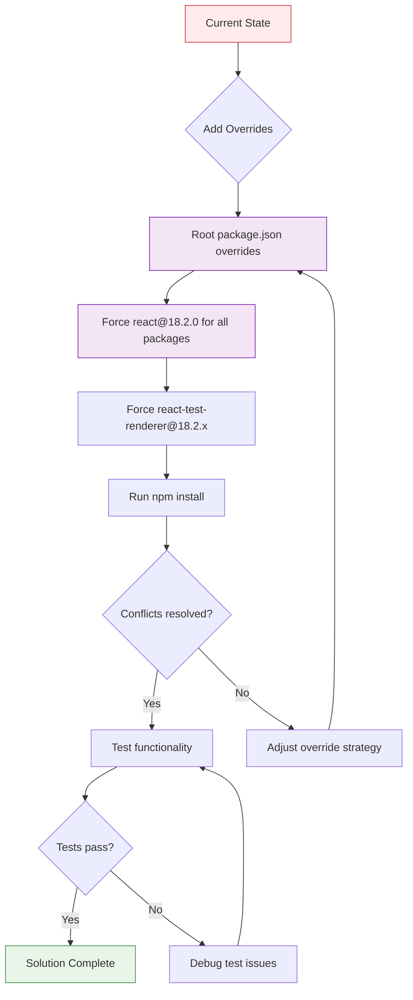
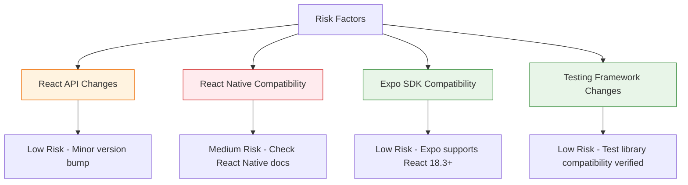
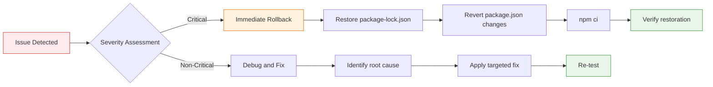

# Dependency Conflict Resolution Design

## Overview

The PropertyAI project is experiencing a dependency resolution conflict during `npm ci` execution, specifically between React version dependencies in the `propertyapp` workspace. The conflict stems from version mismatches between `react@18.2.0` and `react-test-renderer@18.3.1`, where the test renderer requires `react@^18.3.1` but the project is locked to `react@18.2.0`.

## Architecture

### Current Dependency Structure

```mermaid
graph TD
    A[PropertyAI Root] --> B[propertyapp workspace]
    B --> C[react@18.2.0]
    B --> D[react-test-renderer@^18.3.1]
    B --> E[@testing-library/jest-native@^5.4.3]
    
    D --> F[requires react@^18.3.1]
    E --> G[requires react@>=16.0.0]
    E --> H[requires react-test-renderer@>=16.0.0]
    
    C --> I[Conflict: 18.2.0 < 18.3.1]
    F --> I
    
    style I fill:#ff6b6b,stroke:#c92a2a,stroke-width:2px
    style A fill:#e3f2fd,stroke:#1976d2
    style B fill:#f3e5f5,stroke:#7b1fa2
```

### Workspace Architecture

```mermaid
graph LR
    subgraph "PropertyAI Monorepo"
        A[Root package.json] --> B[backend]
        A --> C[dashboard] 
        A --> D[ContractorApp]
        A --> E[propertyapp]
        
        E --> F[React Native App]
        F --> G[React 18.2.0]
        F --> H[Testing Dependencies]
        H --> I[react-test-renderer 18.3.1]
        H --> J[@testing-library/jest-native 5.4.3]
        
        style E fill:#ffebee,stroke:#d32f2f,stroke-width:3px
        style I fill:#fff3e0,stroke:#ef6c00
        style G fill:#e8f5e8,stroke:#388e3c
    end
```

## Resolution Strategy Options

### Option 1: Upgrade React Version (Recommended)



### Option 2: Downgrade Test Dependencies



### Option 3: Use Dependency Overrides



## Implementation Plan

### Phase 1: Analysis and Preparation

1. **Dependency Audit**
   - Analyze all React-related dependencies across workspaces
   - Identify potential breaking changes in React 18.3.1
   - Review React Native compatibility with newer React versions

2. **Testing Strategy**
   - Create backup of current package-lock.json
   - Establish baseline test suite execution
   - Document current functionality state

### Phase 2: Resolution Implementation

#### Recommended Approach: React Upgrade

```json
{
  "dependencies": {
    "react": "^18.3.1",
    "react-dom": "^18.3.1"
  },
  "devDependencies": {
    "react-test-renderer": "^18.3.1",
    "@testing-library/jest-native": "^5.4.3",
    "@testing-library/react-native": "^12.5.0"
  }
}
```

#### Fallback Approach: Dependency Overrides

```json
{
  "overrides": {
    "react": "18.2.0",
    "react-dom": "18.2.0",
    "react-test-renderer": "18.2.0"
  }
}
```

### Phase 3: Validation and Testing

1. **Compatibility Verification**
   - Execute full test suite
   - Verify React Native app functionality
   - Test Expo compatibility
   - Validate TypeScript compatibility

2. **Cross-Workspace Impact Assessment**
   - Test dashboard workspace (React web app)
   - Verify ContractorApp workspace
   - Ensure backend workspace unaffected

## Technical Specifications

### Dependency Compatibility Matrix

| Package | Current Version | Target Version | Compatibility |
|---------|----------------|----------------|---------------|
| react | 18.2.0 | 18.3.1 | ✅ Compatible |
| react-dom | 18.2.0 | 18.3.1 | ✅ Compatible |
| react-native | 0.74.5 | 0.74.5 | ✅ No change needed |
| react-test-renderer | 18.3.1 | 18.3.1 | ✅ Target version |
| @testing-library/jest-native | 5.4.3 | 5.4.3 | ✅ Compatible |

### Risk Assessment



### Workspace Configuration Updates

#### Root package.json Modifications

```json
{
  "overrides": {
    "ip": "^2.0.1",
    "jsonwebtoken": "^9.0.2",
    "node-forge": "^1.3.1",
    "semver": "^7.6.0",
    "react": "^18.3.1",
    "react-dom": "^18.3.1"
  }
}
```

#### PropertyApp package.json Updates

```json
{
  "dependencies": {
    "react": "^18.3.1",
    "react-dom": "^18.3.1"
  },
  "devDependencies": {
    "react-test-renderer": "^18.3.1"
  }
}
```

## Testing Strategy

### Pre-Resolution Testing

1. **Baseline Establishment**
   ```bash
   npm test --workspace=propertyapp
   npm run lint --workspace=propertyapp
   expo start --web # Verify web compatibility
   ```

2. **Functionality Verification**
   - Navigation testing
   - Component rendering
   - API integration
   - Local storage operations

### Post-Resolution Validation

1. **Dependency Installation**
   ```bash
   npm ci
   npm run test --workspaces
   ```

2. **Runtime Testing**
   ```bash
   npm run dev:propertyapp
   npm run test:propertyapp
   npm run lint:propertyapp
   ```

3. **Cross-Platform Verification**
   - iOS simulator testing
   - Android emulator testing
   - Web browser testing

## Monitoring and Rollback

### Success Metrics

- [ ] Successful `npm ci` execution
- [ ] All existing tests pass
- [ ] No TypeScript compilation errors
- [ ] React Native app starts successfully
- [ ] Expo development server runs without errors
- [ ] Cross-workspace compatibility maintained

### Rollback Strategy



## Documentation Updates

### Package.json Documentation

- Update dependency version explanations
- Document override rationale
- Maintain version compatibility notes

### Development Guidelines

- Update contributor setup instructions
- Revise troubleshooting documentation
- Add dependency conflict resolution procedures

## Long-term Maintenance

### Version Management Strategy

1. **Automated Dependency Updates**
   - Configure Dependabot for React ecosystem
   - Set up compatibility testing pipeline
   - Implement gradual upgrade strategy

2. **Workspace Synchronization**
   - Maintain React version consistency
   - Monitor cross-workspace dependencies
   - Regular compatibility audits

### Prevention Measures

1. **Lock File Management**
   - Commit package-lock.json changes
   - Regular dependency audits
   - Version constraint documentation

2. **CI/CD Integration**
   - Dependency conflict detection
   - Automated testing across Node versions
   - Compatibility matrix validation