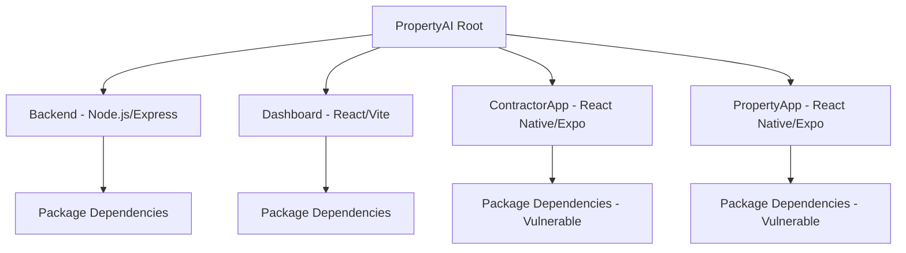
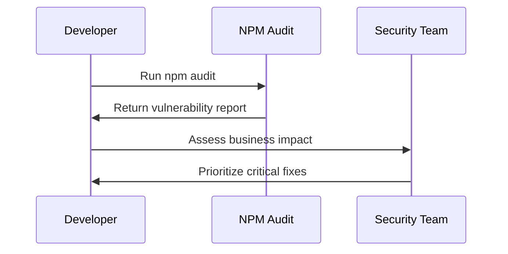

# NPM Audit Vulnerability Fix Design

## Overview

This design document outlines the strategy to resolve high-severity vulnerabilities identified by npm audit across the PropertyAI multi-application workspace. The audit revealed 11 high-severity vulnerabilities primarily affecting the React Native applications (ContractorApp and PropertyApp) and backend services.

## Repository Type Detection

PropertyAI is a **Full-Stack Application** with multiple frontend applications (React dashboard, React Native mobile apps) and a Node.js backend service, organized as an npm workspace.

## Architecture

### Workspace Structure


### Vulnerability Analysis

| Package | Severity | Affected Apps | Root Cause | Fix Strategy |
|---------|----------|---------------|------------|--------------|
| `ip` | High | ContractorApp, PropertyApp | React Native CLI dependency | Force update React Native |
| `jsonwebtoken` | High | Backend (node-apn) | Legacy JWT library | Replace/update node-apn |
| `node-forge` | High | Backend (node-apn) | Cryptographic vulnerabilities | Update node-forge |
| `semver` | High | PropertyApp (expo-notifications) | RegEx DoS vulnerability | Force update expo-notifications |

## Vulnerability Resolution Strategy

### Phase 1: Immediate Risk Assessment


### Phase 2: Dependency Update Plan

#### 2.1 React Native Applications Fix
**Target Applications:** ContractorApp, PropertyApp

**Problem:** `ip` package vulnerability in React Native CLI dependencies

**Solution Strategy:**
1. **Force Update React Native (Breaking Change Risk)**
   - Current: `react-native@0.73.0` (ContractorApp), `react-native@0.74.5` (PropertyApp)
   - Target: `react-native@0.73.11+`
   - Impact: Potential breaking changes

2. **Alternative: Dependency Override**
   - Use npm overrides to force secure `ip` version
   - Less risky than major React Native update

#### 2.2 Backend JWT Security Fix
**Target Application:** Backend

**Problem:** `jsonwebtoken` and `node-forge` vulnerabilities in `node-apn`

**Solution Strategy:**
1. **Update node-apn to latest version**
2. **Replace with alternative push notification library**
3. **Implement dependency overrides for interim fix**

#### 2.3 Expo Notifications Fix
**Target Application:** PropertyApp

**Problem:** `semver` vulnerability in `expo-notifications`

**Solution:** Force update to `expo-notifications@0.31.4`

## Implementation Approach

### Option A: Conservative Approach (Recommended)
```json
{
  "overrides": {
    "ip": "^2.0.1",
    "jsonwebtoken": "^9.0.2",
    "node-forge": "^1.3.1",
    "semver": "^7.6.0"
  }
}
```

### Option B: Aggressive Update Approach
1. Update React Native versions
2. Update Expo SDK versions
3. Replace vulnerable dependencies

### Risk Assessment Matrix

| Fix Strategy | Security Impact | Breaking Risk | Development Time |
|-------------|----------------|---------------|------------------|
| Dependency Overrides | Medium | Low | 1-2 days |
| Selective Updates | High | Medium | 3-5 days |
| Full Framework Updates | High | High | 1-2 weeks |

## Detailed Fix Implementation

### Step 1: Root Package.json Updates
```typescript
// Root package.json additions
{
  "overrides": {
    "ip": "^2.0.1",
    "jsonwebtoken": "^9.0.2", 
    "node-forge": "^1.3.1",
    "semver": "^7.6.0"
  }
}
```

### Step 2: ContractorApp Fixes
```typescript
// ContractorApp/package.json
{
  "dependencies": {
    "react-native": "0.73.11", // Updated from 0.73.0
    "expo-notifications": "~0.27.8" // Ensure latest patch
  }
}
```

### Step 3: PropertyApp Fixes  
```typescript
// PropertyApp/package.json
{
  "dependencies": {
    "expo-notifications": "~0.31.4", // Force update (breaking)
    "react-native": "0.74.5" // Keep current, override deps
  }
}
```

### Step 4: Backend Security Hardening
```typescript
// Backend/package.json
{
  "dependencies": {
    "jsonwebtoken": "^9.0.2", // Updated from transitive dep
    // Consider replacing node-apn with @parse/node-apn or firebase-admin
    "firebase-admin": "^13.4.0" // Already present, prefer for push
  }
}
```

## Testing Strategy

### Pre-Fix Testing
1. **Vulnerability Scan**
   ```bash
   npm audit --audit-level=moderate
   ```

2. **Application Health Check**
   ```bash
   npm run test --workspaces
   npm run build --workspaces
   ```

### Post-Fix Validation
1. **Security Verification**
   ```bash
   npm audit --audit-level=moderate
   npm audit signatures
   ```

2. **Functionality Testing**
   ```bash
   # Test critical user flows
   npm run test:contractor
   npm run test:property
   npm run test:backend
   ```

3. **Integration Testing**
   ```bash
   # Test push notifications specifically
   npm run test:notifications
   npm run test:auth-flows
   ```

## Migration Checklist

### Pre-Migration
- [ ] Backup current node_modules and package-lock.json
- [ ] Document current working versions
- [ ] Run full test suite
- [ ] Verify build processes

### Migration Execution
- [ ] Apply dependency overrides to root package.json
- [ ] Update individual application dependencies
- [ ] Clear node_modules and reinstall
- [ ] Run npm audit to verify fixes

### Post-Migration Validation
- [ ] Verify no new vulnerabilities introduced
- [ ] Test push notification functionality
- [ ] Test JWT authentication flows
- [ ] Run integration tests
- [ ] Deploy to staging environment

## Rollback Strategy

### Immediate Rollback
```bash
git checkout HEAD~1 -- package*.json
rm -rf node_modules
npm install
```

### Selective Rollback
```bash
# Revert specific package updates
npm install package@previous-version
```

## Monitoring and Maintenance

### Automated Security Scanning
```typescript
// Add to CI/CD pipeline
{
  "scripts": {
    "security:audit": "npm audit --audit-level=moderate",
    "security:check": "npm audit && npm audit signatures"
  }
}
```

### Regular Maintenance Schedule
- **Weekly:** Run npm audit across all workspaces
- **Monthly:** Update non-breaking dependencies
- **Quarterly:** Review and plan major dependency updates

## Alternative Solutions

### Push Notification Migration
**Current:** node-apn (vulnerable dependencies)
**Alternative:** Firebase Admin SDK (already available)

```typescript
// Migration from node-apn to Firebase
import admin from 'firebase-admin';

// Replace node-apn implementation
const sendPushNotification = async (token: string, payload: any) => {
  return admin.messaging().send({
    token,
    notification: payload
  });
};
```

### JWT Library Alternatives
**Current:** jsonwebtoken@8.5.1 (vulnerable)
**Alternatives:**
- jose (modern, secure)
- @auth0/node-jsonwebtoken (maintained fork)
- jsonwebtoken@9.0.2+ (updated version)