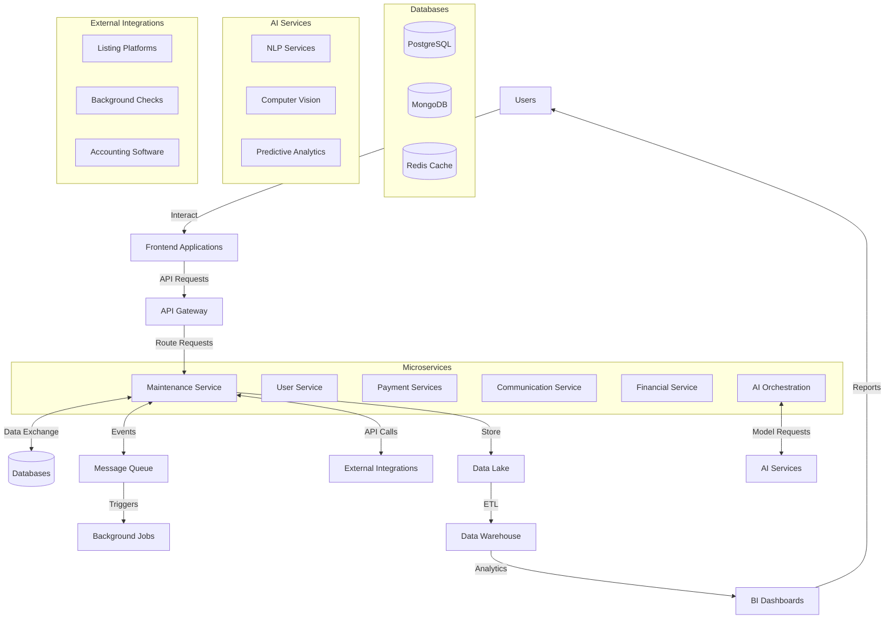

# AI-Powered Property Management App Design

## App Overview: PropertyFlow AI

A comprehensive property management platform that leverages AI to streamline operations, enhance communication, and optimize property performance.

## Core Features

### 1. Intelligent Unit Listing & Marketing
- **AI-Generated Descriptions**: Automatically create compelling property descriptions from photos and basic details
- **Smart Pricing Recommendations**: Dynamic pricing based on market data, seasonality, and property features
- **Multi-Platform Publishing**: One-click posting to Zillow, Apartments.com, Craigslist, Kijiji, Facebook Marketplace, and social media
- **Photo Enhancement**: AI-powered image optimization and virtual staging suggestions
- **SEO Optimization**: Automatic keyword optimization for better search visibility

### 2. AI Communication Hub
- **Smart Response Suggestions**: Pre-written, contextual responses for common inquiries
- **Multi-Language Support**: Real-time translation for diverse tenant base
- **Sentiment Analysis**: Flag urgent or frustrated communications for priority handling
- **Automated Follow-ups**: Schedule and send follow-up messages based on conversation context
- **Voice-to-Text**: Convert voicemails to searchable text with action items

### 3. Tenant Screening & Application Processing
- **AI Risk Assessment**: Score applicants based on credit, income, rental history
- **Document Verification**: Automatically verify pay stubs, employment letters, references
- **Background Check Integration**: Streamlined criminal and credit checks
- **Predictive Analytics**: Identify potential problem tenants before they become issues

### 4. Maintenance Management
- **Smart Work Order Routing**: AI matches maintenance requests with appropriate contractors
- **Predictive Maintenance**: Identify potential issues before they become expensive problems
- **Cost Estimation**: Instant repair cost estimates using historical data and market rates
- **Vendor Performance Tracking**: Rate and track contractor reliability and quality
- **Photo-Based Issue Assessment**: AI analyzes tenant-submitted photos to prioritize urgency

### 5. Financial Management & Reporting
- **Automated Rent Collection**: Smart reminders and multiple payment options
- **Expense Categorization**: AI categorizes expenses for tax reporting
- **Cash Flow Forecasting**: Predict future income and expenses
- **Performance Analytics**: Property-by-property ROI analysis
- **Tax Document Generation**: Automated 1099s and expense reports

### 6. Tenant Portal & Self-Service
- **Mobile App**: React Native implementation for iOS and Android
- **24/7 AI Chatbot**: Handle common questions and requests
- **Maintenance Request System**: Photo upload with AI-powered issue categorization
- **Rent Payment Portal**: Multiple payment methods with automatic reminders
- **Document Access**: Lease agreements, receipts, notices
- **Community Features**: Tenant-to-tenant communication and announcements

## AI-Powered Capabilities

### Primary AI Model
- **Gemini 2.5 Pro**: Core foundation model powering most AI capabilities
- **Multi-modal capabilities**: Process text, images, and documents with a single model
- **Contextual understanding**: Enhanced comprehension of property management domain
- **Efficiency**: Optimized for mobile and web deployment scenarios

### Natural Language Processing
- Extract key information from emails and messages using Gemini 2.5 Pro
- Generate professional correspondence with property-specific context
- Summarize long conversation threads for quick review
- Translate communications in real-time for diverse tenant bases

### Computer Vision
- Analyze property photos for marketing optimization
- Assess maintenance issues from uploaded images
- Monitor property condition changes over time
- Virtual property tours with AI narration

### Predictive Analytics
- Forecast vacancy rates and optimal listing times
- Predict maintenance needs based on property age and usage
- Identify rent increase opportunities
- Market trend analysis for investment decisions

### Machine Learning Optimization
- Learn from user behavior to improve suggestions
- Optimize communication timing for better response rates
- Personalize tenant experience based on preferences
- Continuously improve pricing recommendations

## Technology Stack

### Frontend
- **Mobile Apps**: React Native for iOS and Android
- **Web Dashboard**: React.js with responsive design
- **Real-time Updates**: WebSocket connections

### Backend
- **API**: Node.js with Express framework
- **Database**: PostgreSQL for structured data, MongoDB for documents
- **AI Services**: Gemini 2.5 Pro through Google AI API, complemented by specialized AI services where needed
- **Authentication**: OAuth 2.0 with multi-factor authentication

### Integrations
- **Payment Processing**: Stripe, PayPal, ACH transfers
- **Background Checks**: TransUnion, Experian APIs
- **Listing Platforms**: Zillow, Apartments.com, Rentals.com APIs
- **Communication**: Twilio for SMS, SendGrid for email
- **Accounting**: QuickBooks, Xero integration

## System Architecture

### Microservices Architecture
- **User Service**: Authentication, user management, permissions
- **Property Service**: Property listings, unit management, documentation
- **Communication Service**: Tenant/owner messaging, notifications, AI responses
- **Maintenance Service**: Work orders, vendor management, predictive maintenance
- **Financial Service**: Rent collection, expense tracking, reporting
- **AI Orchestration Service**: Coordinates AI workflows across the platform

### Data Architecture
- **Data Lake**: Raw storage for all system data (AWS S3/Google Cloud Storage)
- **Data Warehouse**: Structured data for analytics (Snowflake/BigQuery)
- **Feature Store**: ML feature repository for AI model training
- **Real-time Processing**: Stream processing for immediate insights (Kafka/Kinesis)

### AI Architecture
- **NLP Pipeline**: Text processing, sentiment analysis, content generation
- **Computer Vision Pipeline**: Image analysis, property inspection, document verification
- **Prediction Engine**: Time-series forecasting, recommendation systems
- **AI Model Registry**: Version control for ML models
- **Monitoring System**: Track model performance, drift detection

### Security Architecture
- **Zero Trust Model**: Continuous authentication and authorization
- **Data Encryption**: End-to-end encryption for sensitive communications
- **Compliance Framework**: GDPR, CCPA, FCRA compliance by design
- **Audit Trail**: Comprehensive logging of all system actions
- **Threat Detection**: ML-based anomaly detection for security events

### DevOps & Infrastructure
- **CI/CD Pipeline**: Automated testing and deployment (GitHub Actions/Jenkins)
- **Infrastructure as Code**: Terraform for consistent environments
- **Containerization**: Docker with Kubernetes orchestration
- **Monitoring Stack**: Prometheus, Grafana, ELK Stack
- **Disaster Recovery**: Multi-region redundancy with automated failover

### API Architecture
- **RESTful APIs**: Primary interface for frontend-backend communication
- **GraphQL Layer**: Flexible data querying for dashboard and reports
- **API Gateway**: Amazon API Gateway/Kong for routing, throttling, and security
- **WebSockets**: Real-time communication for notifications and chat
- **Webhook System**: Integration with third-party services and event triggers
- **OpenAPI Specification**: Standardized API documentation

### Scaling Strategy
- **Horizontal Scaling**: Auto-scaling service instances based on load
- **Database Sharding**: Partitioning data by geography/client for performance
- **Caching Layer**: Redis for frequently accessed data
- **CDN Integration**: Cloudfront/Cloudflare for static assets and media
- **Asynchronous Processing**: Background job queues for non-real-time tasks
- **Multi-tenancy**: Isolated client environments with shared infrastructure
- **Edge Computing**: Deploy critical services closer to users for latency reduction

## AI Implementation Details

### Natural Language Processing
- **Tenant Communication**: Fine-tuned Gemini 2.5 Pro for context-aware responses to inquiries
- **Document Analysis**: BERT-based models for extracting information from leases, applications
- **Smart Description Generation**: Specialized language models for property descriptions
- **Sentiment Analysis Pipeline**: 
  - Text classification models to categorize urgency/sentiment of messages
  - Named entity recognition to identify properties, issues, and people
  - Integration with ticketing system for urgent matters

### Computer Vision Systems
- **Property Analysis**:
  - Object detection for property features (appliances, amenities)
  - Image quality assessment for marketing photos
  - Damage detection for maintenance/inspection reports
- **Document Processing**:
  - OCR with post-processing for document verification
  - ID validation with fraud detection
  - Check processing for paper payments
- **Visual Inspection**:
  - Comparative analysis of property condition over time
  - Automated staging suggestions using GAN models

### Predictive Analytics Engine
- **Rent Optimization Models**:
  - Market analysis using external APIs and internal data
  - Time-series forecasting for seasonal pricing
  - A/B testing framework for pricing strategies
- **Maintenance Prediction**:
  - Failure prediction models based on equipment age and usage patterns
  - Weather impact correlation analysis
  - Cost estimation based on historical work orders
- **Tenant Behavior Models**:
  - Payment pattern analysis for early intervention
  - Renewal prediction based on tenant interactions
  - Satisfaction scoring from communication patterns

### AI Workflow Orchestration
- **Event-Triggered Processing**:
  - New listing → Auto-generation of descriptions and pricing
  - Maintenance request → Urgency classification and vendor matching
  - Payment received → Anomaly detection and reconciliation
- **Model Deployment Strategy**:
  - Containerized model serving using TorchServe/TensorFlow Serving
  - A/B testing framework for model improvements
  - Shadow deployment for new models before production release
- **Feedback Loops**:
  - User correction tracking for continuous improvement
  - Automated retraining pipelines based on performance metrics
  - Active learning for edge cases

### Data Privacy & Ethical AI
- **Differential Privacy**: Techniques to prevent extraction of personal information
- **Bias Detection**: Regular auditing of models for fair treatment
- **Explainability Layer**: Tools to understand AI decision making
- **Data Minimization**: Processing pipelines that use only necessary information

### AI-Driven Communication Workflow
- **Chatbot-First Approach**:
  - Gemini 2.5 Pro-powered chatbot handles majority of tenant/owner communications
  - 24/7 availability for immediate response to common questions and requests
  - Contextual awareness of property details, tenant history, and lease terms
  - Multi-turn conversations with memory of previous interactions
- **Intelligent Escalation System**:
  - Automatic classification of issues requiring human intervention
  - Clear thresholds for when to involve property managers
  - Prioritization based on urgency, sentiment, and issue complexity
  - Seamless handoff with full conversation context for property managers
- **Decision Authority Framework**:
  - AI handles: informational requests, scheduling, status updates, payment reminders
  - Property manager approval required for: maintenance expenditures over threshold, lease exceptions, legal matters, tenant disputes
  - Learning system that improves decision boundaries based on manager feedback
- **Communication Analytics**:
  - Dashboard showing AI resolution rate vs. manager intervention
  - Identification of common escalation triggers for process improvement
  - Satisfaction metrics for AI-handled vs. manager-handled communications

## Integration Architecture

### External Systems Integration
- **Property Listing Platforms**:
  - Bidirectional synchronization with Zillow, Apartments.com, MLS, Kijiji, Facebook Marketplace
  - Automated publishing with platform-specific formatting
  - Listing performance analytics aggregation
- **Financial Systems**:
  - Real-time integration with accounting software (QuickBooks, Xero)
  - Bank account reconciliation through Plaid/Stripe
  - Tax document generation and distribution
- **Background Check Services**:
  - Secure API connections to TransUnion, Experian
  - Automated verification requests with consent tracking
  - Results parsing and risk score calculation
- **Communication Channels**:
  - Omnichannel messaging (email, SMS, in-app, push)
  - Voicemail transcription and routing
  - Automated response generation for common inquiries

### Integration Patterns
- **API-First Strategy**: Well-documented APIs for all system functions
- **Event-Driven Architecture**: Publish-subscribe model for system events
- **Webhook Framework**: Allow third-party systems to trigger workflows
- **ETL Pipelines**: Scheduled data synchronization for reporting systems
- **Middleware Layer**: Transform and normalize data between systems
- **OAuth Connections**: Secure delegated access to third-party services

### Integration Governance
- **API Version Management**: Supporting multiple versions with deprecation policies
- **Rate Limiting**: Prevent system overload from integration partners
- **SLA Monitoring**: Track performance of external service dependencies
- **Circuit Breakers**: Graceful degradation when external services fail
- **Retry Mechanisms**: Intelligent backoff for transient failures

## System Data Flow

## User Experience Flow

### Property Manager Dashboard
1. **Quick Overview**: Key metrics, urgent items, today's tasks
2. **Smart Notifications**: AI-prioritized alerts and recommendations
3. **One-Click Actions**: Common tasks accessible with minimal clicks
4. **Customizable Widgets**: Drag-and-drop dashboard personalization

### Mobile-First Design
- Offline capability for property inspections
- Voice commands for hands-free operation
- GPS integration for location-based features
- Camera integration for instant photo uploads

## Revenue Model

### Subscription Tiers
- **Starter**: $29/month - Up to 10 units, basic AI features
- **Professional**: $79/month - Up to 50 units, advanced AI, integrations
- **Enterprise**: $199/month - Unlimited units, custom AI training, white-label options

### Additional Revenue Streams
- Transaction fees on rent collection (1.5%)
- Premium integrations and add-ons
- AI-powered market reports and insights
- White-label solutions for larger property management companies

## Competitive Advantages

### AI-First Approach
Unlike traditional property management software, every feature is enhanced with AI to reduce manual work and improve decision-making.

### Unified Communication
All tenant, owner, and vendor communications in one intelligent platform with context-aware suggestions.

### Predictive Insights
Proactive recommendations rather than reactive reporting, helping managers stay ahead of issues.

### Scalability
Designed to handle everything from individual landlords to large property management companies.

## Implementation Roadmap

### Phase 1 (Months 1-3): MVP
- Basic property and tenant management
- Chatbot-first communication system with property manager escalation
- Mobile app for property managers
- Basic tenant portal React Native app with essential features
- Payment processing integration

### Phase 2 (Months 4-6): AI Enhancement
- Advanced AI features for pricing and screening
- Predictive maintenance capabilities
- Enhanced features for tenant portal React Native mobile app
- Major platform integrations

### Phase 3 (Months 7-9): Advanced Features
- Computer vision for property analysis
- Advanced analytics and reporting
- White-label options
- API for third-party integrations

### Phase 4 (Months 10-12): Scale & Optimize
- Enterprise features
- International expansion capabilities
- Advanced AI training and customization
- Performance optimization

## Success Metrics

### User Engagement
- Daily active users and session duration
- Feature adoption rates
- Customer satisfaction scores

### Business Impact
- Time saved per property manager (target: 10+ hours/week)
- Vacancy rate reduction (target: 20% improvement)
- Rent collection improvement (target: 95%+ on-time payments)
- Customer retention rate (target: 90%+ annual retention)

This AI-powered property management app would differentiate itself through intelligent automation, predictive insights, and a seamless user experience that scales from individual landlords to enterprise property management companies.