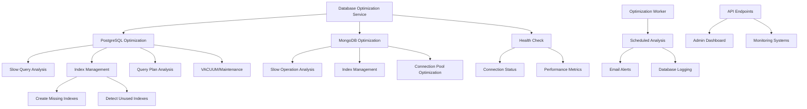
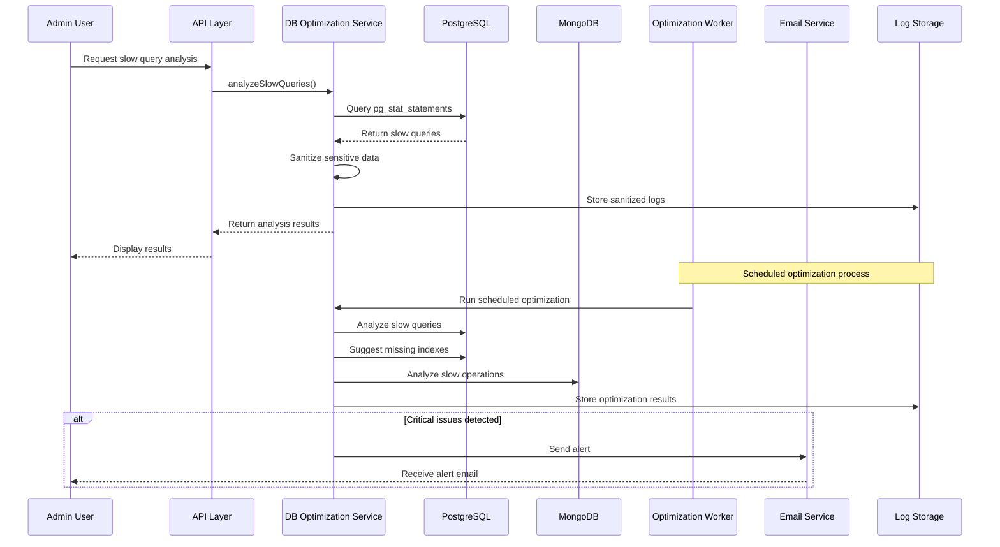

# Database Optimization Service

This document provides comprehensive information about the PropertyAI Database Optimization Service, including API endpoints, usage examples, and best practices.

## Overview

The Database Optimization Service provides tools to analyze and optimize both PostgreSQL and MongoDB databases. It helps identify slow queries, suggest and create indexes, optimize connections, and monitor database performance.

## Architecture



## Process Flow

The following sequence diagram illustrates the flow of a typical database optimization operation:



## API Endpoints

All endpoints require admin authentication and are rate-limited to 10 requests per 15 minutes per IP.

### Analyze Slow Queries

```
GET /api/db-optimization/slow-queries
```

Returns slow queries from PostgreSQL and MongoDB with execution metrics.

**Example Response:**
```json
{
  "postgres": [
    {
      "query": "SELECT * FROM users WHERE email LIKE '%example.com'",
      "duration_ms": 1500,
      "calls": 25,
      "rows": 1200
    }
  ],
  "mongodb": [
    {
      "query": "{ find: 'properties', filter: { status: 'ACTIVE' } }",
      "duration_ms": 800,
      "count": 15
    }
  ]
}
```

### Identify and Create Missing Indexes

```
POST /api/db-optimization/missing-indexes
```

Identifies missing indexes based on query patterns and optionally creates them.

**Parameters:**
- `execute` (boolean, optional): If true, actually creates the suggested indexes. Default: false (suggestion only).

**Example Request:**
```bash
# Suggestion only
curl -X POST https://api.propertyai.com/api/db-optimization/missing-indexes -H "Authorization: Bearer YOUR_TOKEN"

# Create indexes
curl -X POST https://api.propertyai.com/api/db-optimization/missing-indexes?execute=true -H "Authorization: Bearer YOUR_TOKEN"
```

**Example Response:**
```json
{
  "message": "Index suggestions generated",
  "indexes": [
    {
      "table": "users",
      "columns": ["email"],
      "suggestion": "CREATE INDEX idx_users_email ON users(email)",
      "created": false
    }
  ]
}
```

### Detect Unused Indexes

```
GET /api/db-optimization/unused-indexes
```

Identifies unused and redundant indexes that could potentially be dropped.

**Example Response:**
```json
{
  "message": "Unused and redundant indexes detected",
  "count": 2,
  "indexes": [
    {
      "type": "unused",
      "database": "postgres",
      "table_name": "old_logs",
      "index_name": "idx_old_logs_timestamp",
      "scans": 0,
      "size": "15 MB",
      "recommendation": "Consider dropping unused index: DROP INDEX IF EXISTS \"idx_old_logs_timestamp\";"
    },
    {
      "type": "redundant",
      "database": "postgres",
      "table_name": "properties",
      "index_pair": "idx_properties_status and idx_properties_status_city",
      "recommendation": "Consider dropping redundant index: DROP INDEX IF EXISTS \"idx_properties_status\";"
    }
  ]
}
```

### Analyze Query Plans

```
GET /api/db-optimization/query-plans
```

Analyzes execution plans for slow queries and provides optimization recommendations.

**Parameters:**
- `compare` (boolean, optional): If 'false', don't compare with previous plans. Default: true.

**Example Response:**
```json
{
  "message": "Query plans analyzed",
  "count": 1,
  "compareWithPrevious": true,
  "results": [
    {
      "queryHash": "a1b2c3d4e5",
      "query": "SELECT p.*, u.email FROM properties p JOIN users u ON p.user_id = u.id WHERE p.status = 'ACTIVE'",
      "metrics": {
        "calls": 120,
        "total_exec_time": 25000,
        "mean_exec_time": 208.33,
        "rows": 1500
      },
      "analysis": [
        {
          "type": "sequential_scan",
          "table": "properties",
          "recommendation": "Consider adding an index on table \"properties\" to avoid sequential scan"
        }
      ],
      "regressions": [],
      "recommendations": [
        "Consider adding an index on table \"properties\" to avoid sequential scan"
      ]
    }
  ]
}
```

### Optimize Database Connections

```
POST /api/db-optimization/optimize-connections
```

Optimizes database connection pools and settings.

**Example Response:**
```json
{
  "message": "Database connections optimized",
  "postgres": {
    "before": {
      "max_connections": 100,
      "active_connections": 45
    },
    "after": {
      "max_connections": 100,
      "active_connections": 20
    }
  }
}
```

### Run VACUUM ANALYZE

```
POST /api/db-optimization/vacuum-analyze
```

Runs VACUUM ANALYZE on PostgreSQL to update statistics and reclaim space.

**Example Response:**
```json
{
  "message": "VACUUM ANALYZE completed successfully",
  "tables": ["users", "properties", "listings"]
}
```

### Get Database Metrics

```
GET /api/db-optimization/metrics
```

Returns current database performance metrics.

**Example Response:**
```json
{
  "postgres": {
    "size": "1.2 GB",
    "connections": 25,
    "cache_hit_ratio": 0.95,
    "index_usage": 0.87
  },
  "mongodb": {
    "size": "850 MB",
    "connections": 15,
    "wiredTiger": {
      "cache_used_percentage": 0.65,
      "cache_dirty_percentage": 0.05
    }
  }
}
```

### Run Database Health Check

```
GET /api/db-optimization/health-check
```

Performs a quick health check on both PostgreSQL and MongoDB databases, testing connectivity and gathering key metrics.

**Example Response:**
```json
{
  "message": "Database health check completed",
  "timestamp": "2024-06-09T12:34:56.789Z",
  "postgres": {
    "status": "connected",
    "metrics": {
      "active_connections": 12,
      "database_size": "2.5 GB",
      "table_count": 45,
      "max_connections": 100,
      "tables_needing_vacuum": 3,
      "connection_utilization": "12%"
    }
  },
  "mongodb": {
    "status": "connected",
    "metrics": {
      "database_size": "1.8 GB",
      "collection_count": 28,
      "index_count": 42,
      "active_connections": 8
    }
  }
}
```

If there are issues with either database, the response will have status code 500 and include error details:

```json
{
  "message": "Database health check detected issues",
  "timestamp": "2024-06-09T12:34:56.789Z",
  "postgres": {
    "status": "connected",
    "metrics": { ... }
  },
  "mongodb": {
    "status": "error",
    "error": "Connection refused"
  }
}
```

## Automated Worker

The database optimization service includes a standalone worker that runs scheduled tasks:

```bash
# Run the worker
cd backend
npx ts-node src/workers/dbOptimizationWorker.ts
```

The worker performs the following tasks:
- Analyzes slow queries
- Suggests missing indexes
- Logs optimization opportunities
- Monitors database health
- Sends alerts for critical issues

Configuration is stored in `.env` and logs are written to `logs/database/`.

## Best Practices

### Index Management

1. **Be selective with indexes**:
   - Indexes speed up queries but slow down writes
   - Each index requires additional disk space
   - Too many indexes can degrade performance

2. **Monitor index usage**:
   - Regularly check for unused indexes
   - Consider dropping indexes that haven't been used in months
   - Watch for redundant indexes that cover the same columns

3. **Index creation strategy**:
   - Always use the `execute=false` flag first to get suggestions
   - Test index performance in a staging environment
   - Create indexes during low-traffic periods
   - Consider partial indexes for large tables with filtered queries

### Query Optimization

1. **Analyze slow queries regularly**:
   - Set up alerts for queries exceeding certain thresholds
   - Look for patterns in slow queries
   - Test optimized queries before deploying

2. **Use query plans**:
   - Compare plans before and after optimization
   - Watch for sequential scans on large tables
   - Identify missing join conditions

3. **Connection management**:
   - Properly size connection pools
   - Close connections when not in use
   - Monitor for connection leaks

## Troubleshooting

### Common Issues

1. **Rate limiting errors**:
   - The API is limited to 10 requests per 15 minutes
   - Use the worker for regular monitoring instead of direct API calls

2. **Permission errors**:
   - Ensure the database user has appropriate permissions
   - For index creation, the user needs CREATE privileges

3. **Worker not running**:
   - Check logs in `logs/database/worker.log`
   - Ensure environment variables are properly set
   - Verify database connectivity

### Getting Help

For issues with the database optimization service, contact the DevOps team at devops@propertyai.com or open a ticket in the internal support system.

## Testing and Validation

### Automated Tests

The Database Optimization Service includes automated tests to ensure its functionality and reliability:

```bash
# Run all tests
cd backend
npm test -- --testPathPattern=databaseOptimization

# Run specific test file
npm test -- src/__tests__/services/databaseOptimization.service.test.ts
```

### Manual Testing Checklist

Before deploying changes to the Database Optimization Service, validate the following:

1. **Slow Query Analysis**
   - [ ] Slow queries are correctly identified in both PostgreSQL and MongoDB
   - [ ] Recommendations are relevant and actionable
   - [ ] Logs are properly written to the designated location

2. **Index Management**
   - [ ] Missing indexes are correctly identified
   - [ ] Index creation works when `execute=true` is specified
   - [ ] Unused indexes are correctly identified
   - [ ] No system indexes are suggested for removal

3. **Query Plan Analysis**
   - [ ] Plans are correctly parsed and analyzed
   - [ ] Regressions are detected when comparing with previous plans
   - [ ] Recommendations address the actual issues in the plans

4. **Worker Functionality**
   - [ ] Scheduled tasks run at the expected times
   - [ ] Email alerts are sent when issues are detected
   - [ ] Database logs are correctly stored and rotated

5. **API Security**
   - [ ] All endpoints require admin authentication
   - [ ] Rate limiting is working as expected
   - [ ] Sensitive operations (e.g., index creation) require explicit confirmation

### Performance Impact Assessment

Before running intensive operations in production:

1. **For Index Creation**
   - Run during off-peak hours
   - Monitor server load during creation
   - Have a rollback plan ready

2. **For VACUUM ANALYZE**
   - Ensure sufficient disk space is available
   - Monitor for lock contention
   - Consider running in smaller batches for large tables

3. **For Monitoring Operations**
   - Ensure monitoring queries themselves don't cause performance issues
   - Use appropriate timeouts for long-running operations
   - Consider read replicas for heavy analysis

## Security Considerations

The Database Optimization Service has access to sensitive database operations and information. The following security measures are implemented:

### Authentication and Authorization

- **Admin-Only Access**: All endpoints require admin privileges.
- **Rate Limiting**: Endpoints are rate-limited to prevent abuse (10 requests per 15 minutes).
- **Safe Defaults**: Index creation and other potentially disruptive operations require explicit opt-in.

### Data Protection

- **Query Sanitization**: All user inputs are properly sanitized before being used in database operations.
- **No Sensitive Data Exposure**: Slow query logs are sanitized to remove potential sensitive data.
- **Secure Logging**: Database credentials and connection strings are never logged.

### Operational Security

- **Principle of Least Privilege**: The service uses database users with only the permissions needed.
- **Execution Isolation**: The worker runs in a separate process to isolate potential issues.
- **Error Handling**: Errors are caught and logged without exposing implementation details.

### Recommended Configurations

For production environments, consider these additional security measures:

1. **Network Security**:
   - Place the optimization service behind a firewall
   - Use TLS/SSL for all database connections
   - Consider a VPN for remote access to optimization endpoints

2. **Access Control**:
   - Create a dedicated database user with limited permissions for the service
   - Regularly rotate database credentials
   - Implement IP-based restrictions for admin endpoints

3. **Monitoring and Auditing**:
   - Log all access to optimization endpoints
   - Set up alerts for unusual patterns of optimization requests
   - Regularly review optimization logs for unauthorized access attempts 