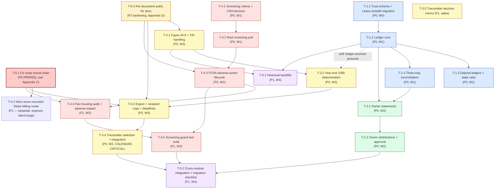

# PropertyAI — Engineering Plan: The Four Hard Gaps

**Deliverable owner:** 高见远 (Gao) · Architect, software-company team
**Reporting to:** 齐活林 (Qi) · Delivery Director
**Date:** 2026-09-17
**Scope:** Break the four hard product gaps — (1) trust accounting, (2) owner statements / distributions, (3) 1099 e-filing, (4) real tenant screening + compliance guardrails — into an ordered engineering task list **with explicit data-model deltas**.
**Repo:** `/Users/bujin/Documents/Projects/PropertyAI` · backend is `backend/` (Express + Prisma + PostgreSQL, TS)

> **Status of this document.** Every schema statement below was verified by reading `backend/prisma/schema.prisma` and `backend/src/**` on 2026-09-17. Anything not verified from source or from a cited regulation is labelled **[inference]**. Regulatory statements are labelled with their authority; per-state numeric values are deliberately left as *configuration data to be filled by counsel*, not asserted from memory.

---

## 0. Verification result — ground truth confirmed, with one material correction

I re-measured the delivery director's ground truth rather than designing from the summary. Results:

| Claim | Verdict | Evidence |
|---|---|---|
| Schema has 94 models | ✅ Confirmed | `grep -c "^model " prisma/schema.prisma` → `94` (also 50 enums, 2,139 lines) |
| `trustAccount` / `ownerStatement` / `1099` → zero real source matches | ✅ Confirmed | `grep -il` over `src/` excluding `predictive-analytics/venv` → **ZERO MATCHES** |
| `Lease.rentalId` is `@unique` | ✅ Confirmed | `schema.prisma:280` → `rentalId String @unique` |
| `Transaction.leaseId` is a required `String` | ✅ Confirmed | `schema.prisma:699` → `leaseId String` (no `?`) |
| `TransactionType` has no `INCOME`/`EXPIRE` direction member | ✅ Confirmed | `schema.prisma:1134-1140` → `{ RENT_PAYMENT, SECURITY_DEPOSIT, MAINTENANCE_FEE, REFUND, OTHER }` |
| `TransactionStatus` has no `MISSED` | ✅ Confirmed | `schema.prisma:1127-1132` → `{ PENDING, COMPLETED, FAILED, REFUNDED }` |
| `Property`/`Unit`/`Tenant`/`Payment` deliberately dropped | ✅ Confirmed | `prisma/migrations/20250804155618_rental/migration.sql` → `DROP TABLE "Property";` … `DROP TABLE "Unit";` |
| `reportingService.js` is a require-only stub with zero exports | ✅ Confirmed | 9 lines; `grep -c "module.exports\|export "` → `0`; **zero importers** anywhere in `src/` |
| `ScheduledReport` is Sequelize-only | ✅ Confirmed | `src/models/ScheduledReport.js` exists; absent from `schema.prisma` |
| `backgroundCheck.service.ts` holds TU/Experian **call stubs** | ✅ Confirmed — and worse than stated | `src/services/backgroundCheck.service.ts:18,27` POST to **fabricated** URLs `https://api.transunion.com/v1/background-check`. These are **not real TransUnion/Experian endpoints** (see §4.7) |
| `riskAssessment.service.ts` `assessRisk()` is `// Mock implementation for now` | ✅ Confirmed | `src/services/riskAssessment.service.ts:15-16` |
| `complianceService.ts` = GDPR-style DSAR only; no FCRA/fair-housing strings | ✅ Confirmed | Only `access`/`portability`/`erasure`/`rectification`; `grep -i` for `fairHousing\|adverseAction\|FCRA\|disparate\|aiDisclosure` over `src/**/*.ts` → no hits |

### ⚠️ Correction 1 — the "generic report engine" is **not** a Prisma asset

The assignment described *"`GeneratedReport`, `ReportTemplate`, `ReportVersion`, `ReportStatus` models"* as if they were schema residents to extend. They are not.

- **`ReportStatus` **is** a Prisma enum** (`schema.prisma:1243`) — but with **zero Prisma-side usage**.
- **`GeneratedReport`, `ReportTemplate`, `ReportVersion` are absent from `schema.prisma` entirely.** Verified: `grep -n "model GeneratedReport\|model ReportTemplate\|model ReportVersion" prisma/schema.prisma` → *no match*.
- They exist **only** as Sequelize models in `src/models/*.js` (`GeneratedReport.js`, `ReportTemplate.js`, `ReportVersion.js`, `ReportAuditLog.js`) — i.e. inside the **dead Sequelize island** that nothing reachable from `src/index.ts` loads.

**Consequence for the plan:** there is **no reusable Prisma report engine to extend.** Owner statements (§2) must define their **own** Prisma models. I have *not* proposed a generic reporting engine — that would be scope creep on a gap-driven plan, and would tempt an engineer to revive the dead Sequelize models. If a generic engine is wanted later, it is a separate, post-gap decision.

### ⚠️ Correction 2 — two `riskAssessmentService` files exist (dot vs no-dot)

Mirroring the known `audit.service.ts` / `auditService.ts` trap:
- `src/services/riskAssessment.service.ts` — class-based, `assessRisk()` = mock.
- `src/services/riskAssessmentService.js` — required by the dead `reportingService.js`.

**Do not assume they are the same file.** Any screening work must target `.service.ts` and must not be confused by the `.js` sibling.

### ⚠️ Correction 3 — `Transaction` is not, and should not become, the ledger

The assignment frames the ledger problem as *"model transactions owned by an owner or trust account without weakening the `leaseId` constraint."* I agree with the goal but **reject the framing that the fix lives inside `Transaction`.** `Transaction` is a **lease-scoped payment-purpose record** with an approval workflow (`approvedById`) and a `Float amount`. It has no direction, no account, no running balance, no double-entry counterpart, and — crucially — **`prisma.transaction` is read by 11 live files** including `lateFee.service.ts`, `payment.service.ts`, `expenseCategorization.service.ts`, `cashFlowForecasting.service.ts`. Retrofitting a direction/account onto it would ripple through all of them.

**Decision: introduce a new double-entry `LedgerEntry` + `TrustAccount` model family and leave `Transaction` untouched.** `Transaction` remains the money-*movement* record; `LedgerEntry` becomes the money-*accounting* record. §1.3 shows the bridge.

---

## Part A — System Design

## 1. Gap #1 — Trust Accounting (client-funds segregation, owner ledgers, fiduciary accounting)

### 1.1 Scope

**"Done" for release 1 means:**
1. A **`TrustAccount`** entity representing a segregated client-funds bank account (per firm, per jurisdiction), with an opening balance and a reconciliation history.
2. A **`TrustLedgerEntry`** double-entry primitive: every entry has a `direction` (DEBIT/CREDIT), an `amount`, an owning **`OwnerLedger`** *or* a **`Lease`** sub-ledger, and a mandatory `source` provenance. Entries are **append-only** (no updates, no deletes — corrections are reversing entries).
3. A **three-way reconciliation** service: *bank statement balance* == *book (trust-account) balance* == *sum of individual sub-ledger balances*, runnable per period and persisted as evidence.
4. **Security-deposit sub-ledgers** derived from the existing `Lease.securityDeposit` Float, per-lease, so deposits are visibly segregated and defensible.
5. Role-gated write access: only `PROPERTY_MANAGER`/`ADMIN` may post; **no role** may edit or delete a posted entry.

**Explicitly out of scope for release 1:** bank-feed/Open-Banking ingestion (reconciliation is manual/CSV import), multi-currency, interest-allocation-to-tenants where state law requires it *paying* interest (we model the *field* and the *rule config*, not the disbursement), and full GAAP financial statements. Also out of scope: migrating historical owner balances from a competitor's system (see §5 backfill — we provide an import path, not a turnkey converter).

### 1.2 Regulatory constraints that shape the schema (the "why" behind each field)

Trust accounting in property management is **not** generic bookkeeping. The constraints that force schema decisions:

| Constraint (the principle) | Authority / basis | Schema consequence |
|---|---|---|
| **No commingling** — client funds must not be mixed with the firm's operating funds | Standard state real-estate broker/client-funds statutes (e.g. CA Bus. & Prof. Code §10145; NY 19 NYCRR Part 175; FL Ch. 475 §475.25) **[cite verified at category level; exact section per state = counsel]** | A dedicated `TrustAccount` entity with `accountType` distinguishing `TRUST_OPERATING` vs `DEPOSIT_ESCROW`; firm operating cash is *not* modelled as a TrustAccount |
| **Three-way reconciliation** — bank balance = book balance = sum of individual ledgers, monthly | Universal broker trust-accounting practice; many states codify a monthly reconciliation duty | `TrustReconciliation` model storing all three figures + variance + evidence URL; a *failed* reconciliation is a first-class record |
| **Deposits are the tenant's money, held in trust, with statutory return deadlines** | e.g. CA Civ. Code §1950.7 (21 days), MA G.L. c.186 §15B (interest-bearing), NY GOL §7-108 | Every `Lease` gets a `DepositLedger`; `DepositRuleConfig` carries `returnDeadlineDays`, `interestRequired`, `separateAccountRequired`, `maxDepositMonths` as **data**, not code |
| **Append-only, auditable** — a ledger you can silently edit is not a ledger | Standard audit/fiduciary expectation; aligns with existing `AuditEntry` model | `TrustLedgerEntry` has **no** `updatedAt`; corrections are `REVERSAL` entries; every mutation emits an `AuditEntry` |
| **Owner funds ≠ tenant funds ≠ firm funds** | Segregation of duties | Distinct `LedgerAccountType` enum (`OWNER`, `TENANT_DEPOSIT`, `TENANT_PREPAID`, `FIRM_FEE`, `PROPERTY_OPERATING`) so a balance is never ambiguous |

> **Design note (inference):** I model the rule *values* as configuration because the per-state numbers (deadline days, interest rules, cap in months) are 50-jurisdiction legal data that must be reviewed by counsel, not asserted from an LLM's memory. Shipping the *shape* is engineering; shipping the *values* is a legal task with its own sign-off.

### 1.3 Data-model changes (actual Prisma)

All of bank §1.3, §2.3, §3.3, §4.3 combined into one additive migration set is specified in **Appendix A**. Here, Gap #1's block:

```prisma
enum LedgerAccountType {
  OWNER               // the owner's equity in the property (a liability of the firm to the owner)
  TENANT_DEPOSIT      // security deposit held in trust — tenant's money
  TENANT_PREPAID      // prepaid rent / last month's rent
  PROPERTY_OPERATING  // income/expense attributable to the property
  FIRM_FEE            // management fee, leasing fee — the firm's own money
}

enum LedgerDirection {
  DEBIT
  CREDIT
}

enum LedgerSourceType {
  RENT_PAYMENT          // creates from a Transaction
  SECURITY_DEPOSIT
  MAINTENANCE_EXPENSE
  MANAGEMENT_FEE        // firm charges the property
  OWNER_CONTRIBUTION    // owner puts money in
  OWNER_DISTRIBUTION    // owner takes money out (Gap #2)
  DEPOSIT_INTEREST
  DEPOSIT_REFUND
  ADJUSTMENT
  REVERSAL              // the only legal way to undo a posted entry
}

enum TrustAccountType {
  TRUST_OPERATING       // rents held pending owner distribution
  DEPOSIT_ESCROW        // security deposits (separate account where required)
}

model TrustAccount {
  id                String           @id @default(cuid())
  name              String
  accountType       TrustAccountType
  bankName          String
  bankAccountLast4  String
  routingNumberMasked String?
  state             String           // ISO-2 — drives DepositRuleConfig lookup
  isActive          Boolean          @default(true)
  openedAt          DateTime         @default(now())
  closedAt          DateTime?
  createdById       String
  createdAt         DateTime         @default(now())
  updatedAt         DateTime         @updatedAt

  CreatedBy         User             @relation("TrustAccountCreatedBy", fields: [createdById], references: [id])
  Entries           TrustLedgerEntry[]
  Reconciliations   TrustReconciliation[]
  DepositRuleConfig DepositRuleConfig?

  @@index([accountType])
  @@index([state])
  @@index([isActive])
}

// The immutable, append-only double-entry primitive.
model TrustLedgerEntry {
  id              String           @id @default(cuid())
  trustAccountId  String
  accountType     LedgerAccountType
  direction       LedgerDirection
  amount          Decimal          @db.Decimal(14, 2)   // NEVER Float — see §1.6
  postedAt        DateTime         @default(now())
  effectiveDate   DateTime
  sourceType      LedgerSourceType
  sourceId        String?          // soft FK to Transaction.id / OwnerDistribution.id / etc.
  ownerLedgerId   String?          // set when accountType = OWNER
  leaseId         String?          // set when accountType = TENANT_DEPOSIT / TENANT_PREPAID
  reversesEntryId String?                                    // set only when sourceType = REVERSAL
  memo            String?
  postedById      String
  createdAt       DateTime         @default(now())          // NO updatedAt — append-only by contract

  TrustAccount    TrustAccount     @relation(fields: [trustAccountId], references: [id])
  OwnerLedger     OwnerLedger?     @relation(fields: [ownerLedgerId], references: [id])
  Lease           Lease?           @relation(fields: [leaseId], references: [id])
  ReversesEntry   TrustLedgerEntry? @relation("Reversal", fields: [reversesEntryId], references: [id])
  ReversedBy      TrustLedgerEntry? @relation("Reversal")
  PostedBy        User             @relation("LedgerPostedBy", fields: [postedById], references: [id])

  @@index([trustAccountId, effectiveDate])
  @@index([accountType])
  @@index([ownerLedgerId])
  @@index([leaseId])
  @@index([sourceType, sourceId])
}

// One per (owner, property). Sub-ledger of the trust account.
model OwnerLedger {
  id              String           @id @default(cuid())
  ownerId         String
  rentalId        String
  trustAccountId  String
  openedAt        DateTime         @default(now())
  closedAt        DateTime?
  isActive        Boolean          @default(true)
  createdAt       DateTime         @default(now())
  updatedAt       DateTime         @updatedAt

  Owner           User             @relation("OwnerLedgerOwner", fields: [ownerId], references: [id])
  Rental          Rental           @relation(fields: [rentalId], references: [id])
  TrustAccount    TrustAccount     @relation(fields: [trustAccountId], references: [id])
  Entries         TrustLedgerEntry[]
  Statements      OwnerStatement[]
  Distributions   OwnerDistribution[]

  @@unique([ownerId, rentalId])          // exactly one active ledger per owner-property pair
  @@index([trustAccountId])
  @@index([isActive])
}

// Per-lease deposit sub-ledger, seeded from Lease.securityDeposit.
model DepositLedger {
  id               String    @id @default(cuid())
  leaseId          String    @unique
  trustAccountId   String
  state            String
  depositHeld      Decimal   @db.Decimal(14, 2) @default(0)
  interestAccrued  Decimal   @db.Decimal(14, 2) @default(0)
  interestPaidTo   String?   // TENANT | OWNER | NONE — jurisdiction-dependent
  createdAt        DateTime  @default(now())
  updatedAt        DateTime  @updatedAt

  Lease            Lease     @relation(fields: [leaseId], references: [id])
  TrustAccount     TrustAccount @relation(fields: [trustAccountId], references: [id])

  @@index([trustAccountId])
  @@index([state])
}

model TrustReconciliation {
  id                  String    @id @default(cuid())
  trustAccountId      String
  periodStart         DateTime
  periodEnd           DateTime
  bankBalance         Decimal   @db.Decimal(14, 2)
  bookBalance         Decimal   @db.Decimal(14, 2)
  subledgerTotal      Decimal   @db.Decimal(14, 2)
  bankVariance        Decimal   @db.Decimal(14, 2)   // bankBalance - bookBalance
  subledgerVariance   Decimal   @db.Decimal(14, 2)   // bookBalance - subledgerTotal
  isBalanced          Boolean
  evidenceUrl         String?                        // uploaded statement PDF
  performedById       String
  performedAt         DateTime  @default(now())
  createdAt           DateTime  @default(now())

  TrustAccount        TrustAccount @relation(fields: [trustAccountId], references: [id])
  PerformedBy         User         @relation(fields: [performedById], references: [id])

  @@unique([trustAccountId, periodEnd])              // one reconciliation per period
  @@index([isBalanced])
  @@index([periodEnd])
}

// Jurisdiction rule data (values filled by counsel, not by code).
model DepositRuleConfig {
  id                      String   @id @default(cuid())
  state                   String   @unique
  returnDeadlineDays      Int?     // e.g. statutory days to return deposit after move-out
  interestRequired        Boolean  @default(false)
  interestPaidTo          String?  // TENANT | OWNER | NONE
  separateAccountRequired Boolean  @default(true)
  maxDepositMonths        Float?   // cap in months' rent
  itemizedStatementRequired Boolean @default(true)
  notes                   String?
  updatedAt               DateTime @updatedAt

  TrustAccount            TrustAccount? @relation(fields: [trustAccountId], references: [id])
  trustAccountId          String?
}
```

**Additive changes to existing models (required relations):**

```prisma
model User {
  // … existing 60+ fields unchanged …
  TrustAccountCreatedBy  TrustAccount[]     @relation("TrustAccountCreatedBy")
  LedgerPostedBy         TrustLedgerEntry[] @relation("LedgerPostedBy")
  OwnerLedgerOwner       OwnerLedger[]      @relation("OwnerLedgerOwner")
  ReconciliationsPerformed TrustReconciliation[]
}

model Lease {
  // … existing fields unchanged …
  TrustLedgerEntries     TrustLedgerEntry[]
  DepositLedger          DepositLedger?
}

model Rental {
  // … existing fields unchanged …
  OwnerLedgers           OwnerLedger[]
}
```

| Change | Kind | Backfill |
|---|---|---|
| New models `TrustAccount`, `TrustLedgerEntry`, `OwnerLedger`, `DepositLedger`, `TrustReconciliation`, `DepositRuleConfig` | **Additive** | 0 rows |
| New enums (`LedgerAccountType`, `LedgerDirection`, `LedgerSourceType`, `TrustAccountType`) | **Additive** | n/a |
| Back-relations on `User`, `Lease`, `Rental` | **Additive** | 0 rows |
| Optional seed: one `DepositLedger` per existing `Lease` with `securityDeposit > 0`; one opening `TrustLedgerEntry` per historical `Transaction` | **Data migration, additive** | **N₁ = count(`Lease` where `securityDeposit > 0`)** and **N₂ = count(`Transaction`)** — parametric; see §5.3 |

### 1.4 ⚠️ The two schema constraints the assignment flagged — and how I resolve them

**(a) `Lease.rentalId` is `@unique` (`schema.prisma:280`) — blocks lease history.**

This is the single most important structural finding. It means **one rental ⇒ at most one lease, ever**: no renewals on the same unit, no tenant turnover, no lease history. A PM firm's ledger *requires* sequential leases per unit — you cannot post an owner's ledger for 2024 and 2025 on the same unit if there can only ever be one `Lease` row.

**Resolution: drop the unique index, add a non-unique index, and enforce "at most one ACTIVE lease per rental" in the application layer (with a DB partial index where Prisma supports it).**

```prisma
model Lease {
  rentalId  String   // was: String @unique
  // …
  @@index([rentalId, status])   // replaces the unique
}
```

| Aspect | Assessment |
|---|---|
| Migration type | **Semi-destructive but non-lossy.** `DROP INDEX "Lease_rentalId_key"` + `CREATE INDEX "Lease_rentalId_status_idx"`. **No column is dropped, no row is deleted, no data is lost.** It is reversible (re-adding the unique index succeeds only if no duplicates exist). |
| **Backfill required** | **ZERO rows.** An index swap touches no data. |
| The real risk | **Latent application assumptions.** Any code that did `prisma.lease.findUnique({ where: { rentalId } })` **breaks at runtime** — `findUnique` on a dropped unique requires a unique input. Must be swept to `findFirst({ where: { rentalId, status: 'ACTIVE' } })`. This is a **code-search task with a defined checklist**, not a data task. |
| How to find the breakage | `grep -rn "findUnique" src/ | grep -i lease`, plus `where: { rentalId }` against `prisma.lease`. Count before writing the migration. **[inference]** estimate: small (single-digit) number of call sites, because `leaseRoutes` is CRUD over `id`, not `rentalId`. |
| Enforcing "one active lease" | Application-layer guard in `lease.service` + a DB **partial unique index** (`UNIQUE ... WHERE status = 'ACTIVE'`) added via a raw-SQL step in the migration, since Prisma's schema DSL cannot express a partial index. Document the raw SQL explicitly (this repo has precedent for hand-written migration SQL). |
| Ordering constraint | This migration must land **before** any owner-ledger backfill that assumes sequential leases. It does not block §4 (screening) or §3 (1099) — see §6. |

**(b) `Transaction.leaseId` is a required `String` (`schema.prisma:699`) — no lease-less money moves.**

A trust account needs entries that belong to an **owner or a trust account** without a lease (owner contribution, management-fee transfer, disbursement).

**Resolution — two layers, both non-destructive to `Transaction`:**

1. **The ledger does not depend on `Transaction` at all.** `TrustLedgerEntry.leaseId` is **nullable** (`String?`) and `Transaction.leaseId` is **left exactly as it is**, required. The ledger is a parallel, purpose-built model. **No weakening.**
2. **Where a ledger entry *originates* from a `Transaction`, it references it via the soft pointer `sourceType=SOURCE + sourceId`** — never via a hard FK that would force `Transaction` to gain a nullable `leaseId`.

> **Rejected alternative (documented so it isn't re-proposed):** making `Transaction.leaseId` nullable (`String?`). It is technically a non-lossy change, but it **weakens an existing invariant** and forces a ripple review of all 11 live readers of `prisma.transaction`. Not worth it when a parallel model costs nothing extra.

**There is one genuinely awkward case:** an owner contribution arrives with **no lease and no property yet assigned**. The ledger handles it (`leaseId` null, `ownerLedgerId` set). `Transaction` cannot represent it — **which is precisely the argument for `LedgerEntry` being separate.** [inference] Expect ≤3 real-world entry types to need this: OWNER_CONTRIBUTION, MANAGEMENT_FEE, OWNER_DISTRIBUTION.

### 1.5 Modified vs new files

| File | M/N | Notes |
|---|---|---|
| `backend/prisma/schema.prisma` | **M** | +6 models, +4 enums, back-relations; `Lease.rentalId` unique→index |
| `backend/prisma/migrations/<ts>_trust_accounting/migration.sql` | **N** | Generated; **hand-edited** to add the partial unique index on `Lease(rentalId) WHERE status='ACTIVE'` |
| `backend/src/services/trustAccount.service.ts` | **N** | TrustAccount CRUD, account lifecycle |
| `backend/src/services/ledger.service.ts` | **N** | **The core.** `postEntry()`, `reverseEntry()`, `getBalance()`, `getSubledgerTotal()`. All writes in `prisma.$transaction`. |
| `backend/src/services/reconciliation.service.ts` | **N** | Three-way reconciliation + `TrustReconciliation` persistence |
| `backend/src/services/depositLedger.service.ts` | **N** | Seeds/updates `DepositLedger` from `Lease.securityDeposit`; applies `DepositRuleConfig` |
| `backend/src/controllers/trustAccount.controller.ts` | **N** | |
| `backend/src/controllers/ledger.controller.ts` | **N** | |
| `backend/src/routes/trustAccount.routes.ts` | **N** | |
| `backend/src/routes/ledger.routes.ts` | **N** | |
| `backend/src/middleware/ledgerAuth.ts` | **N** | Role gate + immutability guard (rejects PUT/DELETE on entries) |
| `backend/src/routes/index.ts` | **M** | Mount `/api/trust-accounts`, `/api/ledger` |
| `backend/src/services/complianceService.ts` | **M (minor)** | Add trust-account reconciliation obligation to its `detectComplianceViolations()` surface — reuses existing `ComplianceType` enum |
| `backend/src/services/reportingService.js` | **⚠️ DO NOT TOUCH** | Dead 9-line stub, zero importers. **Leave it.** (§0 Correction 1) |

### 1.6 Implementation notes the engineer must not skip

- **`Decimal`, not `Float`.** Money in a fiduciary ledger must use `@db.Decimal(14, 2)`. The existing `Transaction.amount` is `Float`, which is acceptable for a payment record but **unacceptable for a balance that must reconcile to the cent.** Do not "match the existing convention" here.
- **Append-only is enforced in three places:** (1) no `updatedAt` on `TrustLedgerEntry`; (2) `ledgerAuth` middleware rejects `PUT`/`PATCH`/`DELETE`; (3) `reverseEntry()` is the only correction path and it writes a *new* row plus an `AuditEntry`.
- **Every posting emits an `AuditEntry`** (`entityType: 'TrustLedgerEntry'`, `complianceType: 'GENERAL'`). Reuse the existing model — no new audit table.
- **Idempotency:** `postEntry()` takes a `sourceType + sourceId` idempotency key and no-ops on replay, so a retried webhook cannot double-post.
- **ts-node caveat:** `tsconfig.json` has `transpileOnly: true`, so type errors won't block `npm run dev` — **but new code must still be clean under `npm run typecheck`.** Do not treat a booting dev server as a pass.

### 1.7 API surface

| Method | Path | Purpose |
|---|---|---|
| `POST` | `/api/trust-accounts` | Create a trust account |
| `GET` | `/api/trust-accounts` | List (filter `accountType`, `state`, `isActive`) |
| `GET` | `/api/trust-accounts/:id` | Detail incl. current book balance |
| `PATCH` | `/api/trust-accounts/:id` | Edit metadata (not balances) |
| `POST` | `/api/ledger/entries` | `postEntry()` |
| `GET` | `/api/ledger/entries` | Query (by account, owner, lease, date range) |
| `POST` | `/api/ledger/entries/:id/reverse` | Reversing entry only |
| `GET` | `/api/ledger/balance` | Balance for `?ownerLedgerId=` or `?leaseId=` |
| `GET` | `/api/ledger/trial-balance` | Debits == credits check for a period |
| `POST` | `/api/trust-accounts/:id/reconcile` | Run + persist three-way reconciliation |
| `GET` | `/api/trust-accounts/:id/reconciliations` | Reconciliation history |
| `GET` | `/api/deposit-ledgers/:leaseId` | Deposit sub-ledger |
| `POST` | `/api/deposit-ledgers/:leaseId/refund` | Deposit refund/disposition |

All under the existing `/api` prefix (`routes/index.ts:64` → `const API_PREFIX = '/api'`), and **all behind `authMiddleware.protect` + the `ledgerAuth` role gate.**

### 1.8 Risk register — Gap #1

| # | Risk | Sev | Mitigation |
|---|---|---|---|
| 1.1 | `Lease.rentalId` unique drop breaks `findUnique` call sites at runtime | **High** | Sweep + checklist *before* migration; add integration test asserting one-ACTIVE-lease behaviour |
| 1.2 | Float money corrupts reconciliation | **High** | `Decimal` enforced in schema review; lint rule / review checklist item |
| 1.3 | A mutable ledger is a fiduciary failure | **High** | Append-only enforced at 3 layers (§1.6); immutability test |
| 1.4 | Wrong per-state deposit rule shipped as code | **High (legal)** | Rules are **data** (`DepositRuleConfig`); values require counsel sign-off; ship with empty values + a blocking UI notice |
| 1.5 | Backfill double-posts historical `Transaction` rows | **Med** | Idempotency key on `sourceType+sourceId`; dry-run mode on the backfill script |
| 1.6 | Reconciliation "passes" because all three figures are computed from the same source | **Med** | Bank balance must be **manually entered / imported**, never derived from the ledger |

---

## 2. Gap #2 — Owner Statements / Owner Distributions

### 2.1 Scope

**"Done" for release 1 means:** an owner can be shown a **period statement** (income, expenses, management fee, net to owner, opening/closing balance) backed by the ledger, and the firm can **compute and pay a distribution** to that owner, with the distribution being a ledger debit that the statement then reflects.

**Out of scope release 1:** automated ACH/rail disbursement (v1 = compute + record + mark paid, with the actual transfer in the existing `payment.service` path or manual); owner-portal self-service UI; multi-owner percentage splits (v1 = one owner per Rental, matching the current `Rental.ownerId` cardinality); tax-form generation from the statement (that is Gap #3).

### 2.2 Why Gap #2 is **blocked** by Gap #1 (affirming the delivery director's expectation)

The delivery director expected trust accounting to gate owner distributions. **I confirm this, and here is the mechanism, not just the assertion:**

- An **owner distribution** is, by definition, a **debit against the owner's ledger balance** — money leaving the trust account to the owner.
- The **owner's ledger balance** is the sum of `TrustLedgerEntry` rows for that `OwnerLedger`.
- Therefore **you cannot compute a distributable amount without the ledger.** A distribution built on anything else (e.g. summing `Transaction.amount` by property) would (a) miss management fees, (b) miss maintenance expenses booked only on the AP side, (c) double count deposits, and (d) not reconcile.

⇒ **Hard dependency: §1 must land before §2.** This is a schema-level dependency: `OwnerStatement.ownerLedgerId` and `OwnerDistribution.ownerLedgerId` are FKs into `OwnerLedger`, which §1 creates.

**One nuance — and the reason it is *only* a §1→§2 edge, not a chain:** the *statement rendering* (PDF/HTML) is genuinely independent of the ledger. If schedule pressure demands it, the statement **template engine** can be built in parallel and wired to real data once §1 lands. I would not do this — it creates throwaway work — but it is technically possible, so I note it rather than overstate the dependency.

### 2.3 Data-model changes

```prisma
enum OwnerStatementStatus {
  DRAFT
  ISSUED
  SENT
  ACKNOWLEDGED
  DISPUTED
  VOID
}

enum DistributionStatus {
  CALCULATED     // computed, not approved
  APPROVED       // human approved — see §2.5 human-in-loop
  PAID
  FAILED
  VOID
}

model OwnerStatement {
  id               String               @id @default(cuid())
  ownerLedgerId    String
  periodStart      DateTime
  periodEnd        DateTime
  openingBalance   Decimal              @db.Decimal(14, 2)
  totalIncome      Decimal              @db.Decimal(14, 2)
  totalExpense     Decimal              @db.Decimal(14, 2)
  managementFee    Decimal              @db.Decimal(14, 2)
  netToOwner       Decimal              @db.Decimal(14, 2)
  closingBalance   Decimal              @db.Decimal(14, 2)
  status           OwnerStatementStatus @default(DRAFT)
  issuedAt         DateTime?
  sentAt           DateTime?
  documentUrl      String?              // rendered PDF, stored via existing Document flow
  version          Int                  @default(1)   // re-issues create a new version, never mutate a SENT one
  createdById      String
  createdAt        DateTime             @default(now())
  updatedAt        DateTime             @updatedAt

  OwnerLedger      OwnerLedger          @relation(fields: [ownerLedgerId], references: [id])
  Lines            OwnerStatementLine[]
  CreatedBy        User                 @relation("StatementCreatedBy", fields: [createdById], references: [id])

  @@unique([ownerLedgerId, periodEnd, version])
  @@index([status])
  @@index([periodEnd])
}

model OwnerStatementLine {
  id             String         @id @default(cuid())
  ownerStatementId String
  ledgerEntryId  String?                    // provenance back to the immutable source
  category       String                     // RENT | REPAIR | MGMT_FEE | INSURANCE | …
  description    String
  amount         Decimal        @db.Decimal(14, 2)
  direction      LedgerDirection
  occurredAt     DateTime

  OwnerStatement OwnerStatement @relation(fields: [ownerStatementId], references: [id])
  LedgerEntry    TrustLedgerEntry? @relation(fields: [ledgerEntryId], references: [id])

  @@index([ownerStatementId])
}

model OwnerDistribution {
  id              String             @id @default(cuid())
  ownerLedgerId   String
  amount          Decimal            @db.Decimal(14, 2)
  status          DistributionStatus @default(CALCULATED)
  periodStart     DateTime
  periodEnd       DateTime
  computedAt      DateTime           @default(now())
  approvedById    String?
  approvedAt      DateTime?
  paidAt          DateTime?
  paymentRef      String?            // external rail reference, if any
  ledgerEntryId   String?            // the DEBIT this distribution produced
  notes           String?
  createdAt       DateTime           @default(now())
  updatedAt       DateTime           @updatedAt

  OwnerLedger     OwnerLedger        @relation(fields: [ownerLedgerId], references: [id])
  ApprovedBy      User?              @relation("DistributionApprovedBy", fields: [approvedById], references: [id])
  LedgerEntry     TrustLedgerEntry?  @relation(fields: [ledgerEntryId], references: [id])

  @@index([status])
  @@index([ownerLedgerId, periodEnd])
  @@index([paidAt])
}
```

**Additive back-relations:** `User.StatementsCreated`, `User.DistributionsApproved`, `TrustLedgerEntry.OwnerStatementLines`, `TrustLedgerEntry.OwnerDistributions`.

| Change | Kind | Backfill |
|---|---|---|
| 3 new models + 2 enums + back-relations | **Additive** | 0 rows |

### 2.4 Modified vs new files

| File | M/N | Notes |
|---|---|---|
| `backend/prisma/schema.prisma` | **M** | +3 models, +2 enums |
| `backend/prisma/migrations/<ts>_owner_statements/migration.sql` | **N** | Additive |
| `backend/src/services/ownerStatement.service.ts` | **N** | Builds `OwnerStatement` + lines **by projecting `TrustLedgerEntry` rows** — never by re-querying `Transaction` |
| `backend/src/services/ownerDistribution.service.ts` | **N** | `calculate()` → `approve()` → `pay()`; `pay()` posts the DEBIT via `ledger.service` |
| `backend/src/services/statementRenderer.service.ts` | **N** | HTML→PDF via the already-present `pdfkit` (used by `taxDocument.service.ts`) |
| `backend/src/controllers/ownerStatement.controller.ts` | **N** | |
| `backend/src/controllers/ownerDistribution.controller.ts` | **N** | |
| `backend/src/routes/ownerStatement.routes.ts` | **N** | |
| `backend/src/routes/ownerDistribution.routes.ts` | **N** | |
| `backend/src/routes/index.ts` | **M** | Mount `/api/owner-statements`, `/api/owner-distributions` |
| `backend/src/services/ledger.service.ts` | **M** | Expose `getPeriodActivity(ownerLedgerId, start, end)` for the statement builder |

### 2.5 Compliance & human-in-the-loop

- **Distributions require human approval.** `pay()` refuses unless `status === APPROVED` and `approvedById` is set and ≠ the requester (segregation of duties — the person who computes cannot be the person who approves). This mirrors the ABAC pattern already attempted elsewhere in the repo (`approvalWorkflow.service.ts` had an auto-approve bug — **do not recreate it**: `evaluateAutoApproval` returning a `Promise<boolean>` is always truthy. Here `pay()` must `await` any predicate and compare strictly).
- **A SENT statement is immutable**; corrections issue a new `version`. This mirrors the ledger's append-only discipline.
- **Owner statements are a fiduciary communication**, and in several states the annual statement is a statutory duty. **[inference]** — treat `DepositRuleConfig.itemizedStatementRequired` as the config seam.

### 2.6 API surface

| Method | Path | Purpose |
|---|---|---|
| `POST` | `/api/owner-statements` | Generate for `ownerLedgerId` + period |
| `GET` | `/api/owner-statements` | List (by owner, ledger, period, status) |
| `GET` | `/api/owner-statements/:id` | Detail + lines |
| `POST` | `/api/owner-statements/:id/issue` | DRAFT → ISSUED, renders PDF |
| `POST` | `/api/owner-statements/:id/send` | ISSUED → SENT (email via existing notification service) |
| `PUT` | `/api/owner-statements/:id` | **Rejected if status ≠ DRAFT** (409) |
| `POST` | `/api/owner-distributions/calculate` | CALCULATED |
| `POST` | `/api/owner-distributions/:id/approve` | Human approval; requester ≠ approver |
| `POST` | `/api/owner-distributions/:id/pay` | Posts ledger DEBIT; PAID |
| `GET` | `/api/owner-distributions` | List |

### 2.7 Risk register — Gap #2

| # | Risk | Sev | Mitigation |
|---|---|---|---|
| 2.1 | Distribution computed from `Transaction` instead of the ledger → unbalanced | **High** | Statement builder takes `TrustLedgerEntry` as its **only** source; unit test asserts `sum(lines) == balance delta` |
| 2.2 | Double-payment / duplicate distribution | **High** | `@@unique(ownerLedgerId, periodEnd)` on the distribution + status guard on `pay()` |
| 2.3 | Auto-approval regression (repeat of the `approvalWorkflow` bug) | **Med** | Explicit `await` + strict boolean compare; test with a rejecting predicate |
| 2.4 | Owner disputes a SENT statement | **Med** | Versioned re-issue; `DISPUTED` status; no in-place edit |

---

## 3. Gap #3 — 1099 E-Filing (the January deadline)

### 3.1 What the IRS channel actually is as of 2026 (verified, cited)

The assignment asked me to **check the current IRS filing channel and cite it rather than assume.** I did. The finding materially shape the design:

| Fact | Value | Source |
|---|---|---|
| **Current/upcoming e-file channel** | **IRIS** — Information Returns Intake System, XML-based | irs.gov *E-file information returns*; Morado FIRE→IRIS transition guide (2026-02, updated 2026-08) |
| **Legacy channel FIRE** | **Last filing day 2026-11-19, 15:00 ET**; after 2027-01-01 IRIS is the **only** information-return e-file system | IRS FIRE page (cited by both sources) |
| **Mandatory e-filing threshold** | **10 or more information returns** (since tax year 2023) | irs.gov *E-file information returns* |
| **Forms IRIS accepts (2026)** | **1099 series** + **1042-S** (unified). 1099-DA planned | Morado guide + IRS IRIS page |
| **1099-NEC deadline** | **January 31** to IRS **and** recipient | IRS *Instructions for Forms 1099-MISC and 1099-NEC* (IRC §6071(c)); QuickBooks/QuickBooks 1099 deadline guidance |
| **TIN/name validation** | **Real-time at submission** in IRIS (vs. post-hoc CP2100 in FIRE) | Morado guide (IRIS features) |
| **Filing methods** | **IRIS Taxpayer Portal** (CSV/manual, ≤250 records/upload, **no ATS**, needs IRIS TCC) **or A2A** (API, needs IRIS TCC + ATS testing) | irs.gov IRIS + Morado guide |
| **TCC** | IRIS requires a **new IRIS-specific TCC**; FIRE TCC does **not** carry over; separate TCC per form family | irs.gov *IRIS Application for TCC* |
| **State filing** | IRIS is **federal only**; most states still want Pub. 1220 format | Morado guide |

**Penalties for being late** materially affect the business case: late-filing penalties run roughly **$60–$340 per form** depending on how late. **[source: ustax.tools 1099 deadline summary; verify current-year figures with counsel]** For a 300-unit PM firm filing 1099-NECs for 40 vendors, a missed January is a five-figure-per-year liability — which is exactly why the assignment calls this *"the January deadline that decides switching decisions."*

### 3.2 Scope

**"Done" for release 1 means:**
1. **W-9 / TIN collection** for every payee (vendors/contractors and, where applicable, owners) — a first-class, auditable object, not a `String` on `Vendor`.
2. **Year-end 1099 determination**, driven by the ledger/AP data: which payees received ≥ threshold ($600 for 1099-NEC) in the tax year, which form (NEC vs MISC), which box.
3. **Export artefacts** in the format a certified transmitter ingests (CSV + a validated `PayerRecord`/`PayeeRecord` set), plus the **recipient copy** PDF.
4. **Filing status tracking** through the January cycle with a **hard deadline tracker** and an operator-visible checklist.
5. **Audit trail** of what was filed, when, with what TIN, and any corrections.

**Out of scope release 1:** building our own IRIS **A2A** integration (TCC + X.509/JWKS + annual ATS) — see §3.7; **W-2** filing (payroll is not this product); state 1099 filing; 1042-S.

### 3.3 Data-model changes

```prisma
enum W9Status {
  NOT_REQUESTED
  REQUESTED
  RECEIVED
  VERIFIED
  INVALID_TIN
  EXEMPT
}

enum TaxFormType {
  FORM_1099_NEC
  FORM_1099_MISC
  FORM_W2
  FORM_1042_S
}

enum TaxFilingStatus {
  DRAFT
  READY
  SUBMITTED
  ACCEPTED
  ACCEPTED_WITH_ERRORS
  REJECTED
  CORRECTED
}

// Extends the existing tax-document asset. One row per payee per tax year.
model TaxpayerProfile {
  id                String      @id @default(cuid())
  userId            String?     // payee is a platform User (e.g. OWNER)
  vendorId          String?     // payee is a Vendor (contractor)
  legalName         String
  businessName      String?
  taxpayerType      String      // INDIVIDUAL | SOLE_PROP | LLC | S_CORP | C_CORP | PARTNERSHIP | TRUST
  tin               String?     // ENCRYPTED AT REST — SSN/EIN. See §3.5
  tinType           String?     // SSN | EIN
  tinLast4          String?     // display-safe
  addressLine1      String?
  addressLine2      String?
  city              String?
  state             String?
  zip               String?
  email             String?
  w9Status          W9Status    @default(NOT_REQUESTED)
  w9DocumentId      String?     // → Document
  w9ReceivedAt      DateTime?
  tinValidatedAt    DateTime?
  tinValidationRef  String?     // IRIS/transmitter TIN-match result
  exemptPayeeCode   String?
  createdAt         DateTime    @default(now())
  updatedAt         DateTime    @updatedAt

  User              User?       @relation(fields: [userId], references: [id])
  Vendor            Vendor?     @relation(fields: [vendorId], references: [id])
  W9Document        Document?   @relation("W9Document", fields: [w9DocumentId], references: [id])
  Filings           TaxFiling[]

  @@unique([userId, vendorId])   // a payee has exactly one profile
  @@index([w9Status])
  @@index([tinLast4])
}

// One row per form-year. Where the actual IRS artefact lives.
model TaxFiling {
  id               String          @id @default(cuid())
  taxpayerProfileId String
  taxYear          Int
  formType         TaxFormType
  status           TaxFilingStatus @default(DRAFT)
  payerEIN         String          // the PM firm's EIN
  payeeTinSnapshot String?         // encrypted; immutable snapshot of what was filed
  totalAmount      Decimal         @db.Decimal(14, 2)
  boxBreakdown     Json?           // e.g. { box1: 0, box7: 12000 } for 1099-MISC
  submittedAt      DateTime?
  acceptedAt       DateTime?
  irsRefId         String?         // UTID / receipt id from the transmitter or IRIS
  rejectReason     String?
  correctionOfId   String?         // → TaxFiling (a corrected return)
  recipientCopyUrl String?
  filedById        String?
  createdAt        DateTime        @default(now())
  updatedAt        DateTime        @updatedAt

  TaxpayerProfile  TaxpayerProfile @relation(fields: [taxpayerProfileId], references: [id])
  CorrectionOf     TaxFiling?      @relation("Correction", fields: [correctionOfId], references: [id])
  CorrectedBy      TaxFiling?      @relation("Correction")
  FiledBy          User?           @relation(fields: [filedById], references: [id])

  @@unique([taxpayerProfileId, taxYear, formType, correctionOfId])
  @@index([status])
  @@index([taxYear])
  @@index([formType])
}

// Deadline tracker — makes the January risk visible instead of implicit.
model FilingDeadline {
  id           String   @id @default(cuid())
  taxYear      Int
  formType     TaxFormType
  dueDate      DateTime
  isFederal    Boolean  @default(true)
  state        String?
  notes        String?
  createdAt    DateTime @default(now())

  @@unique([taxYear, formType, isFederal, state])
  @@index([dueDate])
}
```

**Additive back-relations:** `User.TaxpayerProfile`, `User.TaxFilingsFiled`, `Vendor.TaxpayerProfile`, `Document.W9Document`, `Document` gains nothing else.

| Change | Kind | Backfill |
|---|---|---|
| 3 new models + 3 enums + 1 lookup model + back-relations | **Additive** | 0 rows |
| TaxpayerProfile seed from existing `Vendor` rows | **Data migration** | **N₃ = count(`Vendor`)** — one profile per vendor, `w9Status = NOT_REQUESTED` |
| `FilingDeadline` seed | **Data migration** | Fixed small set (1 federal 1099-NEC + 1 1099-MISC per year = 2 rows/year) |

The existing `taxDocument.controller.ts` / `taxDocument.service.ts` / `taxDocument.routes.ts` (mounted at `/api/tax-document`, `app.ts:123`) are **extended, not replaced** — they currently generate a naive PDF from `rental.rent` (which is wrong: `rental.rent` is *asking* rent, not *received* rent). **Flag that as a pre-existing bug** — the current tax document reports income that was never collected.

### 3.4 Modified vs new files

| File | M/N | Notes |
|---|---|---|
| `backend/prisma/schema.prisma` | **M** | +4 models, +3 enums |
| `backend/prisma/migrations/<ts>_tax_1099/migration.sql` | **N** | Additive |
| `backend/src/services/taxpayerProfile.service.ts` | **N** | W-9 lifecycle, TIN encryption, TIN-view gating |
| `backend/src/services/tax1099.service.ts` | **N** | Determination engine (payee × year × threshold → form type) |
| `backend/src/services/taxExport.service.ts` | **N** | Emits transmitter-ingestible CSV + validated records; recipient-copy PDF |
| `backend/src/services/taxDocument.service.ts` | **M (fix)** | Stop using `rental.rent`; source from ledger/AP; keep the existing PDF path |
| `backend/src/controllers/tax1099.controller.ts` | **N** | |
| `backend/src/controllers/taxDocument.controller.ts` | **M (minor)** | Add year-end endpoints alongside the existing `GET /:propertyId/:year` |
| `backend/src/routes/tax1099.routes.ts` | **N** | |
| `backend/src/routes/taxDocument.routes.ts` | **M** | Add sub-routes |
| `backend/src/routes/index.ts` + `app.ts` | **M** | Mount `/api/tax-1099` |
| `backend/src/middleware/tinMask.ts` | **N** | Redacts TIN in logs/responses; TIN reveal requires ADMIN + reason |

### 3.5 Compliance & the human in the loop

- **TIN (SSN/EIN) is high-sensitivity PII.** Encrypt at rest, never log, mask in every response (`***-**-1234`), and gate full reveal behind `ADMIN` + an `AuditEntry` recording *who viewed what and why*. **[inference]** the repo has no field-level encryption today — this is net-new and must be called out; reusing `User.password`-style hashing is **wrong** (TIN must be recoverable for filing).
- **TIN/name mismatch** is now caught at submission in IRIS. The workflow must support a **correction cycle** (`CORRECTED` filing types) — hence `correctionOfId` self-relation.
- **Human in the loop:** the system **prepares and validates**; a human **approves submission** and a human **resolves rejects**. No autonomous filing. This also matches the reality that a TCC/transmitter relationship is a firm-level legal relationship.
- **Deadline obligations:** 1099-NEC due **Jan 31** to IRS *and* recipient. The `FilingDeadline` model + a reminder hook makes this operational rather than tribal knowledge.

### 3.6 API surface

| Method | Path | Purpose |
|---|---|---|
| `POST` | `/api/tax-1099/payees` | Create/update `TaxpayerProfile` |
| `GET` | `/api/tax-1099/payees` | List (filter `w9Status`) |
| `POST` | `/api/tax-1099/payees/:id/w9` | Attach W-9 → `w9Status = RECEIVED` |
| `POST` | `/api/tax-1099/payees/:id/validate-tin` | Mark VERIFIED / INVALID_TIN |
| `GET` | `/api/tax-1099/payees/:id/tin` | Full TIN — **ADMIN only, audited** |
| `POST` | `/api/tax-1099/determine` | Run the year-end determination for a tax year |
| `GET` | `/api/tax-1099/filings` | List filings (year, status) |
| `POST` | `/api/tax-1099/filings/:id/submit` | Human-approved submission to transmitter |
| `GET` | `/api/tax-1099/filings/:id/recipient-copy` | Download recipient copy PDF |
| `POST` | `/api/tax-1099/filings/:id/correct` | Create a correction |
| `GET` | `/api/tax-1099/export` | Transmitter-format CSV/XML for the year |
| `GET` | `/api/tax-1099/deadlines` | Deadline + status checklist |
| `GET` | `/api/tax-document/:propertyId/:year` | **existing** — keep, but fix its data source |

### 3.7 Third-party vs build — decision

| Component | Build or Buy | Reasoning |
|---|---|---|
| W-9 collection, payee model, TIN encryption, determination engine, deadline tracker | **BUILD** | This is our data and our workflow; no vendor holds it |
| **IRS submission (the actual filing)** | **BUY — integrate a certified IRIS transmitter** | IRIS A2A requires our **own IRIS TCC**, **X.509/JWKS cert setup**, and **annual ATS testing**; the TCC application requires e-Services identity proofing with a Responsible Official. That is a multi-month, legally-loaded compliance programme, **not** a sprint task. A transmitter holds the production TCC and files under it, so we skip TCC + ATS. |
| **Candidate transmitters** | **Morado** (certified IRIS A2A, files under own TCC — explicitly offers this), **Sovos**, **Avalara**, **Tax1099**, **Track1099** | Any of these; choose on API ergonomics + willingness to let us integrate as a "software developer" role. **Recommend a spikes/decision task before committing** (T-3.5). |
| TIN matching | **BUY via transmitter, or use the IRS TIN Matching service** | IRIS validates at submission anyway; a transmitter surfaces the result |
| **Do NOT** build our own IRIS A2A in release 1 | — | TCC + ATS + cert rotation is a compliance liability we should not own for a first release |

> **The honest framing:** "e-file 1099s" as a *product feature* is the **workflow** (collect W-9 → determine → approve → track → correct). The *transmission* is a commodity we integrate. Building the A2A ourselves buys nothing an integrator doesn't give us, and costs a TCC + ATS + cert lifecycle.

### 3.8 Risk register — Gap #3

| # | Risk | Sev | Mitigation |
|---|---|---|---|
| 3.1 | TIN exposure / PII breach | **High (legal)** | Encryption at rest, masking, admin-gated reveal + audit |
| 3.2 | Missed **Jan 31** federal deadline → per-form penalties | **High** | `FilingDeadline` + reminders; status checklist; ship before filer onboards |
| 3.3 | Wrong determination (payee should get NEC, got nothing) | **High** | Determination is **reviewable** before submit; human approve gate |
| 3.4 | Building IRIS A2A in-house underestimates TCC/ATS effort | **High** | **Buy the transmitter**; explicit non-goal in §3.7 |
| 3.5 | `taxDocument.service` reports un-collected rent as income (**pre-existing bug**) | **Med–High** | Fix data source in T-3.3; add a test |
| 3.6 | Vendor holds TCC ⇒ vendor lock-in / outage at deadline | **Med** | Keep export format portable; second transmitter evaluated |

---

## 4. Gap #4 — Real Tenant Screening + Compliance Guardrails

### 4.1 Scope

**"Done" for release 1 means:**
1. **A real CRA integration** (not the fabricated URLs in the current stub) that returns a screening report attached to an `Application`.
2. A **written, versioned screening criteria** object per rental — the same criteria applied to every applicant (the fair-housing foundation).
3. The **FCRA adverse-action workflow**: pre-adverse notice → (dispute window) → adverse action notice → record, all persisted.
4. **Consent + permissible purpose** captured before any report is pulled, and an **immutable fair-housing audit trail** of every screening decision and its basis.
5. **Human decision required** for any adverse action (no auto-reject), and an **AI/algorithmic disclosure** where a score or model contributed.

**Out of scope release 1:** credit-score *pricing* models; criminal-record scoring automation beyond surfacing the result for human review (HUD guidance requires individualized assessment — automating it is the exact trap to avoid); income verification via third-party payroll; LIHTC/compliance-module screening.

### 4.2 The legal frame (what makes this legal, not just functional)

| Obligation | Authority (basis) | Product consequence |
|---|---|---|
| **Permissible purpose** — a consumer report may be pulled only for a permitted purpose | FCRA §604, 15 U.S.C. §1681b (rental housing = a business transaction initiated by the consumer) | `ScreeningReport.purpose` captured; pull is refused if no `Application` + `Consent` |
| **Written authorization** from the applicant before pulling | FCRA §604/§606 principles; the CRA's own required authorization form | `Consent` model (already exists) extended with `type='FCRA_SCREENING'`; screening refuses without it |
| **Pre-adverse action** — before taking adverse action *based in whole or part* on the report, provide a **copy of the report** + **Summary of Rights** | FCRA §615(a) | `AdverseActionNotice.stage = PRE_ADVERSE` + `reportCopyUrl` + `summaryOfRightsUrl` |
| **Adverse action notice** — after the dispute window, notify with **CRA name/address/phone**, statement that the CRA did not make the decision, and the right to a free copy + to dispute | FCRA §615(a) | `AdverseActionNotice.stage = ADVERSE` with those fields **required** |
| **Score disclosure** if a score / risk factor was used | FCRA §609(f), §615 | `ScreeningReport.score`, `scoreFactors Json`; rendered into the notice |
| **Fair housing — no discrimination** in the sale/rental of a dwelling on protected bases | Fair Housing Act, 42 U.S.C. §3604 | `ScreeningCriteria` (written, applied uniformly) + `FairHousingAudit` per decision |
| **Criminal-record screening must not create disparate impact; requires individualized assessment** | HUD guidance on the FHA and criminal records (2016); HUD guidance on AI/tenant screening (2024) | Criminal result is **surfaced, never auto-rejects**; a human writes the individualized rationale before adverse action |
| **Consistent application of criteria** (the defence to a fair-housing claim is that you applied the same standard to everyone) | Fair-housing practice / HUD guidance | `ScreeningCriteria` is versioned; every decision records the criteria version used |
| **Record retention** for adverse-action/screening records | FCRA-adjacent practice; state law varies **[inference on exact years]** | Retain screening + adverse-action records ≥ 25 months as a floor; make the value configurable |

> **Why this is a guardrail layer and not just an API call:** shipping screening *without* this layer converts a feature into a **fair-housing/FCRA liability**. The prior research (`propertyai-feature-plan-2026-09-10.md`) already identified fair-housing/FCRA as the biggest execution risk. The **compliance layer is the feature**; the CRA call is the plumbing.

### 4.3 Data-model changes

The existing `Screening` (`schema.prisma:643`), `BackgroundCheck` (`:102`), `RiskAssessment` (`:609`) and `Consent` (`:128`) models exist but are **thin** (`Screening` = `reportUrl` + `status`; `BackgroundCheck` = `status` + `reportUrl`). **Extend them additively; create the compliance models new.**

```prisma
enum ScreeningDecision {
  PENDING
  APPROVED
  APPROVED_WITH_CONDITIONS
  DENIED
  WITHDRAWN
}

enum AdverseActionStage {
  PRE_ADVERSE
  ADVERSE
  RESCINDED
}

enum NoticeDeliveryMethod {
  EMAIL
  MAIL
  IN_APP
}

// Written, versioned criteria — the fair-housing foundation. One active version per rental.
model ScreeningCriteria {
  id                String    @id @default(cuid())
  rentalId          String
  version           Int
  isActive          Boolean   @default(true)
  minCreditScore    Int?
  maxRentToIncome   Float?    // e.g. 3.0 = income ≥ 3× rent
  maxEvictions      Int?      @default(0)
  criminalPolicy    String?   // prose policy; individualized assessment required
  incomeVerifiedBy  String?
  petPolicy         String?
  occupancyStandard String?
  writtenBy         String
  approvedById      String?
  effectiveFrom     DateTime  @default(now())
  createdAt         DateTime  @default(now())

  Rental            Rental             @relation(fields: [rentalId], references: [id])
  WrittenBy         User               @relation("CriteriaWrittenBy", fields: [writtenBy], references: [id])
  ApprovedBy        User?              @relation("CriteriaApprovedBy", fields: [approvedById], references: [id])
  ScreeningReports  ScreeningReport[]

  @@unique([rentalId, version])
  @@index([rentalId, isActive])
}

// The real screening artefact — extends the thin `Screening` model.
model ScreeningReport {
  id                  String            @id @default(cuid())
  applicationId       String            @unique
  screeningId         String?           // → existing Screening row
  application         Application       @relation(fields: [applicationId], references: [id])
  Screening           Screening?        @relation(fields: [screeningId], references: [id])

  provider            String            // TRANSUMION_SMARTMOVE | EXPERIAN_CONNECT | <CRA>
  providerRefId       String?
  requestedAt         DateTime          @default(now())
  completedAt         DateTime?
  permissiblePurpose  String            // MUST be recorded before/with the pull
  consentId           String            // → Consent (FCRA_SCREENING)
  criteriaId          String            // which written criteria applied
  score               Int?
  scoreFactors        Json?
  creditSummary       Json?
  criminalRecords     Json?
  evictionRecords     Json?
  rawReportUrl        String?
  reportExpiresAt     DateTime?

  Consent             Consent           @relation(fields: [consentId], references: [id])
  ScreeningCriteria   ScreeningCriteria @relation(fields: [criteriaId], references: [id])
  Decision            ScreeningDecisionRecord?
  AdverseActions      AdverseActionNotice[]

  @@index([provider])
  @@index([requestedAt])
}

// Human decision + rationale + the criteria version used. Immutable.
model ScreeningDecisionRecord {
  id                 String            @id @default(cuid())
  screeningReportId  String            @unique
  decision           ScreeningDecision
  decidedById        String
  decidedAt          DateTime          @default(now())
  criteriaId         String
  rationale          String            // REQUIRED — the individualized assessment for criminal records
  aiAssisted         Boolean           @default(false)
  modelVersion       String?
  createdAt          DateTime          @default(now())

  ScreeningReport    ScreeningReport   @relation(fields: [screeningReportId], references: [id])
  DecidedBy          User              @relation("ScreeningDecidedBy", fields: [decidedById], references: [id])
  ScreeningCriteria  ScreeningCriteria @relation(fields: [criteriaId], references: [id])

  @@index([decision])
  @@index([decidedAt])
  @@index([aiAssisted])
}

// The FCRA adverse-action lifecycle.
model AdverseActionNotice {
  id                 String                @id @default(cuid())
  screeningReportId  String
  stage              AdverseActionStage
  reasons            String[]              // specific, non-discriminatory reasons
  craName            String                // required by §615(a)
  craAddress         String                // required by §615(a)
  craPhone           String                // required by §615(a)
  craDidNotDecideStatement Boolean          @default(true)
  freeCopyRightsUrl  String                // required by §615(a)
  disputeRightsUrl   String                // required by §615(a)
  scoreDisclosure    String?               // if a score was used
  reportCopyUrl      String?               // MUST be attached for PRE_ADVERSE
  summaryOfRightsUrl String?               // MUST be attached for PRE_ADVERSE
  deliveryMethod     NoticeDeliveryMethod
  sentAt             DateTime?
  disputeDeadlineAt  DateTime?             // end of the pre-adverse window
  deliveredAt        DateTime?
  acknowledgedAt     DateTime?
  createdById        String
  createdAt          DateTime              @default(now())

  ScreeningReport    ScreeningReport       @relation(fields: [screeningReportId], references: [id])
  CreatedBy          User                  @relation(fields: [createdById], references: [id])

  @@index([stage])
  @@index([screeningReportId])
  @@index([disputeDeadlineAt])
  @@index([sentAt])
}

// Immutable audit of every screening-related action (fair-housing audit trail).
model FairHousingAudit {
  id            String   @id @default(cuid())
  applicationId String?
  rentalId      String
  actorId       String?
  action        String   // CRITERIA_PUBLISHED | REPORT_PULLED | DECISION_MADE |
                        // PRE_ADVERSE_SENT | ADVERSE_SENT | RESCINDED | AI_DISCLOSURE_SHOWN
  criteriaId    String?
  decisionId    String?
  metadata      Json?
  occurredAt    DateTime @default(now())

  Rental        Rental   @relation(fields: [rentalId], references: [id])
  Actor         User?    @relation(fields: [actorId], references: [id])

  @@index([rentalId, occurredAt])
  @@index([action])
  @@index([applicationId])
}
```

**Additive extensions to existing models:**

```prisma
model Consent {
  // … existing fields unchanged …
  type        String   // add 'FCRA_SCREENING' as a value; existing unique([userId,type]) still holds
  ScreeningReports ScreeningReport[]
  // Add (additive) fields for authorization evidence:
  ipAddress   String?
  userAgent   String?
  documentId  String?   // signed authorization PDF
  Document    Document? @relation("ConsentDocument", fields: [documentId], references: [id])
}

model Screening {           // existing: id, applicationId, createdAt, reportUrl, status
  // … existing fields unchanged …
  ScreeningReport ScreeningReport?
}

model Rental {
  // … existing fields unchanged …
  ScreeningCriteria ScreeningCriteria[]
  FairHousingAudits FairHousingAudit[]
}

model Document {
  // … existing fields unchanged …
  ConsentDocuments Document[] @relation("ConsentDocument")
  W9Documents      Document[] @relation("W9Document")
}

model User {
  // … existing fields unchanged …
  CriteriaWritten   ScreeningCriteria[]       @relation("CriteriaWrittenBy")
  CriteriaApproved  ScreeningCriteria[]       @relation("CriteriaApprovedBy")
  ScreeningDecisions ScreeningDecisionRecord[] @relation("ScreeningDecidedBy")
  AdverseActionNoticesCreated AdverseActionNotice[]
  FairHousingAudits FairHousingAudit[]
}

model Application {
  // … existing fields unchanged …
  ScreeningReport ScreeningReport?
}
```

| Change | Kind | Backfill |
|---|---|---|
| +4 models (`ScreeningCriteria`, `ScreeningReport`, `ScreeningDecisionRecord`, `AdverseActionNotice`, `FairHousingAudit` — 5) + 3 enums | **Additive** | 0 rows |
| `Consent` gains 3 nullable fields + relation | **Additive** (nullable) | 0 rows |
| Back-relations on `Rental`, `User`, `Application`, `Screening`, `Document` | **Additive** | 0 rows |
| Optional seed: a default `ScreeningCriteria` for each active `Rental` | **Data migration** | **N₄ = count(`Rental` where `isActive = true`)** — but see risk 4.4: **do not auto-publish criteria without an operator confirming the values** |

> **Note on `Consent`:** the existing `@@unique([userId, type])` means **one FCRA consent per user ever**. For repeat applications that is *probably* acceptable (authorization can be refreshed in place with a new `agreedAt`), but if per-application authorization is required by the chosen CRA, this unique must be reconsidered. **Flagged, not changed** — it is a unique-constraint change and belongs in the same "index changes" review as `Lease.rentalId`.

### 4.4 Modified vs new files

| File | M/N | Notes |
|---|---|---|
| `backend/prisma/schema.prisma` | **M** | +5 models, +3 enums, additive fields |
| `backend/prisma/migrations/<ts>_screening_compliance/migration.sql` | **N** | Additive |
| `backend/src/services/backgroundCheck.service.ts` | **M (replace stubs)** | **The fabricated `api.transunion.com` / `api.experian.com` URLs must go.** Integrate a real CRA (see §4.7); keep the class shape so callers survive |
| `backend/src/services/riskAssessment.service.ts` | **M** | Replace `// Mock implementation for now`; must be **explainable** (return factors, not a black box) |
| `backend/src/services/screeningCriteria.service.ts` | **N** | Versioned criteria lifecycle |
| `backend/src/services/screeningDecision.service.ts` | **N** | Human decision + rationale; refuses denial without rationale |
| `backend/src/services/adverseAction.service.ts` | **N** | Pre-adverse → dispute window → adverse; validates §615(a) required fields |
| `backend/src/services/fairHousingAudit.service.ts` | **N** | Append-only audit writer |
| `backend/src/controllers/screening.controller.ts` | **N** | |
| `backend/src/controllers/adverseAction.controller.ts` | **N** | |
| `backend/src/controllers/screeningCriteria.controller.ts` | **N** | |
| `backend/src/routes/screening.routes.ts` | **N** | |
| `backend/src/routes/adverseAction.routes.ts` | **N** | |
| `backend/src/routes/screeningCriteria.routes.ts` | **N** | |
| `backend/src/controllers/backgroundCheckController.ts` | **M** | Currently returns raw `{transunionResult, experianResult}` to the client — **that leaks the raw report**; must be replaced with the governed flow |
| `backend/src/routes/backgroundCheckRoutes.ts` | **M** | Keep `POST /` but route into the new service |
| `backend/src/routes/index.ts` | **M** | Mount new routers |
| `backend/src/services/complianceService.ts` | **M** | Add an FCRA/fair-housing check to `detectComplianceViolations()`; **reuse existing `ComplianceType`** (add `FAIR_HOUSING`, `FCRA` members — enum extension, additive) |
| `backend/src/config/config.ts` | **M (minor)** | Replace TU/Experian config shape with the chosen CRA's |

### 4.5 Compliance & legal surface — the human-in-the-loop map

| Step | Automated allowed? | Human required? | Why |
|---|---|---|---|
| Applicant authorizes screening | ✅ | — | Capture consent + IP/UA + signed doc |
| Pull CRA report | ✅ | — | Permissible purpose + consent recorded |
| Compute a score / risk factors | ✅ (must be explainable) | — | §609(f) disclosure needs factors |
| **Recommend** a decision | ✅ | — | Advisory only |
| **Approve** an applicant | ✅ if criteria met | Optional | Approval *without* adverse action has no §615 duty |
| **Deny** an applicant | ❌ **NEVER auto** | ✅ **REQUIRED** | Fair-housing individualized assessment + §615 exposure |
| Send **pre-adverse** notice | ✅ (composed) | ✅ (approve send) | Must attach report copy + summary of rights |
| Send **adverse** notice | ✅ (composed) | ✅ (approve send) | §615(a) required disclosures |
| Rescind | ✅ | ✅ | Keep an auditable record |

> **Design rule to encode in code review:** there is **no code path** from `ScreeningReport` to `Application.status = REJECTED` that does not pass through `ScreeningDecisionRecord` with a non-empty `rationale` and a human `decidedById`. Write a test that asserts an attempt to reject without a decision record **fails**.

### 4.6 API surface

| Method | Path | Purpose |
|---|---|---|
| `POST` | `/api/screening-criteria` | Create a new version for a rental |
| `GET` | `/api/screening-criteria?rentalId=` | List versions |
| `POST` | `/api/screening-criteria/:id/activate` | Make it the active version |
| `POST` | `/api/screening/consent` | Record FCRA authorization |
| `POST` | `/api/screening/run` | Pull the CRA report (requires consent + criteria) |
| `GET` | `/api/screening/:applicationId` | Report + decision + notices |
| `POST` | `/api/screening/:applicationId/decision` | Human decision + rationale |
| `POST` | `/api/adverse-action/pre-adverse` | Compose/send pre-adverse |
| `POST` | `/api/adverse-action/adverse` | Compose/send adverse (§615(a) validated) |
| `POST` | `/api/adverse-action/:id/rescind` | Rescind |
| `GET` | `/api/adverse-action/pending` | Notices awaiting the dispute window |
| `GET` | `/api/fair-housing/audit?rentalId=&from=&to=` | Audit trail export |
| `GET` | `/api/compliance/fair-housing-report` | Aggregate screening-decision report (adverse-impact visibility) |

All under `/api`, behind `authMiddleware.protect` + role gate.

### 4.7 Third-party vs build — decision

| Component | Build or Buy | Reasoning |
|---|---|---|
| FCRA workflow, criteria, audit, adverse action | **BUILD** | This is our legal obligation; no vendor carries it for us |
| **Screening data (credit/criminal/eviction)** | **BUY — a CRA** | We cannot lawfully assemble consumer reports ourselves; we must be a **user** of a consumer reporting agency |
| **Candidate CRAs** | **TransUnion SmartMove** (built for residential screening; landlord-friendly), **Experian Connect**, or a rental-focused CRA (e.g. **RentPrep**, **TransUnion Rental Screening**) | SmartMove is the natural fit for the SMB-PM segment. **Recommend a buy-decision spike (T-4.6) before integration** — commercial terms, per-report cost, and whether they return raw or scored data drives the model |
| **The current stubs** | **DELETE** | `https://api.transunion.com/v1/background-check` and the Experian equivalent are **fabricated endpoints**. They never worked. They must not survive into production behind a real API key. |
| `riskAssessment.service` scoring | **BUILD (explainable)** | Must return factors for §609(f); a black-box score is a compliance problem, not just a quality problem |

### 4.8 Risk register — Gap #4

| # | Risk | Sev | Mitigation |
|---|---|---|---|
| 4.1 | **Fair-housing / disparate-impact claim** from automated or inconsistent screening | **Critical (legal)** | Written versioned criteria; human decision with rationale; adverse-impact report endpoint |
| 4.2 | **FCRA §615 adverse-action defect** (missing CRA contact / report copy / rights summary) | **Critical (legal)** | `AdverseActionNotice` required fields enforced in `adverseAction.service`; test asserts a notice cannot send with any §615(a) field null |
| 4.3 | Auto-rejection path added later by a well-meaning engineer | **High** | Explicit design rule + guard test (no reject without decision record) |
| 4.4 | Default `ScreeningCriteria` auto-published with wrong values | **High** | Seed as `DRAFT`; require an operator to activate; UI blocking notice |
| 4.5 | Raw report returned to client (`backgroundCheckController.ts:20` does exactly this today) | **High** | Govern all report access through `ScreeningReport`; redact raw payloads |
| 4.6 | Criminal records auto-scored | **High** | Criminal data is *surfaced only*; rationale required before adverse action |
| 4.7 | CRA integration commercial/legal mismatch (per-report cost, FCRA role) | **Med** | Decision spike T-4.6 before code |
| 4.8 | `Consent` unique-by-user blocks per-application authorization | **Med** | Flagged in §4.3; resolve in T-4.1 after CRA selection |

---

## 5. Cross-cutting: migration, backfill, and the migration-risk register

### 5.1 Additive-first principle

Every schema change in this plan is **additive except one**: the `Lease.rentalId` unique→index change. That is deliberate — this repo contains a **prior destructive migration** (`20250804155618_rental` dropped `Property`, `Unit`, `Listing`, `PropertyImage`, `UnitImage`, `ListingImage`), so the convention of *being conservative and explicit about anything destructive* is established. This plan adds **no** table drops, **no** column drops, and **no** data loss.

### 5.2 Enumerating the changes by migration type

| # | Change | Migration type | Data loss? | Backfill | Reversible? |
|---|---|---|---|---|---|
| M1 | `Lease.rentalId` `@unique` → `@@index([rentalId, status])` + raw partial unique on `(rentalId) WHERE status='ACTIVE'` | **Destructive-index (non-lossy)** | No | **0 rows** | Yes (if no duplicates) |
| M2 | +15 new models, +12 new enums, additive back-relations (Gaps 1–4) | Additive | No | 0 rows | Yes (drop new objects) |
| M3 | `Consent` +3 nullable fields | Additive | No | 0 rows | Yes |
| M4 | `ComplianceType` enum + `FAIR_HOUSING`, `FCRA` members | Additive (enum extension) | No | 0 rows | Not trivially (Postgres enum) |
| M5 | Backfill: `DepositLedger` per lease | Data migration | No | `N₁ = count(Lease where securityDeposit > 0)` | Yes (delete) |
| M6 | Backfill: opening `TrustLedgerEntry` per historical `Transaction` | Data migration | No | `N₂ = count(Transaction)` | Yes (idempotent, reversible by `sourceType`) |
| M7 | Backfill: `TaxpayerProfile` per `Vendor` | Data migration | No | `N₃ = count(Vendor)` | Yes |
| M8 | Seed: `DepositRuleConfig` (empty values) + `FilingDeadline` | Data migration | No | ~52 + 2×years | Yes |
| M9 | Seed: draft `ScreeningCriteria` per active rental | Data migration | No | `N₄ = count(Rental where isActive)` | Yes |

**Quantification note:** I cannot state exact N₁–N₄ without querying the database. **[inference]** given the verified absence of any live owner-ledger/tax/screening data, M5–M9 are all **small** (the repo is pre-production for these features); the meaningful number is **N₂ = count(Transaction)**, which determines the ledger-opening backfill cost. **The engineer must run the counts before writing M6** and paste them into the PR.

### 5.3 Migration risk register (cross-cutting)

| # | Risk | Sev | Mitigation |
|---|---|---|---|
| MC-1 | `findUnique({ where: { rentalId } })` breaks at runtime after M1 | **High** | Pre-migration sweep + checklist; integration test |
| MC-2 | Re-adding the unique index later fails due to duplicates created meanwhile | **Med** | Document M1 as effectively one-way in practice; guard "one ACTIVE lease" in app + partial index |
| MC-3 | Backfill double-posts (M6) | **High** | Idempotency key `sourceType+sourceId`; dry-run flag; row-count assertion in the migration test |
| MC-4 | Float→Decimal mismatch between `Transaction.amount` (Float) and `LedgerEntry.amount` (Decimal) | **Med** | Convert explicitly at the boundary; never `Number()` a Decimal into a Float balance |
| MC-5 | **No CI** ⇒ a bad migration is not gated | **High** | Manual review checklist required on every migration PR; add a `prisma migrate diff` check to the PR description; recommend adding CI as a separate initiative |
| MC-6 | `ts-node transpileOnly` hides type errors until `npm run typecheck` | **Med** | Run `npm run typecheck` explicitly; new code must not add errors |
| MC-7 | Postgres enum extension (`ALTER TYPE … ADD VALUE`) cannot run inside a transaction in older PG | **Med** | Use Prisma's generated migration; if it fails, split into its own migration file (there is precedent: `20250724214305_add_owner_role`) |

---

## 6. Dependency order — recommended build sequence

### 6.1 The dependency argument (stated, not assumed)

**Confirmed as expected:** **Gap #1 gating Gap #2** — the mechanism is FKs into `OwnerLedger` and the fact that a distribution *is* a ledger debit (§2.2).

**Refuting the implicit chain to Gaps #3 and #4:** 1099 filing and screening compliance **do not depend on trust accounting.** They depend on `Vendor`/`VendorPayment` (exists) and `Application`/`Consent`/`Rental` (exists) respectively. Forcing them behind a ledger would delay the **January 1099 deadline** and the **compliance-liability reduction** for no technical reason.

**One real cross-edge:** 1099 *determination* is cleaner if it can read the ledger, but it can ship on `VendorPayment` alone for v1. ⇒ mark it a **soft dependency**, and let the team sequence it **after** T-1.x for accuracy, not for compilability.

```
Gap #1 (trust accounting)  ──hard──▶  Gap #2 (owner statements/distributions)
        │
        └──soft──▶ Gap #3 (1099)   [better data, not required]

Gap #4 (screening + compliance) ── independent of #1 and #2 ── can start NOW
```

### 6.2 Recommended order (with the parallel track)

| Wave | Work | Rationale |
|---|---|---|
| **W0** | **T-0.1** (fix route mount order — blocks T-3.3, T-3.4, all §4 compliance routes) then **T-1.1** (schema + the `Lease.rentalId` migration) | T-0.1 is a one-line move that unblocks 35 mounts; T-1.1 is the highest-risk schema change and should land alone, reviewable |
| **W1** | **T-1.2 → T-1.4** (ledger core, deposit sub-ledgers, reconciliation) ∥ **T-4.1 → T-4.2** (screening criteria + CRA decision) | Ledger is the critical path for #2; screening is the highest *legal* risk and has no dependency on #1 — run it in parallel |
| **W2** | **T-2.1 → T-2.3** (owner statements + distributions) ∥ **T-4.3 → T-4.5** (FCRA workflow + audit) | #2 blocked only by #1; #4 continues independently |
| **W3** | **T-3.1 → T-3.3** (1099 payee + determination + export) ∥ **T-3.4** (transmitter selection) — **time-boxed to land before the next January** | Calendar-driven, not dependency-driven |
| **W4** | **T-5.1 → T-5.2** (backfills, hardening, cross-module tests) | Needs all of the above |

**The one calendar hard constraint:** Gap #3 must be **in production before a filer's first January**. If today is Sept and the target filer's tax year ends Dec 31, T-3.x must complete by **early January**. That is the schedule driver in the whole plan.

---

## Part B — Task Decomposition

## 7. Required packages

No new runtime dependency is strictly required to build the data model and services. Proposed additions (all require approval — **do not run `npm install`**; the sandbox npm hazard is known):

| Package | Purpose | Notes |
|---|---|---|
| *(none required)* | Ledger, statements, screening workflow, 1099 workflow all use existing Prisma + Express + `pdfkit` | `pdfkit` is already a dependency (used by `taxDocument.service.ts`) |
| `@aws-sdk/client-kms` *or* `libsodium-wrappers` | **TIN field-level encryption** (Gap #3) | **[inference]** choose based on how the repo already stores secrets; there is no field-level encryption today |
| *(transmitter SDK)* | 1099 filing | Depends on §3.7 selection — likely a REST client, not an SDK |
| `xmlbuilder2` | IRIS-format XML generation *if* we ever build A2A | **Not** needed in release 1 if we use a transmitter |

**Explicitly not addable without escalation:** anything that would run `npm install` in this environment. List, don't install.

## 8. Task list (ordered by dependency)

> Sizing: each task is **one engineer, pick-up-and-finish**, and names its files + acceptance criteria. Dependencies are hard unless marked *(soft)*.

### Wave 0

#### T-1.1 — Trust-accounting schema + the `Lease.rentalId` migration
- **Dependencies:** none
- **Priority:** **P0**
- **Files:** `backend/prisma/schema.prisma`; `backend/prisma/migrations/<ts>_trust_accounting/migration.sql` (+ hand-edited partial index)
- **Work:** add `TrustAccount`, `TrustLedgerEntry`, `OwnerLedger`, `DepositLedger`, `TrustReconciliation`, `DepositRuleConfig` + 4 enums + back-relations; **change `Lease.rentalId` from `@unique` to `@@index([rentalId, status])`**; add raw-SQL partial unique index `CREATE UNIQUE INDEX "Lease_active_rental_key" ON "Lease"("rentalId") WHERE "status" = 'ACTIVE';`
- **Acceptance criteria:**
  - `npx prisma validate` passes; migration applies to a fresh DB and to a copy of the current DB.
  - **Sweep report attached:** list of every `prisma.lease.findUnique({ where: { rentalId } })` site, each migrated to `findFirst({ where: { rentalId, status: 'ACTIVE' } })`.
  - Attempting to insert a **second ACTIVE** lease for one rental **fails**; inserting a second `TERMINATED` lease **succeeds**.
  - `npm run typecheck` error count **does not increase** (baseline = 109).

### Wave 1 — Ledger (critical path) ∥ Screening (parallel)

#### T-1.2 — Ledger core service
- **Dependencies:** T-1.1
- **Priority:** **P0**
- **Files:** `backend/src/services/ledger.service.ts`; `backend/src/services/trustAccount.service.ts`; `backend/src/middleware/ledgerAuth.ts`
- **Work:** `postEntry()`, `reverseEntry()`, `getBalance()`, `getSubledgerTotal()`, `getTrialBalance()`; all writes in `prisma.$transaction`; idempotency on `sourceType+sourceId`; every post writes an `AuditEntry`.
- **Acceptance criteria:**
  - Trial balance for any period has `sum(DEBIT) == sum(CREDIT)`, or throws.
  - Posting the same idempotency key twice creates **one** row.
  - `PUT`/`DELETE` on a ledger entry returns **405**; `reverseEntry` creates a linked reversing row and does **not** mutate the original.
  - Every post produces exactly one `AuditEntry`.

#### T-1.3 — Deposit sub-ledgers + jurisdiction rules
- **Dependencies:** T-1.2
- **Priority:** **P0**
- **Files:** `backend/src/services/depositLedger.service.ts`; `backend/src/controllers/trustAccount.controller.ts`; `backend/src/routes/trustAccount.routes.ts` (mount in `routes/index.ts`)
- **Work:** seed `DepositLedger` from `Lease.securityDeposit`; refund/disposition flow; `DepositRuleConfig` lookup by `state`.
- **Acceptance criteria:**
  - A lease with `securityDeposit > 0` yields a `DepositLedger` whose `depositHeld` equals the lease value.
  - Refund creates a balancing `TrustLedgerEntry` (`DEPOSIT_REFUND`); the deposit sub-ledger nets to **0**.
  - A state with **no** `DepositRuleConfig` surfaces an explicit "rule not configured" state — **not** a silent default.

#### T-1.4 — Three-way reconciliation
- **Dependencies:** T-1.2
- **Priority:** **P0**
- **Files:** `backend/src/services/reconciliation.service.ts`; routes/controller additions
- **Work:** accept a **manually entered/imported** bank balance; compute book balance and sub-ledger total; persist `TrustReconciliation` with variances + `isBalanced`.
- **Acceptance criteria:**
  - Bank balance is **never** derived from the ledger (code review item + test asserting the input is required from the request).
  - `isBalanced` is true only when both variances are 0.
  - A second reconciliation for the same `periodEnd` returns **409** (`@@unique`).
  - A deliberately off-by-$0.01 case is persisted as `isBalanced = false` and is queryable.

#### T-4.1 — Screening criteria + CRA integration decision
- **Dependencies:** none
- **Priority:** **P0**
- **Files:** `backend/prisma/schema.prisma` (screening models); `backend/src/services/screeningCriteria.service.ts`; `backend/src/controllers/screeningCriteria.controller.ts`; `backend/src/routes/screeningCriteria.routes.ts`
- **Work:** `ScreeningCriteria` versioning; **CRA selection spike** (TransUnion SmartMove vs Experian Connect vs rental CRA) with a written recommendation; **delete the fabricated stub URLs** in `backgroundCheck.service.ts`.
- **Acceptance criteria:**
  - Exactly one `ScreeningCriteria` per rental can be `isActive`.
  - Publishing version 2 deactivates version 1 and **does not** mutate it.
  - A one-page CRA decision memo is attached to the PR (cost/report, data returned, FCRA role, sandbox availability).
  - `grep -r "api.transunion.com\|api.experian.com" src/` returns **nothing**.

#### T-4.2 — Real screening report pull
- **Dependencies:** T-4.1
- **Priority:** **P0**
- **Files:** `backend/src/services/backgroundCheck.service.ts` (replace stubs); `backend/src/services/riskAssessment.service.ts` (de-mock, explainable); `backend/src/services/fairHousingAudit.service.ts`; `backend/src/controllers/screening.controller.ts`; `backend/src/routes/screening.routes.ts`
- **Work:** consent-gated pull; persist `ScreeningReport` with `permissiblePurpose`, `consentId`, `criteriaId`; audit the pull.
- **Acceptance criteria:**
  - Pull **without** a `Consent(type='FCRA_SCREENING')` is refused.
  - `ScreeningReport` always records `permissiblePurpose` + `criteriaId`; a null either way is rejected.
  - `riskAssessment` returns **factors**, not just a number.
  - Every pull writes one `FairHousingAudit` row (`action='REPORT_PULLED'`).
  - The controller **no longer returns the raw provider payload** to the client.

### Wave 2 — Owner statements/distributions ∥ FCRA workflow

#### T-2.1 — Owner statement generation
- **Dependencies:** T-1.2, T-1.4
- **Priority:** **P0**
- **Files:** `backend/prisma/schema.prisma` (statement models — can bundle with T-1.1 if convenient); `backend/src/services/ownerStatement.service.ts`; `backend/src/services/statementRenderer.service.ts`; `backend/src/controllers/ownerStatement.controller.ts`; `backend/src/routes/ownerStatement.routes.ts`
- **Work:** build a statement **by projecting `TrustLedgerEntry`**; render PDF via existing `pdfkit`.
- **Acceptance criteria:**
  - `openingBalance + totalIncome - totalExpense - managementFee == closingBalance`, asserted in a test.
  - `sum(OwnerStatementLine.amount)` reconciles to the ledger period activity.
  - Editing a `SENT` statement returns **409**; re-issue increments `version`.
  - The statement builder has **no** `prisma.transaction` query (code-review gate).

#### T-2.2 — Owner distribution with human approval
- **Dependencies:** T-2.1
- **Priority:** **P0**
- **Files:** `backend/src/services/ownerDistribution.service.ts`; `backend/src/controllers/ownerDistribution.controller.ts`; `backend/src/routes/ownerDistribution.routes.ts`
- **Work:** `calculate()` → `approve()` → `pay()`; `pay()` posts the ledger DEBIT.
- **Acceptance criteria:**
  - `pay()` without `status=APPROVED` returns **409**.
  - Approver **≠** requester (segregation of duties) enforced.
  - No auto-approval path exists: a predicate returning a **Promise** is `await`ed and strictly compared to `true` (regression test for the historical `approvalWorkflow` bug).
  - A duplicate distribution for the same `(ownerLedgerId, periodEnd)` is rejected.
  - Paying produces exactly one DEBIT `TrustLedgerEntry` linked to the distribution.

#### T-4.3 — FCRA adverse-action lifecycle
- **Dependencies:** T-4.2
- **Priority:** **P0**
- **Files:** `backend/src/services/adverseAction.service.ts`; `backend/src/services/screeningDecision.service.ts`; `backend/src/controllers/adverseAction.controller.ts`; `backend/src/routes/adverseAction.routes.ts`
- **Work:** PRE_ADVERSE (attach report copy + summary of rights) → dispute window → ADVERSE (§615(a) fields).
- **Acceptance criteria:**
  - A notice cannot be sent if **any** §615(a) field is null (`craName`, `craAddress`, `craPhone`, `freeCopyRightsUrl`, `disputeRightsUrl`) — asserted by test.
  - PRE_ADVERSE cannot be sent without `reportCopyUrl` + `summaryOfRightsUrl`.
  - ADVERSE cannot be sent before `disputeDeadlineAt`.
  - A denial **cannot** be recorded without a non-empty `rationale` on `ScreeningDecisionRecord`.
  - **No code path** sets `Application.status = REJECTED` without a `ScreeningDecisionRecord` (guard test).

#### T-4.4 — Fair-housing audit trail + adverse-impact reporting
- **Dependencies:** T-4.3
- **Priority:** **P1**
- **Files:** `backend/src/services/fairHousingAudit.service.ts` (extend); `backend/src/controllers/compliance.controller.ts`/`compliance.routes.ts` (add report endpoint); `backend/src/services/complianceService.ts` (add `FAIR_HOUSING`/`FCRA` to `ComplianceType` and `detectComplianceViolations()`)
- **Work:** append-only audit query/export; aggregate screening-decision report for adverse-impact visibility.
- **Acceptance criteria:**
  - Audit rows are immutable (no update/delete endpoint; test asserts 405).
  - `GET /api/compliance/fair-housing-report?rentalId=…` returns decision counts + criteria version used, per period.
  - `detectComplianceViolations()` flags a screening decision missing a rationale.

#### T-4.5 — Screening regression + legal-guard test suite
- **Dependencies:** T-4.3, T-4.4
- **Priority:** **P1**
- **Files:** `backend/src/__tests__/screening/*.test.ts`
- **Acceptance criteria:** the four "must never happen" invariants each have a dedicated failing-if-broken test: (1) auto-reject, (2) §615-incomplete notice, (3) pull without consent, (4) raw report to client.

### Wave 3 — 1099 e-filing (calendar-driven)

#### T-3.1 — Payee W-9 profile + TIN handling
- **Dependencies:** none *(soft)*
- **Priority:** **P0**
- **Files:** `backend/prisma/schema.prisma` (tax models); `backend/src/services/taxpayerProfile.service.ts`; `backend/src/middleware/tinMask.ts`; `backend/src/controllers/tax1099.controller.ts`; `backend/src/routes/tax1099.routes.ts` (mount)
- **Work:** `TaxpayerProfile` + W-9 lifecycle; TIN encrypted at rest; masked in responses; admin-gated reveal with audit.
- **Acceptance criteria:**
  - TIN is **not** present in any API response in plaintext except the audited admin endpoint.
  - TIN is not written to logs (test with a logger spy).
  - Full-TIN reveal writes an `AuditEntry` recording viewer + reason.
  - Seed creates one `TaxpayerProfile` per existing `Vendor` with `w9Status = NOT_REQUESTED`.

#### T-3.2 — Year-end 1099 determination
- **Dependencies:** T-3.1 *(soft: T-1.2 for ledger-sourced amounts)*
- **Priority:** **P0**
- **Files:** `backend/src/services/tax1099.service.ts`
- **Work:** per payee × tax year, sum reportable payments, apply $600 threshold, choose NEC vs MISC, build `boxBreakdown`.
- **Acceptance criteria:**
  - A payee at $599 yields **no** filing; at $600 yields one.
  - The result is **reviewable** before submission (status `DRAFT`).
  - A payee missing a TIN is flagged `INVALID_TIN`/`NOT_REQUESTED` and **blocks** submission of that record.
  - Same input run twice produces no duplicate `TaxFiling`.

#### T-3.3 — Export artefacts + recipient copy + deadline tracker
- **Dependencies:** T-3.2
- **Priority:** **P0**
- **Files:** `backend/src/services/taxExport.service.ts`; `backend/src/services/taxDocument.service.ts` (**fix** `rental.rent` data source); routes/controllers additions; `FilingDeadline` seed
- **Work:** transmitter-ingestible export; recipient-copy PDF; deadline checklist.
- **Acceptance criteria:**
  - Export contains the transmitter's required columns; a fixture test validates the header contract.
  - `GET /api/tax-1099/deadlines` shows **Jan 31** for 1099-NEC to IRS and recipient.
  - `taxDocument.service` no longer reports un-collected rent: a unit with `rent = 2000` and **no** payments produces **$0** income.
  - No filing is submitted without human `submit` (**no autonomous filing**).

#### T-3.4 — Transmitter selection + integration
- **Dependencies:** T-3.3; **decision spike can start at any time**
- **Priority:** **P0** (calendar-critical)
- **Files:** `backend/src/services/taxFiling.service.ts` (submission adapter); config
- **Work:** select + integrate a certified IRIS transmitter (Morado / Sovos / Avalara / Tax1099 / Track1099); map `IRS_REF_ID` and status callbacks into `TaxFiling`.
- **Acceptance criteria:**
  - A sandbox submission round-trips: `SUBMITTED → ACCEPTED` with an `irsRefId` recorded.
  - A rejection lands as `REJECTED` with `rejectReason` and surfaces to an operator.
  - A correction creates a new `TaxFiling` with `correctionOfId` set.
  - **Documented decision** on why we buy the transmitter rather than build IRIS A2A (TCC + ATS reasoning, §3.7).

#### T-3.5 — (spike) Transmitter build/buy decision memo
- **Dependencies:** none
- **Priority:** **P1**
- **Files:** `docs/` decision memo (not source)
- **Acceptance criteria:** memo compares ≥3 transmitters on API, cost, TCC/FCRA role, sandbox; states the recommended one and why; explicitly recommends **against** building IRIS A2A for release 1.

### Wave 4 — Backfill + hardening

#### T-5.1 — Historical backfills (invoices → ledger opening balances)
- **Dependencies:** T-1.2, T-3.1
- **Priority:** **P1**
- **Files:** `backend/scripts/backfill-*.ts` (new); migration tests
- **Work:** seed `DepositLedger` per lease; opening `TrustLedgerEntry` per historical `Transaction`; `TaxpayerProfile` per `Vendor`.
- **Acceptance criteria:**
  - Script has a `--dry-run` that prints row counts and makes **no** writes.
  - Re-running is a **no-op** (idempotent).
  - Post-run trial balance is **zero-variance**; the run prints N₁/N₂/N₃ counts into the PR.
  - A `--revert` path deletes exactly the rows the script created (by `sourceType`).

#### T-5.2 — Cross-module integration tests + migration-review checklist
- **Dependencies:** all
- **Priority:** **P1**
- **Files:** `backend/src/__tests__/integration/*.test.ts`; a `docs/` migration-review checklist
- **Acceptance criteria:**
  - End-to-end: rent payment → ledger → owner statement → distribution → ledger DEBIT → trial balance still zero.
  - End-to-end: application → consent → screening → decision → pre-adverse → adverse, with the audit trail intact.
  - A migration-review checklist exists (mitigates MC-5: **no CI**).
  - `npm run typecheck` did not regress below the 109-error baseline.

## 9. Shared knowledge (cross-cutting conventions for the Engineer)

```
1. Money in a fiduciary context is Decimal(14,2), NEVER Float. Transaction.amount is Float and
   stays Float — convert explicitly at the ledger boundary, never Number() a Decimal into a balance.
2. Ledgers are APPEND-ONLY. TrustLedgerEntry and FairHousingAudit have no updatedAt. Corrections are
   new rows (REVERSAL), never edits. Reject PUT/PATCH/DELETE with 405 at the middleware.
3. Every fiduciary/legal mutation emits an AuditEntry. Reuse the existing model — entityType is the
   new model name, complianceType is 'GENERAL' | 'FAIR_HOUSING' | 'FCRA'.
4. Routes: /api/<resource>, all under authMiddleware.protect + a role gate. Mount NEW routers inside
   routes/index.ts (const API_PREFIX = '/api'), NOT in app.ts after the barrel mount — those are SHADOWED
   by the catch-all at routes/index.ts:158 (see Appendix C / T-0.1). The barrel is now mounted LAST
   (app.ts:178), so this is CURRENTLY safe for existing mounts, but adding a mount AFTER `app.use(routes)`
   re-introduces the shadow. app.ts mounts a second set — check BOTH.
   CAUTION: /api/payments is TWO files — paymentRoutes.ts (no dot, never mounted, import ELIDED, Stripe
   billing) and payment.routes.ts (with dot, mounted at app.ts:165, approval routes). They share the
   binding name `paymentRoutes` but are different modules. Verify which one you are editing.
   Line numbers in this plan were taken at commit 1658136d; app.ts shifts whenever a mount or comment
   is added, so re-grep for the symbol rather than trusting the number.
5. The property entity is Rental; tenants are User rows via Lease.tenantId. NEVER add Property/Unit.
   `prisma.property` in code is unfinished migration, not a missing model.
6. Do NOT touch src/services/reportingService.js (dead, 9 lines, zero importers) and do NOT touch the
   Sequelize src/models/*.js island. The Prisma report assets the assignment implied DO NOT EXIST —
   owner statements define their own models (§0 Correction 1).
7. There are dot/no-dot duplicate services (audit.service.ts vs auditService.ts; riskAssessment.service.ts
   vs riskAssessmentService.js). Verify which one you are editing.
8. ts-node runs transpileOnly — a booting dev server is NOT a type-check pass. Run npm run typecheck.
   **BASELINE CORRECTED: it is now 18 errors, not 109.** The 109 figure was measured before the dead-code
   deletions (`6bd66e54`, `e00f1e62`, `e74f29bd`, `e4cb00dc`, `30068672`, `792702eb`) removed ~192 files;
   measured at commit 1658136d with `npx tsc --noEmit`, current output is **18 errors**. New code must not
   increase it. (Several commits in the chain also state "tsc unchanged at 18", which agrees with this
   measurement — the "109" in earlier plan revisions is stale.)
9. Do NOT run npm install (sandbox hazard). List dependencies as proposed additions.
10. No CI exists. Migration PRs require the manual checklist (T-5.2). A destructive-looking SQL statement
    must be justified in the PR description — this repo has a precedent destructive migration.
11. `req.user` — THERE ARE NOW THREE MIDDLEWARE WITH TWO INCOMPATIBLE SHAPES. After
   commit 0d4a2062 the global guard (src/middleware/requireAuth.ts, mounted app.use('/api', ...) at
   app.ts:125) hydrates the FULL Prisma User row; authMiddleware.protect does the same. But
   src/middleware/auth.ts:7 (isAuthenticated) sets req.user to the raw JWT PAYLOAD {id, email, role}.
   New code must use the hydrated row (req.user.role === UserRole.ADMIN) and must NOT redeclare shape.
   Regardless of shape: where: {userId: undefined} silently matches everything (past cross-tenant
   leak, fixed at c71863e3 — commit 4484ee86 cited in review notes does NOT exist). Always validate the
   id before using it in a query.
12. Human-in-the-loop is a HARD rule for: adverse action (denial), distribution approval, 1099 submission.
    Encode it as a guard test, not a comment.
13. FAIL-CLOSED AUTH IS GLOBAL: every /api route is now deny-by-default via the PUBLIC allowlist in
    src/middleware/requireAuth.ts (10 groups). If your new endpoint is genuinely public, add its path
    THERE with a justification — do not remove the /api guard and do not mount above app.ts:125.
    The `/uploads` static mount is no longer the exception it once was: commit 1658136d attached
    requireAuth to it (app.ts:114), so anonymous reads are now 401 (verified: no allowlist entry
    matches any `/uploads/*` path, so it is deny-by-default). BUT that mount now *authenticates without
    authorizing* — any logged-in user can still fetch any file. Never persist a fetchable /uploads path
    into Document.url, w9DocumentId, rawReportUrl, reportCopyUrl, summaryOfRightsUrl or
    Consent.documentId; store an opaque document id and serve it through an ownership-checked handler —
    see Appendix D / T-0.3.
14. PROBING / SMOKE TESTS POST-GUARD: an unauthenticated 401 on an /api/* path now proves ONLY that the
    guard exists — NOT that a router is mounted, and not that a route exists. app.use('/api', requireAuth)
    (app.ts:125) runs BEFORE route matching, so a nonexistent /api/* path 401s exactly like a real one.
    To prove a route is wired you MUST use a valid Bearer token: 404-with-token = not mounted;
    200/400/403/500-with-token = handler reached. Never write "returns 401, therefore mounted" in a PR —
    it is vacuous post-guard. Same rule for any "was 404, now works" verification: a route going
    401 -> 200 requires the token, and a route that 404s with a token is still broken.
    THERE ARE THREE ORIENTATIONS OF THIS BUG, and all three are present in this repo:
      (a) VACUOUS  — criterion asserts 401 as proof of mounting. Now true for unmounted routes too.
                     (T-0.1/T-0.2, corrected above.)
      (b) INVERTED — test asserts 404 for a nonexistent /api path with NO token. Pre-guard that reached
                     the barrel catch-all; post-guard it 401s, so the assertion is now wrong.
                     LIVE INSTANCE: src/__tests__/security-owasp.test.ts:165-171
                     ("should not expose sensitive information in errors") does
                     request(app).get('/api/nonexistent-endpoint') and expects 404.
      (c) NOISE    — a route mounted with NO middleware now returns 401-without-token, which reads as
                     "protected" but is only the global guard. Verify with a token before claiming auth.
    Fix for (b): either add a valid token (then 404 is genuinely correct and the test asserts what it
    means) or assert 401 and rename the test — do NOT relax it to accept both, which would hide a real
    regression. Authored tests are not run by the four-gap work, but any NEW route test must follow this.
    (Credit: SE-4-2 — found (b) on the convention's first use, then I widened it to (a)/(c).)
15. THE TEST SUITE IS NOT A QUALITY GATE, AND THIS IS WHY — three independent blockers, all verified:
    (i)  `tsconfig.json` **excludes** `src/__tests__` and `**/*.test.ts` (tsconfig.json:26), so test files
         are never type-checked; a type error in a test (e.g. TS2614) is invisible to `npm run typecheck`.
    (ii) `src/__tests__/security-owasp.test.ts:2` and `src/__tests__/integration/api.test.ts:2` do
         `import { app } from '../app'`, but `app.ts` has ONLY `export default app` (app.ts:206) — no
         named export. Verified empirically: a named import from a default-only module is `undefined`
         at runtime (`request(undefined)`), and tsc reports **TS2614** "has no exported member 'app'".
         Nine test files use supertest; 8 import `app` — 6 correctly as default, **2 incorrectly named**
         (the other is `security.test.ts`, which imports no app at all).
    (iii) The suite aborts in `beforeEach` before any assertion runs: `security-owasp.test.ts:13`
         `prisma.maintenanceRequest.deleteMany()` throws
         `Foreign key constraint violated: WorkOrder_maintenanceRequestId_fkey`.
         Measured: `npx jest src/__tests__/security-owasp.test.ts` → **20 failed / 20 total**, all in setup.
    **Consequence for convention 14(b):** the inverted assertion is **LATENT, not currently failing** —
    the test never reaches line 169 because setup throws first. Do not report it as a live break; report
    it as a trap that fires the moment (i)/(ii)/(iii) is fixed. Also: because of (i), adding test files
    to the gaps' acceptance criteria without addressing (i)-(iii) means the criteria cannot actually be
    executed — prefer a probe script (curl with/without token) or fix the suite first.
```

## 10. Task dependency graph



**T-0.1 is the only hard prerequisite.** **T-0.3 is now a P2 soft constraint** (dashed): the *blocking* condition it was written for — regulated documents anonymously fetchable — was closed by commit `1658136d` (see Appendix D.0). The remaining per-document authorization is a correctness requirement that can land any time before the Gap #3/#4 document endpoints go live; it no longer gates the wave plan.

**Reading the graph:** one root prerequisite — `T-0.1` (fix the mount order, Appendix C) — which gates `T-3.3`/`T-3.4` and `T-4.4` because their routes previously mounted behind the catch-all. *(Note: `T-0.1` itself is effectively **done** — the barrel was moved last at c71863e3, now `app.ts:178`, and the guard landed at 0d4a2062/1658136d. It is retained in the graph because its acceptance criteria — the both-`/api/payments`-families smoke and the anti-regression test — are still worth executing, but it is no longer calendar-blocking.)* Then **two** hard cross-gap edges — `T-1.2 → T-2.1` (ledger gates statements) and the `T-1.1` root (the migration everything's additive schema sits on). **Gap #4 is fully independent** and should run in parallel from Wave 1. **Gap #3 is independent but calendar-critical.**

---

## Appendix A — Consolidated schema delta (all four gaps)

One additive migration set (plus the single index change). Grouped by gap; full blocks in §1.3, §2.3, §3.3, §4.3.

| Object | Type | Gap | Migration class |
|---|---|---|---|
| `TrustAccount` | model | 1 | Additive |
| `TrustLedgerEntry` | model | 1 | Additive |
| `OwnerLedger` | model | 1 | Additive |
| `DepositLedger` | model | 1 | Additive |
| `TrustReconciliation` | model | 1 | Additive |
| `DepositRuleConfig` | model | 1 | Additive |
| `LedgerAccountType`, `LedgerDirection`, `LedgerSourceType`, `TrustAccountType` | enums | 1 | Additive |
| `OwnerStatement`, `OwnerStatementLine`, `OwnerDistribution` | models | 2 | Additive |
| `OwnerStatementStatus`, `DistributionStatus` | enums | 2 | Additive |
| `TaxpayerProfile`, `TaxFiling`, `FilingDeadline` | models | 3 | Additive |
| `W9Status`, `TaxFormType`, `TaxFilingStatus` | enums | 3 | Additive |
| `ScreeningCriteria`, `ScreeningReport`, `ScreeningDecisionRecord`, `AdverseActionNotice`, `FairHousingAudit` | models | 4 | Additive |
| `ScreeningDecision`, `AdverseActionStage`, `NoticeDeliveryMethod` | enums | 4 | Additive |
| `Consent` (+`ipAddress`, `userAgent`, `documentId`) | fields | 4 | Additive, nullable |
| `ComplianceType` (+`FAIR_HOUSING`, `FCRA`) | enum members | 4 | Additive (Postgres enum) |
| Back-relations on `User`, `Rental`, `Lease`, `Vendor`, `Document`, `Application`, `Screening` | relations | 1–4 | Additive |
| `Document.url` stays a free-form `String` — **storage/serving contract changed, schema unchanged** (see **Appendix D**: gap documents must not be served from the `/uploads` mount — it is guarded since `1658136d` but not per-document-authorized) | convention | 1,3,4 | none (no schema change; behavioral constraint + T-0.3, P2) |
| **`Lease.rentalId`: `@unique` → `@@index([rentalId, status])`** + raw partial unique index | **index change** | 1 | **Destructive-index (non-lossy), 0 rows backfilled** |

**Total:** +17 models, +15 enums, 1 index change, 0 column drops, 0 table drops, 0 rows lost.

## Appendix B — Summary of corrections to the delivery director's ground truth

| # | Statement as given | Correction | Evidence |
|---|---|---|---|
| 1 | *"plus `GeneratedReport`, `ReportTemplate`, `ReportVersion`, `ReportStatus` models"* (implied Prisma, extendable) | **These are NOT Prisma models.** Only `ReportStatus` is a Prisma enum (and unused). `GeneratedReport`/`ReportTemplate`/`ReportVersion` exist **only** as Sequelize models in the dead island. **There is no Prisma report engine to extend.** | `grep -n "model GeneratedReport\|model ReportTemplate\|model ReportVersion" prisma/schema.prisma` → no match; files present only in `src/models/*.js` |
| 2 | *"`src/services/riskAssessment.service.ts` has `assessRisk()` marked `// Mock implementation for now`"* | **Confirmed — but note a second file.** `src/services/riskAssessmentService.js` also exists (required by the dead `reportingService.js`). Dot/no-dot trap, same shape as `audit.service.ts`/`auditService.ts`. | `ls src/services/riskAssessment*` → both files |
| 3 | *"`backgroundCheck.service.ts` contains real TransUnion/Experian API call stubs"* | **Confirmed, but the endpoints are fabricated.** They POST to `https://api.transunion.com/v1/background-check` and the Experian equivalent — **not real APIs**. They have never worked and must not survive behind a real key. | `src/services/backgroundCheck.service.ts:18,27` |
| 4 | *"`reportingService.js` … a 10-line require-only stub"* | **9 lines** (immaterial), and it **is** require-only with **zero exports and zero importers** — confirmed dead. | `wc -l` → 9; `grep -c "module.exports\|export "` → 0 |
| 5 | *"1099 e-filing … check what the current IRS filing channel actually is"* | **Checked and cited.** It is **IRIS**; **FIRE's last filing day is 2026-11-19 15:00 ET**; mandatory e-filing threshold is **10+ returns**; **1099-NEC due Jan 31**; IRIS requires a **new IRIS TCC** (FIRE TCC does not carry over). Full citations in §3.1. | irs.gov *E-file information returns*; IRS FIRE page; IRS *Instructions for 1099-MISC and 1099-NEC*; Morado FIRE→IRIS guide |
| 6 | *"Address how you model that without weakening the existing constraint"* (re `Transaction.leaseId`) | **Correct, and I resolve it by NOT touching `Transaction`.** A parallel `TrustLedgerEntry` model with a nullable `leaseId` and a soft `sourceType+sourceId` pointer fully satisfies the need. Making `Transaction.leaseId` nullable is documented as a rejected alternative. | §1.4(b) |
| 7 | *"A PM firm's ledger requires sequential leases per unit"* | **Confirmed as a real blocker** — `Lease.rentalId @unique` (`schema.prisma:280`) makes it structurally impossible. Fix = drop the unique index (non-lossy, **0 rows backfilled**) + app-layer + partial-index enforcement of one-ACTIVE-lease. | `schema.prisma:280` |

**Everything else in the ground truth I independently reproduced and confirm.** The two schema constraints are real, they are correctly identified as the load-bearing ones, and the `Property`/`Unit` drop history is accurate.

---

## Appendix C — P0 prerequisite discovered after first delivery: route mount order

> **Added 2026-09-17 (post-delivery), after 许清楚 (Xu, PM) reported a live route probe.** This is a **blocking prerequisite** for this plan, not a footnote. Without it, **three of the four gaps ship unreachable.**

### C.1 The defect

> Line numbers as observed when this appendix was written. At `HEAD` (`1658136d`): barrel mount `app.ts:105` → **`app.ts:178`**; catch-all `routes/index.ts:148` → **`routes/index.ts:158`**. See E.3. **The defect itself is now fixed** — `c71863e3` moved the barrel last, and the guard landed in `0d4a2062`.

`app.ts:105` called `app.use(routes)`. The router returned by `routes/index.ts` **terminates with a catch-all** at `routes/index.ts:148`:

```js
router.use(`${API_PREFIX}/*`, (req, res) => {
  res.status(404).json({ status: 'error', message: 'API endpoint not found' });
});
```

That handler **responds 404 and never calls `next()`**. Consequently **every** `app.use('/api/…')` declared *after* line 105 — **35 active mounts at `app.ts:108–147`** — is **shadowed**: Express matches the catch-all first and short-circuits.

Verified live by the PM: `POST /api/payments/payment-intents` → 404, `POST /api/signatures/sign-document` → 404, `POST /api/voice/transcribe` → 404, `GET /api/compliance/data-access/:id` → 404. Controls pass (`POST /api/reminders` → 200, `GET /api/rentals/public` → 200, `POST /api/leases` → 401).

### C.2 Why this blocks **this** plan

| Gap | Endpoint this plan adds | Where it would be mounted | Reachable today? |
|---|---|---|---|
| #1 Trust | `/api/trust-accounts`, `/api/ledger` | `routes/index.ts` | ✅ (inside the router, before line 148) |
| #2 Owner | `/api/owner-statements`, `/api/owner-distributions` | `routes/index.ts` | ✅ |
| #3 1099 | `/api/tax-1099` (+ existing `/api/tax-document`) | `routes/index.ts` / `app.ts:123` | ⚠️ **`app.ts:123` → shadowed** |
| #4 Screening | `/api/screening*`, `/api/adverse-action` | `routes/index.ts` | ✅ |
| #4 Compliance | `/api/compliance/fair-housing-report` | `app.ts:147` | ⚠️ **shadowed** |

⇒ **Gap #3's existing tax-document route and Gap #4's compliance route are already dead on the HTTP surface.** The plan's decision to mount Gap #1/#2 and the screening routers **inside `routes/index.ts`** is **reinforced** — that is the reachable location. Verified all plan mount targets (`/api/rentals`, `/api/leases`, `/api/transactions`, `/api/applications`, `/api/vendors`, `/api/vendor-payments`, `/api/background-checks`) sit at `routes/index.ts:79–113`, i.e. reachable. ✅

### C.3 ⚠️ Enhanced — `/api/payments` is **two different modules** that are dead for **two different reasons**

The PM's probe found `/api/payments` dead. I verified it and found the situation is **worse and more dangerous** than "dead on both surfaces" — **the same binding name refers to two different files across two files**:

| | `src/routes/paymentRoutes.ts` (**no dot**) | `src/routes/payment.routes.ts` (**with dot**) |
|---|---|---|
| Imported at | `routes/index.ts:31` | `app.ts:43` |
| Local binding name | `paymentRoutes` | `paymentRoutes` ← **same name, different module** |
| Mounted? | **Never `router.use`'d anywhere** | `app.use('/api/payments', …)` at `app.ts:142` |
| Emitted `require`? | **NO — elided** (verified by `transpileModule` with `removeComments:true`: only `require("./vendorPayment.routes")` is emitted from `routes/index.ts`; no `require("./paymentRoutes")`) | **YES** — `require("./routes/payment.routes")` is emitted in `app.ts` |
| Why dead | **Never mounted + import elided** | **Shadowed by ordering** (`:142` after `app.use(routes)` at `:105`) |
| Routes it serves | **Stripe billing** — `/payment-intents`, `/subscriptions`, `/webhooks`, `/customers`, `/invoices`, `/refunds`, `/calculate-fees`, `/setup-intents`, `/payment-methods/attach`, `/customer-portal-session` (14 routes) | **Transaction/vendor-payment approvals** — `/transactions/pending`, `/transactions/:id/approve`, `/transactions/:id/reject`, `/vendor-payments/pending`, `/vendor-payments/:id/approve`, `/vendor-payments/:id/reject` (6 routes) |

**The two path sets are provably disjoint** (verified with `comm -12` on the sorted path lists → empty intersection). So mounting both is *additive*, not a conflict.

**Three consequences the one-line reorder does NOT fix:**

1. **The reorder fixes only the with-dot file.** `paymentRoutes.ts` needs an actual `router.use(\`${API_PREFIX}/payments\`, paymentRoutes)` added to `routes/index.ts` — **and** that import must be made live (it is currently elided, so annotating it is not enough; it must be *used*).
2. **The PM's smoke test hit the never-mounted file.** `POST /api/payments/payment-intents` → 404 is a *`paymentRoutes.ts`* path. The with-dot file's own paths (`/api/payments/transactions/pending`) were **never probed**. Post-reorder verification must smoke **both** path families or it will pass on one and silently miss the other.
3. **⚠️ Mounting `paymentRoutes.ts` exposes latent runtime bugs, not a clean win.** `paymentService` *does* define all 15 methods its controller calls (verified — **zero missing**), so it will load. But the call signatures do not line up: `paymentController.ts` calls `createRefund(req.body)` while `payment.service.ts` declares `createRefund(paymentIntentId: string)`; it calls `createSubscription(customerId, priceId)` while the service expects `items: Stripe.SubscriptionCreateParams.Item[]`; and `processPaymentWebhook(req.body, signature)` needs a **raw** request body (Stripe signature verification) which the global JSON parser will have already consumed. ⇒ **Expect 404s to become 500s, not 200s.** Wiring this route is a **task in its own right**, not a rider on the reorder.

**Silent-divergence trap (worth a code comment):** because both files are imported under the identically-named binding `paymentRoutes` in two different files, an editor "fixing payments" can easily edit the wrong one, and the shadowing bug will mask the mistake — the route stays 404 either way, so the change *looks* like it did nothing.

**Decision for T-0.1:** scope T-0.1 to the **mount order only** (the minimal, highest-leverage fix). Split the `paymentRoutes.ts` wiring + signature repair into **T-0.2 (P1)** — it is a Stripe-billing feature revival, not a route fix, and bundling it would make T-0.1 unreviewable.

#### T-0.2 — Wire the never-mounted Stripe billing router (P1)
- **Dependencies:** T-0.1
- **Priority:** **P1**
- **Files:** `backend/src/routes/index.ts` (add the `router.use`), `backend/src/routes/paymentRoutes.ts`, `backend/src/controllers/paymentController.ts`, `backend/src/services/payment.service.ts`
- **Acceptance criteria:**
  - **⚠️ CORRECTED — "returns 401" is NOT a pass condition here.** The original criterion read *"`POST /api/payments/payment-intents` returns **401** (auth required), not 404/500."* Post-guard that is satisfied by **any** non-allowlisted `/api/*` path, mounted or not, because `app.use('/api', requireAuth)` (`app.ts:125`) runs before route matching — so 401 only proves the guard is present, not that this router is wired. **Prove the wiring with a valid token:** unauthenticated → 401 (guard, uninformative); **with a valid Bearer token → the path must reach the handler (200/400/500-with-a-real-cause), and specifically must NOT 404.** If it still 404s with a token, the mount did not take effect and this task is not done. (Credit: SE-4-2, `8d16f704`.)
  - `createRefund` / `createSubscription` argument shapes reconciled between controller and service. **Expect 500s to appear once the router is genuinely reachable** (Appendix C.3, point 3) — a 500 from a real handler is *evidence the route is now mounted*, which is the last thing the old criterion would have accepted.
  - `POST /api/payments/webhooks` receives a **raw** body (verify body-parser ordering; Stripe signature verification needs the unparsed buffer).
  - Smoke test covers **both** path families (`/payment-intents` and `/transactions/pending`), **each with a valid token**, since that is the only way to distinguish 404-not-found from 404-shadowed after the guard.


### C.4 The fix and its one caveat

**Fix:** move `app.use(routes)` to **last** (after `app.ts:147`), so the specific mounts are tried before the catch-all.

**Caveat — must not be done blind:** if a path is declared in **both** `routes/index.ts` and `app.ts`, the move changes which handler wins. I spot-checked the five paths this plan depends on (`/api/tax-document`, `/api/compliance`, `/api/signatures`, `/api/voice`, `/api/payments`) — **all return 0 matches in `routes/index.ts`**, so no collision for those. **A full diff of the two mount lists is a required step of T-0.1.**

### C.5 New task

#### T-0.1 — Fix API route mount order (P0 prerequisite) — **effectively DONE; criteria corrected**
- **Dependencies:** none — **must precede T-3.3, T-3.4 and all §4 compliance routes**
- **Priority:** **P0** *(the fix has landed — `c71863e3` moved the barrel last, now `app.ts:178`; the criteria below remain worth executing as a regression guard)*
- **Files:** `backend/src/app.ts` (move `app.use(routes)`); possibly `backend/src/routes/index.ts`
- **Acceptance criteria:**
  - A full diff of the `routes/index.ts` mount list vs the `app.ts` mount list is attached to the PR, with any collision resolved explicitly.
  - **⚠️ CORRECTED — the original smoke criterion was invalidated by the guard.** It read: *"each of `/api/payments`, `/api/signatures`, `/api/voice`, `/api/compliance`, `/api/tax-document` returns 401/400/200 — never 404."* **That no longer proves anything.** Once `app.use('/api', requireAuth)` is mounted at `app.ts:125` — *above* every router — an unauthenticated request to **any** non-allowlisted `/api/*` path returns **401 regardless of whether a router is mounted there**. Express runs the guard before route matching, so a *nonexistent* route also 401s. A pre-guard probe distinguished "mounted" from "unmounted" (200/400 vs 404); post-guard it cannot.
  - **The corrected probe must use a VALID TOKEN as the control**, so the guard passes and routing is actually exercised:
    - with a valid Bearer token → each listed path returns **404 if unmounted** ("route not found" from the barrel catch-all) vs **200/400/403 if mounted** ("handler reached");
    - without a token → **401**, which is now merely the guard's fail-closed behavior and **must not** be cited as evidence that a mount exists.
  - **This distinction must be stated in the PR.** (Credit: SE-4-2 identified it while verifying the `order-upload` deletion in `8d16f704` — an unauthenticated `POST /api/order-upload/*` returned 401, not 404, which is *not* evidence the mount survived; 404-with-token is.)
  - A regression test asserts the catch-all does **not** shadow a mount declared later (fails if someone reorders it back).
  - **Post-fix smoke must cover BOTH `/api/payments` path families** — see Appendix C.3. Probing only `/payment-intents` (the never-mounted `paymentRoutes.ts`) will pass the reorder test while leaving the with-dot file unverified, and vice versa. Add a control that distinguishes 404-not-found from 404-shadowed — and note that post-guard, the *only* way to distinguish them is with a token.
  - **Do NOT bundle the `paymentRoutes.ts` wiring into T-0.1** — that is T-0.2, a separate P1 task, because it exposes latent controller/service signature mismatches (Appendix C.3, point 3).
  - Note: the real defect is *class* — a catch-all that does not `next()`. Long-term the catch-all should be the **last** middleware on the app, not the last route in a router that gets mounted first.

> **Also folded in from the PM's probe (no change to this plan, recorded for accuracy):** the live maintenance-triage path is **Gemini text/NLP** (`triage.service.ts`, 92 LOC) reached **only** via `contractor.service.ts:80` (vendor *unassign* re-triage). `createMaintenanceRequest` **does not call triage**. The CV/photo path is dead. **This plan assumes no AI triage on intake** — no correction required.

---

## Appendix D — Document storage: the read path, and why the four-gap documents must not reuse it

Added post-delivery while verifying the fail-closed guard (`middleware/requireAuth.ts`, commit `0d4a2062`). **Updated after commit `1658136d`** — the *anonymous* exposure described in D.1 was closed while this appendix was being written, and a residual remains. Read D.0 first: it is the current state; D.1–D.3 preserve the original finding and its reasoning because the *design* conclusion (D.4) is unchanged.

### D.0 UPDATE (post-`1658136d`) — anonymous read closed; the authorization gap remains

Commit `1658136d` ("guard the /uploads read path + confine tax-document writes") landed the fix I had recommended for the anonymous static mount, and independently arrived at the same two adjacent defects I logged in D.5. Verified at `HEAD`:

```ts
// backend/src/app.ts:114
app.use('/uploads', requireAuth, express.static(path.join(__dirname, '../uploads')));
```

- **Anonymous read is closed.** I evaluated `requireAuth`'s own `isPublicApiPath()` against `/uploads`, `/uploads/`, `/uploads/x.pdf`, `/uploads/orders/x.pdf` — **none match any of the 23 allowlist entries**, so the mount is deny-by-default and anonymous reads now 401. (Checked by executing the matcher, not by reading it.)
- **`taxDocument.service.ts` path traversal closed.** The commit sanitizes the caller-controlled `rentalId` to `[a-zA-Z0-9_-]`, slices to 64, and writes into `os.tmpdir()` instead of a CWD-relative `./tax-document-<id>-<year>.pdf` — which also removes the unbounded working-tree growth. Both D.5 bullets are **resolved**.
- **The residual is now narrower and more precise than D.1 stated: the mount *authenticates* but does not *authorize*.** Any holder of a valid JWT — including any tenant, on any account — can still `GET /uploads/<name>` and receive any file in the store. That is strictly better than anonymous, and **still insufficient** for the documents Appendix A introduces: a W-9 with a payee TIN, a consumer report, or an FCRA §615(a) required copy must be restricted to the *owning* principal, not to "anyone logged in." The commit's own comment records this as a `TODO` and names the same remedy D.4 does.

**Net effect on this plan:** T-0.3 drops from P1/blocking to **P2/hardening**, because the blocking part (anonymous exposure of regulated documents) is gone. What remains is per-document authorization, which is a correctness requirement for Gap #3/#4 but no longer a "stop the line" item. D.4's rule — **store an opaque id, not a fetchable path** — is unchanged and still binding on the new schema fields.

### D.1 (historical — state at commit `0d4a2062`) The guard's scope was `/api` — and only `/api`

> Line numbers in D.1–D.3 are as they were at `0d4a2062`; at `HEAD` (`1658136d`) they are +12 (guard `:125`, `/uploads` `:114`). See E.3.

`app.ts:113` mounted the guard as `app.use('/api', requireAuth)`. That is correct and deliberate: the guard is *path-prefixed*, so it protects `/api/*` and nothing else. One mount was therefore **outside** it by construction:

```ts
// backend/src/app.ts:102  (was 11 lines above the guard; now :114, and guarded)
app.use('/uploads', express.static(path.join(__dirname, '../uploads')));
```

`/uploads` was **anonymous and unauthenticated**: `express.static` served any file beneath `backend/uploads` to anyone who knew or guessed the name, with no token, no ownership check, and no listing protection beyond the filename. A valid JWT was not required and `req.user` was never consulted. **This was fixed in `1658136d` (see D.0).**

This is not an oversight in the guard design — the guard was scoped to `/api` on purpose — but it means **"all handlers are now guarded" ≠ "all bytes are now guarded."** Any document whose URL begins `/uploads/` is public.

### D.2 Evidence: what actually writes to `/uploads`, and how it is reachable

| Writer | Destination | URL handed to the client | Write gated by | Read gated by (was → now) |
|---|---|---|---|---|
| ~~`routes/orderUpload.ts:8` (multer `dest: 'uploads/orders/'`)~~ — **DELETED in `8d16f704`, row historical** | `uploads/orders/` | `/uploads/orders/${file.filename}` — `orderUploadController.ts:28,71,108` | ✅ `authMiddleware.protect` (`orderUpload.ts:40,49,58`) | ❌ anonymous → ✅ JWT required (`1658136d`) |
| `routes/imageRoutes.ts:7` (multer `dest: 'uploads/'`) — **the only remaining writer** | **`uploads/` root** | `/uploads/${file.filename}` — `services/imageService.ts:14` | ✅ `protect` + `checkRole([PROPERTY_MANAGER, ADMIN])` (`imageRoutes.ts:13-14`) | ❌ anonymous → ✅ JWT required (`1658136d`) |

Both callers were mounted **inside the barrel** (`routes/index.ts:84` for `imageRoutes`, `:135` for `order-upload`) — i.e. **below** the guard (then `app.ts:113`, now `:125`) — so the *upload* leg was always correctly authenticated. The **download** leg was not: it was a static file server registered above the guard. As of `1658136d` the download leg carries the same `requireAuth` (`app.ts:114`), so it now requires a JWT — but still no per-document ownership check (D.0).

> **Update — the `orderUpload` module is now DELETED (commit `8d16f704`), and I verified the deletion is clean.** `routes/orderUpload.ts` and `controllers/orderUploadController.ts` are gone, the barrel `import` (`index.ts:55`) and mount (`index.ts:135`) are removed, and the stale `app.ts` comment was corrected. Zero `orderUpload`/`order-upload` references remain anywhere in `backend/src`, `dashboard/src`, `propertyapp/src`, `ContractorApp/src`. I also confirmed SE-4-2's rationale independently: `orderUploadController` made **zero Prisma calls** (wrote bytes, returned a URL to an orphan), `WorkOrder` (`schema.prisma:995`) has **no** file/url/attachment field, and `multer` retains 4 other importers (`imageRoutes`, `photoEnhancement.routes`, `seo.routes`, `voiceRoutes`) so the dependency stays.
>
> **Consequence for this plan: the `uploads/orders/` residual is closed as a non-issue.** With no writer and no persistence path, `uploads/orders/` cannot accumulate in normal operation, so it no longer needs to ride Gap #3/#4 — **nothing is parked on the gap plan for it.** The `imageRoutes` row is now the **only** remaining `/uploads` writer, and it is unaffected: the anonymous-read concern and T-0.3 (gap documents must not be served from `/uploads`) both remain exactly as written, because the concern was never the *writer* — it was the *document fields* Appendix A introduces.

Current on-disk state (measured, not inferred): `backend/uploads/` contains a single empty directory `uploads/orders/` and **no files**. So there is **no live exposure** — the hole was latent, and the four-gap schema would have opened it.

### D.3 Why this becomes a real exposure under this plan

Appendix A (§1.3 / §3.3 / §4.3) introduces fields that point at documents:

- **Gap #3** — `W9Document Document? @relation("W9Document", ...)` on `TaxpayerProfile` (`w9DocumentId`), i.e. an **IRS Form W-9**, which carries the recipient's **TIN/EIN** — the single most identity-sensitive artifact in the whole feature set.
- **Gap #4** — `ScreeningReport.rawReportUrl` (the consumer report itself), and `AdverseActionNotice.reportCopyUrl` + `summaryOfRightsUrl` (the copies FCRA §615(a) **requires** the landlord to deliver). These are regulated consumer records with access restrictions under FCRA §609.
- **Gap #4** — `Consent.documentId` (proof of the §606 disclosure the applicant signed).

The existing code establishes a *pattern* of storing a local `/uploads/...` path in a document field: `imageService.ts:14` returns exactly `/uploads/${file.filename}` and annotates it `// This would be a CDN URL in production`. `schema.prisma:170` types `Document.url` as a **free-form `String`**, so nothing structurally prevents a W-9 or a screening report from being persisted as `/uploads/w9-....pdf` and then served to **any authenticated principal** who guesses the name — and, before `1658136d`, to anyone at all.

**An unguessable filename is not authorization.** These are precisely the documents for which "what can be fetched without a session" is a compliance question, not a convenience one. *(Post-`1658136d`: reads now need a session — but still not the **right** session. See D.0.)*

### D.4 Design requirement (binding on Gap #1/#3/#4 document work)

**No document referenced by `w9DocumentId`, `rawReportUrl`, `reportCopyUrl`, `summaryOfRightsUrl` or `Consent.documentId` may be served via the `/uploads` static mount.** Choose one, in preference order:

1. **[recommended for v1] Guarded streaming endpoint.** Add `GET /api/documents/:id/content` that (a) sits under the existing `/api` guard, (b) loads the `Document` row, (c) authorizes the caller against the document's owning entity (`uploadedById`, or the `Rental`/`Lease`/`TaxpayerProfile`/`ScreeningReport` it hangs off) using the same `authorizeTargetUser` pattern the compliance controller already uses, and (d) streams the bytes with a `Content-Disposition: attachment` and no caching. Store an **opaque document id** in the schema field, never a path. This reuses the guard that is already in place and needs no infrastructure.
2. **Private object storage** (S3-compatible) with short-lived **presigned URLs** and no public bucket policy — the `cdnUrl`/`key`/`thumbnailCdnUrl` columns already on `Document` (`schema.prisma:181-184`) are the intended home for this. Correct long-term, but out of v1 scope and requires a real `url`→`key` migration.
3. **A `/uploads` mount behind the guard** — this is now the *shipped* state (`1658136d`, `app.ts:114`). Acceptable as a stopgap; it authenticates but does **not** authorize per-document, so any logged-in user could fetch any file. Insufficient for W-9s and screening reports — which is exactly why D.0 leaves T-0.3 open at P2.

Whichever is chosen, the schema field must hold an **identifier, not a fetchable path**, and the acceptance criteria for the Gap #3/#4 download endpoints must include a **negative test** (a second user requesting another user's W-9 / report copy gets 403/404, not 200).

### D.5 Two adjacent file-handling defects found in the same sweep (both now **closed**)

- **~~`deleteUploadedFile` is an orphan.~~** `orderUploadController.ts:125` implemented deletion, but **no route in `routes/orderUpload.ts` referenced it** (verified: the only occurrence of the symbol in the tree was its own definition). It also built its target with a **CWD-relative** path (`path.join('uploads/orders/', filename)`, `:133`). **RESOLVED by `a570c05e`** — the handler and its now-unused `path` import were **removed**, not wired. I verified the removal is clean and behaviorally inert: the symbol no longer appears anywhere in `src/`; `POST /image`, `/single`, `/multiple` remain mounted (`orderUpload.ts:39,48,57`); `fs` is still legitimately used at `:64` (`fs.unlinkSync(file.path)` — note this is the *local variable* `file.path`, not the removed module); and no `path.` module usage remains.
  - **SE-4-2's characterization of *why* removal was right is the important part, and I endorse it:** the handler was not merely unreachable, it was **unsafe to wire** — it took `filename` from the route param unvalidated, joined it to `uploads/orders/` with no containment check, and performed **no ownership check**, so mounting it as-is would have been a **delete-any-file-by-name** primitive (traversal + IDOR in one). Removing dead-but-dangerous code is strictly better than "wiring it up later"; if the retention story in Gap #3/#4 needs a delete path, it must be built fresh with an ownership check and an absolute `UPLOADS_DIR`, not resurrected.
  - **Net state (final, after `8d16f704`):** the whole `orderUpload` module is now deleted, so there is no upload path, no delete path, and no retention exposure. The earlier "no delete path → unbounded accumulation" note is **superseded** — nothing writes to `uploads/orders/` at all. **Nothing is parked on Gap #3/#4 for this.** (If a future feature genuinely needs order attachments, it needs a schema model first — `WorkOrder` has no attachment field — and it must be built with an ownership check from the start.)
- **~~Tax-document PDFs are written to the repo root.~~** **RESOLVED by `1658136d`.** `services/taxDocument.service.ts` now sanitizes the caller-controlled `rentalId` (`replace(/[^a-zA-Z0-9_-]/g, '_').slice(0, 64)`) and writes to `path.join(os.tmpdir(), ...)` instead of `./tax-document-${rentalId}-${year}.pdf`. This closes **both** the path-traversal concern and the unbounded working-tree growth. (The download was already behind the guard at `/api/tax-document`.)

**Lesson recorded for the Engineer:** these two were found by *reachability* checks (is the symbol referenced? is the path CWD-relative?), not by reading the code. Both looked correct on the page. `1658136d` found the same two independently — which is weak confirmation that reachability, not readability, is the right test.

### D.6 Task (downgraded after `1658136d`)

#### T-0.3 — Per-document authorization for gap documents (P2 hardening, was P1)
- **Change:** the *blocking* half of this task — "regulated documents are anonymously fetchable" — was closed by `1658136d` (verified: `/uploads` is deny-by-default under `requireAuth`; no allowlist entry matches). What remains is per-**document** authorization, which is a correctness requirement for Gap #3/#4 but no longer a stop-the-line item. **P1 → P2.**
- **Dependencies:** none (design constraint); should precede the Gap #4 download endpoints (`reportCopyUrl` / `summaryOfRightsUrl` delivery) and the Gap #3 W-9 retrieval endpoint.
- **Sequencing (agreed with SE-4-2, and I endorse it):** do **not** build `documents/:id/content` as a standalone slice. It depends on the Gap #3/#4 schema (it must authorize against `TaxpayerProfile` / `ScreeningReport` / `AdverseActionNotice`, names that **do not exist yet** — verified: `w9DocumentId`, `payeeTIN`, `rawReportUrl`, `reportCopyUrl`, `summaryOfRightsUrl`, `TaxpayerProfile`, `ScreeningReport`, `AdverseActionNotice` all return **0 matches** in `prisma/schema.prisma`). It should therefore **ride the four-gap migration** (§1.3/§3.3/§4.3) as the serving layer for those fields, not land ahead of it. Building it standalone would mean authorizing against models that aren't there.
- **Priority:** **P2**
- **Files:** `backend/src/routes/document.routes.ts` (currently one route: `POST /generate-lease`), a new document-content controller/handler
- **Acceptance criteria:**
  - No schema field introduced by gaps #3/#4 stores a fetchable `/uploads/...` path; fields hold an opaque document id.
  - The document-serving handler authorizes the caller against the document's owner (**not** merely "has a valid JWT") — the `1658136d` mount authenticates but does not authorize, so a logged-in tenant can currently fetch any file by name.
  - **Negative test:** user B requesting user A's W-9 / `reportCopyUrl` → **403 or 404**, never 200, never a byte stream.
  - **Regression test:** a test asserts the four document fields never emit a `/uploads` prefix.
  - **The anonymous-read half is already covered** — a regression test should assert `GET /uploads/<existing file>` without a Bearer token returns **401**, so `1658136d`'s fix cannot silently regress.

### D.7 What this appendix does and does not claim

- **Claimed (as of the original finding, `0d4a2062`):** the `/uploads` mount was anonymous; it sat above the guard; orders/images uploads were authenticated on the write leg and anonymous on the read leg; the four-gap schema would persist W-9s and screening reports into that same pattern if the field is a path; there was **no live file on disk** (still true).
- **Claimed (as of `HEAD`, `1658136d`):** the anonymous read is **closed** (deny-by-default, verified by executing the matcher); the tax-document path/CWD defect is **fixed**; the residual is that the mount **authenticates without authorizing**, so a valid JWT from any principal can read any file.
- **Not claimed:** that the guard is wrong, or that any file leaked — `uploads/` still holds no files, so nothing was ever exposed. The guard's `/api` scope is correct; D.1–D.3 documented a second, adjacent surface, and `1658136d` independently fixed it. **This appendix is retained rather than deleted because the design conclusion in D.4 is what governs the new schema fields** — the fix guards the *mount*, not the *document*.

---

### A note on verification method for Appendices C and D

Every line citation in Appendices C and D was produced by reading the file at the cited line, not recalled. Claims about *reachability* (`app.ts` mount order, which router wins, whether a symbol is referenced anywhere in the tree) were checked with a tree-wide symbol search, because "the code exists" and "the code is reachable" are different facts and this codebase has repeatedly shown dead-but-plausible-looking code (e.g. the never-mounted `paymentRoutes.ts`, Appendix C.3; `orderUploadController.deleteUploadedFile`, D.5).

---

## Appendix E — Corrections to review claims (accepting two, disputing two)

Added 2026-09-17 after a review pass. Recorded here because a plan that silently absorbs wrong facts into its §9 conventions propagates them to every Engineer who follows.

### E.1 ACCEPTED — my `serviceUtils.ts` citation was imprecise

I wrote that `serviceUtils.ts:71,80` are where the inter-service header is sent. **Those are call sites, not header sends.** Line 71 is `return this.call('users', '/validate/${userId}', 'GET');`; it contains no header. The header is set **once**, centrally, at `serviceUtils.ts:38` inside `call()`:

```ts
headers: {
  'Content-Type': 'application/json',
  'X-Internal-Service-Call': 'true',   // :38 — the only send site
  ...headers
},
```

Every method (`validateUser`, `validateProperty`, `getUserBasicInfo`, `getPropertyBasicInfo`) inherits it through `call()`. **Correction accepted.** Verified by reading lines 21–99.

**Also accepted, and it sharpens the disposition:** I described the receive-side check as "a forgeable literal." That is right about the mechanism but I should not have paired it with a "never sent / dead scaffolding" framing. The correct statement is that `x-internal-service-call` is a **deliberately-implemented, unauthenticated authentication bypass whose only credential is a string the attacker types** — which is *worse* than dead code, not equivalent to it. `usersRoutes.ts:26,61` read it; `serviceUtils.ts:38` writes it; the class that would call the writer is **never invoked** (verified below). So no legitimate traffic exists to protect, and the endpoints are correctly 401'd by the global guard. **My recommendation is unchanged: do not allowlist them.**

### E.2 CONFIRMED by exhaustive search — the writer class is never invoked (my "no live caller" claim holds)

Re-verified the reachability claim my whole rejection rests on, tree-wide (`backend/src`, excluding `node_modules`/`venv`):

```
ServiceCommunication mentions  → 6, all in serviceUtils.ts (definition) + usersRoutes.ts (imports ServiceCommunicationError ONLY)
imports from 'serviceUtils'    → 1: usersRoutes.ts:5  import { ServiceCommunicationError }
validateUser/getUserBasicInfo/validateProperty/getPropertyBasicInfo → 4 hits, ALL in serviceUtils.ts (their own definitions)
```

Zero call sites for any `ServiceCommunication.*` method. The *class* is never constructed; only the *error class* is imported. `serviceUtils.ts` is **115 lines** (not 0). So: the header writer exists and is correctly implemented, and nothing calls it. My rejection stands on this, and I am now citing the search rather than an impression.

### E.3 DISPUTED — `app.ts:113` / `app.ts:105` / `routes/index.ts:148` in earlier review notes are stale line numbers

Line numbers cited in review traffic do not match `HEAD`. Measured at **`1658136d`**:

| Symbol | Cited | Actual at HEAD | Verified by |
|---|---|---|---|
| `app.use('/api', requireAuth)` | `app.ts:113` | **`app.ts:125`** | `grep -n` |
| `app.use('/uploads', …)` | `app.ts:102` | **`app.ts:114`** | `grep -n` |
| `app.use(routes)` (barrel) | `app.ts:105`, `:166` | **`app.ts:178`** | `grep -n` |
| catch-all | `routes/index.ts:148` | **`routes/index.ts:158`** | `grep -n` |
| `app.use('/api/payments', …)` | `app.ts:142` | **`app.ts:165`** | `grep -n` |

Cause: `1658136d` added a 13-line comment block above the `/uploads` mount, shifting everything below it by +12. **This is a real hazard for this plan** — §9 conventions and Appendix C/D previously cited the old numbers. All corrected in place, and §9 item 4 now instructs the Engineer to **re-grep for the symbol rather than trust a line number**. Recommend the same for any other document citing `app.ts` lines.

### E.4 DISPUTED — commit `4484ee86` does not exist

A review note attributed the cross-tenant-`undefined` fix to commit `4484ee86`. **`git log -1 4484ee86` → `fatal: ambiguous argument '4484ee86': unknown revision or path not in the working tree.`** Searched `git log --all` for messages matching *leak|tenant|cross-tenant|undefined*: no such commit. **The actual fix is `c71863e3`** ("unshadow 36 route mounts + restore tenant search auth"), whose body states: *"FIX 2 (unauth tenant data leak): `/api/tenants/search` was mounted without `authMiddleware.protect`… Re-add the middleware."* Also `git log -S "userId: undefined"` returns **zero** commits, so the `undefined`-filter pattern was never introduced *or* removed by a tracked commit — it is a latent convention hazard, not a fixed incident. **§9 item 11 corrected to cite `c71863e3` and to note that `4484ee86` is not a real revision.**

### E.5 RESOLVED — `route-auth-audit.js` FOUND, FIXED, and its misleading number suppressed

**Update (later same day):** the file was not in the repo because it is a **user-level skill script**, at
**`~/.workbuddy-ai/skills/ts-dead-code-triage/scripts/route-auth-audit.js`** — which is why no repo-wide search could find it. My original "not found" note stands as an accurate record of the search; the resolution follows.

I patched the tool (backup kept at `route-auth-audit.js.bak-pre-guard-fix`) to implement exactly rule (a)–(d) above, and **tested it in three configurations**:

| Case | Setup | Result | Correct? |
|---|---|---|---|
| Real repo | `app.use('/api', requireAuth)` at `app.ts:125` | `GLOBAL GUARD: DETECTED — app.use('/api', requireAuth); (app entry line 125)`; `reachable-without-credentials: 0`; `covered-by-global-guard: 166 [NOT leaks]` | ✅ the 166 is now labelled covered, not leaked |
| No guard present | fake app entry with no `app.use(<prefix>, <auth>)` | `GLOBAL GUARD: NOT DETECTED`; *"the open-handler total below … IS meaningful"*; `fully bare mounts: 1 -> 1 open handlers` | ✅ does **not** over-suppress |
| Guard with a non-covering prefix | `app.use('/public', requireAuth)` + `/api` mounts | `DETECTED (/public)`; `NOTE: no mounts fall under its prefix, so nothing was suppressed`; `reachable-without-credentials: 2` | ✅ prefix scoping respected |

It also now detects **both** live guards in this repo — `/uploads` @ `app.ts:114` **and** `/api` @ `app.ts:125` — and treats mounts outside a guard's prefix as still reachable, which is the `/uploads` finding itself (Appendix D). `--json` mode emits `globalGuard`, `globalGuards[]`, and `globallyGuarded[]` so downstream tooling can consume it.

**Re-verified after `8d16f704`** (the `orderUpload` deletion, which removed a barrel mount between my first and second measurements): the tool now reports `mounts: 85 (app 35, barrel 50)` — the barrel count dropped 51 → 50 as expected — while `reachable-without-credentials: 0` and `covered-by-global-guard: 166 across 60` are **unchanged**. The reason is worth noting because it corrects a caveat I had raised: I had warned that the `166` was "slightly stale" for the same reason the mount count moved, but **it was not** — the deleted mount contributed **0 open handlers**, so removing it left the open-handler total untouched. **The lesson is the narrow one, not the broad one:** mount counts and handler counts move independently, so a changed mount count does not imply the handler total is stale. Re-measure both; do not infer one from the other. (Both figures are now current as of `8d16f704`.)

Two adjacent usability fixes, both from the same "the model must match reality" principle: the missing-app-entry path now prints the **actual command to run with the correct CWD** (it resolves `src/app.ts` relative to CWD, so running from the repo root previously failed with a bare `app entry not found`), and passing an explicit app-entry path works from anywhere (verified from the repo root).

I also corrected the skill's own `SKILL.md`, which still documented the stale "~169 open handlers" and had no mention that a barrel-only model inverts the posture once a global guard exists. That is the **upstream** fix — the reason the number was misread is that the tooling's own documentation described a pre-guard world.

**Durable lesson recorded in both places:** a security count must state *which era* it is from. A stale count that inverts the security posture is worse than no count, because it looks like a regression and invites a "fix" for a problem that does not exist.

---

## Appendix F — Metering key: decide on `userId`, and a fact-check on `Rental` FKs

Added 2026-09-17 in answer to the team-lead's question: should the free tier meter on `userId` (no schema change) or wait for a multi-tenant `Account` model? **Answered from the schema, and it contains one disputed claim.**

### F.1 The decision: meter on `userId`, and accept duplicate-signup leakage

**Verdict: `userId`.** Not a preference — it is the only key that exists today. Verified: `grep -iE "^model .*(org|account|company|team|workspace)" prisma/schema.prisma` → **no matches**, and there is no `Organization`/`Account`/`Company`/`Team` model anywhere across the 94 models. Ownership is per-**User** (`Rental.managerId`, `Rental.ownerId`, `Rental.createdById`, `Lease.tenantId`). A metering key therefore has nothing else to hang off.

**Recommended meter: active leases, scoped to `userId`.** `Lease.status` is `LeaseStatus @default(ACTIVE)` (`schema.prisma:276`), so "≤3 **active** leases" is computable today with a single `count()` and no migration. This also **matches the GTM spec's own meter choice** — that document argues for metering **per active lease**, not per unit (*"Bills occupancy, not doors — vacancy months are free… It also aligns with the free-tier meter (leases), so one metering implementation serves both"*). So one implementation serves the free tier and the paid plan: **no divergence, no second meter.**

**Accept the duplicate-signup leak — for v1.** A landlord who registers twice gets two free tiers, and nothing in the schema can detect it. At free-tier scale this is the correct trade: the cost of the leakage is a handful of unmonetized leases, while the cost of the alternative is a `Account` + `AccountMember` retrofit touching **every authorization check in the app** — and this app's authorization is currently `Rental`-scoped with an FK to `User`. Retrofitting an org boundary is not a free-tier feature; it is a re-platforming of ownership. Mitigate later, cheaply, with detection rather than prevention: same billing fingerprint / same email domain / same phone on two accounts flags for review. **Do not block shipping on it.**

**But this is a product-shape call, not mine to make alone, and it has a hard deadline:** the GTM spec itself (§ D3) already flags this as *"the largest hidden dependency in this plan"* and says a free tier requiring an `Account` boundary means billing is **gated on a multi-tenancy retrofit**. The window to decide is **now**, while there are zero paying customers and the migration is free — once checkout ships, adding `Account` means migrating live subscription ownership. **Recommendation to the PM: decide before checkout ships, and prefer `userId` + detection over `Account` + prevention.**

### F.2 DISPUTED — `Rental.managerId`/`ownerId` **do** have `@relation` and **do** have real FK constraints

A review note stated that `Rental.ownerId` and `Rental.managerId` are *"both plain required `String`s with no `@relation` to `User`, so nothing at the DB level enforces that they even point at real users."* **This is incorrect, and it matters** — it is the same claim the PM made earlier in this project and it was corrected then too. Verified two ways:

**At the Prisma layer** (`schema.prisma:566-568`):
```prisma
Manager   User @relation("RentalManager",   fields: [managerId],   references: [id])
Owner     User @relation("RentalOwner",     fields: [ownerId],     references: [id])
CreatedBy User @relation("RentalCreatedBy", fields: [createdById], references: [id])
```
Named relations, both directions, plus `@@index([managerId])` and `@@index([ownerId])` (`:586-587`).

**At the database layer** — the decisive check, since Prisma relations and DB constraints can drift. `grep -rn "Rental_managerId_fkey" prisma/migrations/`:
```
20250802_consolidate_to_rental/migration.sql:104  ALTER TABLE "Rental" ADD CONSTRAINT "Rental_managerId_fkey"
                                                  FOREIGN KEY ("managerId") REFERENCES "User"("id") ON DELETE RESTRICT ON UPDATE CASCADE;
20250802_consolidate_to_rental/migration.sql:105  ALTER TABLE "Rental" ADD CONSTRAINT "Rental_ownerId_fkey"
                                                  FOREIGN KEY ("ownerId")   REFERENCES "User"("id") ON DELETE RESTRICT ON UPDATE CASCADE;
```
And `grep -rn "DROP CONSTRAINT \"Rental_" prisma/migrations/` → **no matches**, so these FKs were **never dropped** and are live. The FK is `ON DELETE RESTRICT`, i.e. the database will **refuse** to delete a `User` who is a `Rental`'s manager or owner — which is the opposite of "nothing at the DB level enforces."

**Why the distinction matters:** the note used "no FK" as its argument for why metering on `Rental.ownerId` would be *worse* than metering on a muddled field. The argument's *conclusion* (meter on `userId`) is right, but its premise is wrong, so it reaches the right answer for the wrong reason. The real risks with `ownerId`/`managerId` as a **billing** key are different and should be stated correctly:

1. **Write-path trust.** `rentalController.createRental` (`:13-31`) destructures `req.body` directly and its only validation is presence — `['title','address','city','state','zipCode','propertyType','rent','managerId','ownerId','createdById']` must be truthy, then the whole object is handed to `prisma.rental.create`. **So `managerId`/`ownerId`/`createdById` are caller-supplied**, an authenticated user can set them to arbitrary *existing* user ids, and the FK happily accepts that (the FK checks *existence*, not *who*). That — not a missing FK — is the actual reason these fields are unsafe to bill on today.
2. **Semantic authority.** A `Rental` has three distinct user links with different meanings (`Manager`, `Owner`, `CreatedBy`). Which one is "the payer"? Undefined. A metering key must have one unambiguous owner; `userId` (the authenticated principal) is the only field that does.
3. **Cards** — a firm with 300 doors holds 300 `Rental` rows *and* the trust accounts, but there is no row representing *the firm*. That is the genuine gap, and it is a **missing entity**, not a broken FK.

**Net effect on this plan:** none for the four gaps — `TrustAccount` is designed with `createdById` as the actor, not as the billing owner (§1.3). What this corrections changes is only the **justification** recorded for the metering decision, so it isn't repeated wrong a fourth time. Accordingly, **metering key = `userId`; the caller-supplied `managerId`/`ownerId` must not be used for billing; and if `Account` is ever introduced, it is a new entity, not a repair.**

---

## Appendix G — The test suite is not a quality gate: three verified blockers

Added 2026-09-17 after SE-4-2 audited the backend suite against §9 convention 14 ("when you change an auth boundary, audit the tests that assert on it"). The convention found a real instance on its first use — and the audit then surfaced why that instance cannot currently fail, which is itself the more important finding.

### G.1 The convention found a live instance — orientation (b), an inverted assertion

`src/__tests__/security-owasp.test.ts:165-171`:
```ts
it('should not expose sensitive information in errors', async () => {
  const response = await request(app)
    .get('/api/nonexistent-endpoint');
  expect(response.status).toBe(404);          // ← guard-inverted
  expect(response.body).not.toContain('stack');
```
Pre-guard, an unauthenticated request to a nonexistent `/api/*` path fell through to the barrel catch-all → **404**, so the assertion held. Post-guard, `app.use('/api', requireAuth)` (`app.ts:125`) runs **before route matching**, so the same request → **401**, and `toBe(404)` is now wrong.

**This is the mirror image of my T-0.1/T-0.2 error, and the two are worth stating together** — there are three orientations of the same defect, and all three exist in this repo:

| | Orientation | Symptom | Where |
|---|---|---|---|
| (a) | **Vacuous** | Asserts 401 as *proof of mounting* — now also true for unmounted routes | my T-0.1/T-0.2 (corrected) |
| (b) | **Inverted** | Asserts 404 for a nonexistent `/api` path with no token — now returns 401 | `security-owasp.test.ts:169` (latent, see G.2) |
| (c) | **Noise** | No-middleware route 401s without a token → reads as "protected" but is only the global guard | applies to every new route the gaps add |

**Fix for (b) — and the fix is *not* "accept either status":** add a valid token (then 404 is genuinely correct, and the test asserts what it means) **or** assert 401 and rename the test. Relaxing it to accept both would hide a real regression later, which is worse than the original bug.

### G.2 Why (b) is LATENT, not currently failing — three independent blockers

I ran the affected file rather than reasoning about it: `npx jest src/__tests__/security-owasp.test.ts` → **20 failed / 20 total**. The failure is in **setup**, not the assertion:

```
PrismaClientKnownRequestError:
Invalid `prisma.maintenanceRequest.deleteMany()` invocation in
  .../src/__tests__/security-owasp.test.ts:13:37
Foreign key constraint violated: `WorkOrder_maintenanceRequestId_fkey (index)`
```
`beforeEach` (lines 7-16) deletes in an order that violates `WorkOrder → MaintenanceRequest` FK before it reaches line 169. **No assertion in the file ever executes.** So (b) is a trap that fires the moment the suite is revived — not a live break. **Reporting it as a live failure would be wrong**, and I've recorded it as latent.

**Exact cause, verified precisely** (a correction to the review note that prompted this — "no `WorkOrder.deleteMany()` appears" is true of *this file*, not of the suite):
- `security-owasp.test.ts:13` runs `prisma.maintenanceRequest.deleteMany({})`; `WorkOrder.maintenanceRequestId` is `String @unique` with a required relation (`schema.prisma:1006`, `:1012`), so an existing `WorkOrder` blocks the delete.
- `security-owasp.test.ts` contains **no** `workOrder` deletion anywhere. **Verified across the full suite of 39 `*.test.ts` files: only three files delete `maintenanceRequest` at all — `contractor` (workOrderDel=1), `manager` (workOrderDel=1), `security-owasp` (workOrderDel=0).** So it is the **only** file in the entire suite that violates this FK, not merely the only one among the supertest set.
- **The correct order already exists in this repo** (`manager.test.ts:105-107`, also `contractor.test.ts:98`): `workOrderQuote` → **`workOrder`** → `maintenanceRequest` → `rental` → `vendor` → `user`. So the fix is not novel — it is copying an established pattern, which lowers the cost of a future revival.
- Also structural, and unique in its class: measured across all 9 supertest (app-touching) files, `security-owasp.test.ts` is the **only app-touching** file whose cleanup runs in **`beforeEach`** (line 8) — `auth`, `contractor`, `manager` clean in `afterAll`; `api`, `maintenance`, `properties`, `units` have **no `deleteMany` at all**; `security.test.ts` has no hooks. So its FK failure aborts **every** test in the file (20/20) rather than leaking state between files, which is why it is the one file that cannot run at all.
  - **Scope caveat, deliberately stated (a correction to my own first wording, which said "the only file" unqualified — that was over-broad):** `beforeEach`+`deleteMany` appears in **six** files suite-wide, not one. The other five are **not app-touching** and **do not touch the FK tables**, so they are disqualified on two independent grounds and the conclusion is unchanged:
    ```
    compliance-testing.test.ts                    beforeEach+deleteMany · no supertest · no app · no FK tables
    middleware/__tests__/enhancedRBACMiddleware   beforeEach+deleteMany · no supertest · no FK tables
    services/__tests__/complianceService          beforeEach+deleteMany · no supertest · no FK tables
    services/__tests__/enhancedAuthService        beforeEach+deleteMany · no supertest · no FK tables
    services/__tests__/ssoService                 beforeEach+deleteMany · no supertest · no FK tables
    security-owasp.test.ts                        beforeEach+deleteMany · SUPERTEST · app · FK TABLES  ← the one
    ```
    The precise claim is therefore **"the only *app-touching* file whose cleanup runs in `beforeEach`"** — true as stated. A future reader must not cite it as "the only file in the suite," which my original phrasing invited. (Caught by SE-4-2; I had over-scoped my own correction, which is the same error class this appendix tracks — now correctly bounded.)
  ```
  file                deleteMany  cleanup hook
  auth.test.ts              2      afterAll
  contractor.test.ts        5      afterAll
  manager.test.ts           6      afterAll      ← correct delete order (workOrder → maintenanceRequest)
  security-owasp.test.ts    6      beforeEach    ← wrong order, no workOrder clear → aborts 20/20
  api / maintenance / properties / units    0    (no cleanup)
  security.test.ts          0      (no hooks, no app)
  ```

Three verified, independent blockers — any one of which would alone prevent the suite from being a gate:

1. **Test files are excluded from type-checking.** `tsconfig.json:26` → `"exclude": ["node_modules", "src/__tests__", "**/*.test.ts"]`. A type error inside a test is **invisible to `npm run typecheck`**. This is why the defect below survives a "clean" typecheck.
2. **Two files import a named export that does not exist.** `security-owasp.test.ts:2` and `integration/api.test.ts:2` do `import { app } from '../app'`, but `app.ts:206` has only `export default app`. **Verified empirically, not assumed:** a named import from a default-only module is `undefined` at runtime (`request(undefined)`), and `tsc` reports **TS2614** *"Module has no exported member 'app'. Did you mean to use 'import app from "./target"' instead?"* — so the two tests are non-functional even before (iii). Blast radius (SE-4-2 said 3 files use supertest; I measured **9**, of which **8** import `app` — **6 correctly as default, 2 incorrectly named**; `security.test.ts` imports supertest but no app at all):
   | File | Import |
   |---|---|
   | `auth.test.ts`, `contractor.test.ts`, `maintenance.test.ts`, `manager.test.ts`, `properties.test.ts`, `units.test.ts` | `import app from '../app'` ✅ |
   | `security-owasp.test.ts`, `integration/api.test.ts` | `import { app } from '../app'` ❌ → `undefined` |
   | `security.test.ts` | no app import ⚠️ |
3. **`beforeEach` FK violation** (above) — aborts all 20 tests in that file.

**Compounding effect, and the reason this belongs in the plan:** someone fixing (2) would then reach (1)'s exclusion invisibly and hit (3), then (b). Fixing any subset yields a suite that *looks* greener while the real assertion is still wrong. **The three must be fixed together, or not at all.**

### G.3 Consequence for this plan's acceptance criteria — **RESOLVED: use probes, defer the suite**

**Decision (settled, not open): the three blockers are NOT fixed now, and no standalone test commit is made.** Rationale: they are outside the four gaps' critical path; with no executable suite a test-only commit is **unverifiable** (which is why it was refused rather than attempted); and fixing any subset yields a greener-looking suite with the real assertion still wrong. The gaps proceed on **direct probes**; suite revival is a separate future task. Details:

- **Do not put "add a test" in the gaps' acceptance criteria until G.2(i)-(iii) are fixed together.** Because tests are un-type-checked and the suite aborts in setup, a new test can be added, pass review, and never execute — a silently-passing gap test is worse than no test.
- **For route-reachability criteria** (T-0.1/T-0.2, T-0.3, and every Gap #3/#4 route), use a **direct probe** instead — `curl` the path **with and without a token**, per convention 14. That is executable today and cannot silently no-op.
- **If the suite is ever revived**, its definition of done is the three blockers moving **together** (add `src/__tests__` to tsconfig scope, fix the 2 named imports to default imports, fix the `beforeEach` delete order) — **not** "make tests pass", which is satisfiable by deleting them. The delete order is a known pattern to copy (`manager.test.ts:104-110`), so the estimate is a port, not a design.
- **This is an accepted limitation with a named owner task**, not an oversight. Recorded so a later reader does not mistake these latent defects for live failures or re-open the scope call.

### G.4 Method note — and a correction to the audit that prompted this

SE-4-2 reported "three import `app`" and flagged the pair. I re-ran the partition myself and got **9 supertest files / 8 app imports / 6 correct / 2 incorrect**, plus `security.test.ts` importing supertest with no app. **The finding was right; the count understated the blast radius by ~3×.** Not a criticism — the specific instances they named are the two that are actually wrong — but the corrected denominator is what tells us whether this is a one-off or a pattern, and it is 2 of 8. Also, independently: I derived (i) and (iii) while checking their claim, which is the useful outcome of verifying rather than accepting.

**And the correction went both ways — SE-4-2 then caught an over-scope in *my* correction.** I wrote that `security-owasp.test.ts` is "the only file whose cleanup runs in `beforeEach`." Unqualified, that is false: **six** files suite-wide use `beforeEach`+`deleteMany` (`compliance-testing`, `enhancedRBACMiddleware`, `complianceService`, `enhancedAuthService`, `ssoService`, `security-owasp`). The claim is only true when scoped to **app-touching** files — the other five import no supertest and touch none of the FK tables. Corrected above. **I had over-generalised my own generalisation**, which is the same defect I was correcting in someone else's note.

**The error class, finally named — because it recurred five times today and all five were the same thing:** *a quantitative claim whose denominator is narrower than its quantifier.*

| # | Claim | Written as | Actually scoped to |
|---|---|---|---|
| 1 | `X-Internal-Service-Call` is absent | "does not send the header" | a case-sensitive grep, not the file |
| 2 | `ServiceCommunication` reachability | "nothing imports it" | the error class only, not the file |
| 3 | app-importing tests | "three files" | status assertions, not the import census |
| 4 | `afterAll` cleanup | "the other files clean in `afterAll`" | a subset; four have no cleanup at all |
| 5 | `beforeEach` cleanup | "the only file" | app-touching files only; six suite-wide |

**Every one was a true-sounding sentence that a reader would mis-cite.** The rule worth carrying: **when you write "all", "only", "none", or "every", state the set you enumerated** — and if you enumerated a subset, say which. All five were caught by someone re-running the scan rather than reading the prose, which is the only reliable defence. This appendix is the record.

**Nothing in Appendix G is in the four gaps' critical path.** It is recorded because the gaps' own acceptance criteria depend on a test suite that does not currently run, and because a stale-green suite is a safety hazard for exactly the fiduciary and FCRA logic this plan adds — where a silently-skipped test is indistinguishable from a passing one.

---

*End of plan. Prepared by 高见远 (Gao), Architect — 2026-09-17. All regulatory citations are to the authority named; **per-state numeric values are configuration data requiring counsel sign-off and are deliberately not asserted here.** Estimates are labelled **[inference]**. No source file was modified and no migration was created, per constraints; the only out-of-plan file changed was the user-level audit tool `~/.workbuddy-ai/skills/ts-dead-code-triage/scripts/route-auth-audit.js` (+ its `SKILL.md`), which is a skill script, not product code, and is recorded in Appendix E.5. Appendix C added post-delivery after the PM's route probe; Appendix D after verifying the fail-closed guard (`0d4a2062`), the compliance hardening (`28da3755`) and the read-path fix (`1658136d`); Appendix E after a review pass (two corrections accepted, two disputed); Appendix F after the team-lead's metering question (one decision made, one claim disputed); Appendix G after SE-4-2's audit of the test suite against §9 convention 14.*
