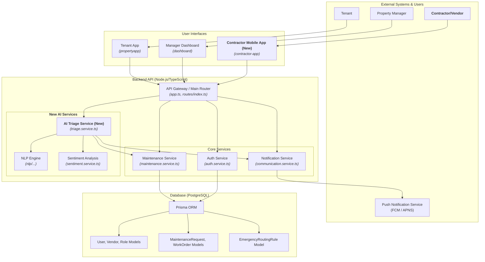

# Architectural Plan: AI Triage & Contractor Mobile App

This document outlines the architectural plan for integrating an AI-powered Triage Service and a dedicated **Contractor Mobile App** into the PropertyAI ecosystem.

## 1. Executive Summary

The goal is to enhance the maintenance workflow by automating the initial handling of requests and providing a dedicated, mobile-first interface for vendors. This will be achieved by introducing two main components:

1.  **AI Triage Service**: A backend service to intelligently analyze, prioritize, and route incoming maintenance requests.
2.  **Contractor Mobile App**: A new native mobile application (iOS and Android) for vendors to manage assigned work orders on the go.

This plan leverages the existing backend infrastructure while ensuring the new components are modular, scalable, and tailored to the needs of mobile users.

## 2. Existing Architecture Overview

The current system consists of:
- **Frontends**: A `propertyapp` for tenants and a `dashboard` for managers.
- **Backend**: A monolithic Node.js/TypeScript API using Prisma to connect to a PostgreSQL database.
- **Infrastructure**: Cloud-native deployment managed via Terraform.

## 3. Proposed High-Level Architecture

The following diagram illustrates how the new components will integrate with the existing system.

## 4. Detailed Component Breakdown

### A. AI Triage Service (Backend)

This service remains unchanged from the previous plan. It will be a new service within the `backend` (`backend/src/services/triage.service.ts`) responsible for ingesting, analyzing, classifying, and routing maintenance requests.

### B. Contractor Mobile App (Frontend + Backend API)

This is the primary change from the original plan. Instead of a web portal, we will build a native mobile application.

*   **Technology Stack**: We recommend **React Native** for the mobile app. This allows for a single codebase for both iOS and Android and can potentially share some logic with your existing React-based web apps.
*   **Project Directory**: A new directory, `contractor-app/`, will be created at the project root.
*   **Key Features**:
    1.  **Authentication**: Secure login for users with the `VENDOR` role.
    2.  **Push Notifications**: Instant alerts for new work orders, status changes, and messages. This is critical for mobile users.
    3.  **Work Order Management**: A mobile-friendly interface to view, accept, and update the status of jobs.
    4.  **Offline Support**: The app should cache essential work order data to remain functional in areas with poor connectivity. Status updates can be queued and synced when the connection is restored.
    5.  **Native Device Integration**:
        *   **Camera**: To upload photos of completed work directly from the job site.
        *   **GPS/Maps**: To provide directions to the property.
*   **Backend API**: The required API endpoints remain the same as in the previous plan, but will now serve the mobile app. A new `contractor.routes.ts` module will be created in the backend.

## 5. Implementation Plan

1.  **Backend First**:
    *   Develop the `triage.service.ts` and integrate the NLP engine.
    *   Build and test the `contractor.routes.ts` API endpoints.
    *   Integrate a push notification service (e.g., Firebase Cloud Messaging) into the `communication.service.ts`.
2.  **Mobile App Development**:
    *   Set up the new React Native project in the `contractor-app/` directory.
    *   Build the UI screens for login, dashboard, and work order details.
    *   Integrate the backend API for data fetching and updates.
    *   Implement push notifications and offline capabilities.

This revised plan aligns better with the mobile nature of a contractor's work, providing them with a more powerful and convenient tool to interact with the PropertyAI system.