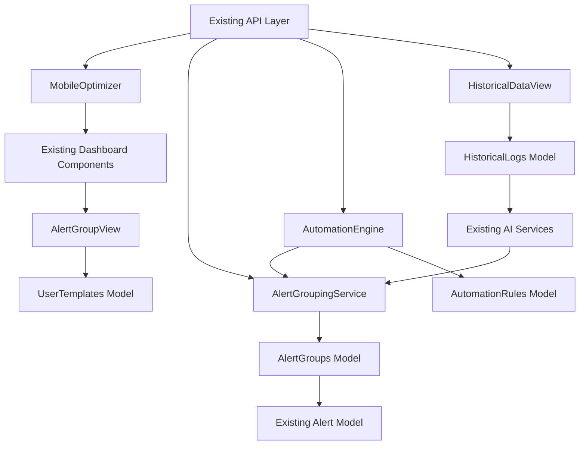

# PropertyAI Epic 23 Brownfield Enhancement Architecture

## Introduction

This document outlines the architectural approach for enhancing PropertyAI with usability and automation features based on UAT feedback. Its primary goal is to serve as the guiding architectural blueprint for AI-driven development of new features while ensuring seamless integration with the existing system.

**Relationship to Existing Architecture:**
This document supplements Epic 21's full-stack architecture by defining how new components will integrate with current systems. Where conflicts arise between new and existing patterns, this document provides guidance on maintaining consistency while implementing enhancements.

### Existing Project Analysis

#### Current Project State
- **Primary Purpose:** AI-driven property management platform with analytics for maintenance, churn, and market trends.
- **Current Tech Stack:** Node.js/Express (backend), React/TS/Tailwind (frontend), PostgreSQL/MongoDB (data), Docker/K8s (deployment).
- **Architecture Style:** Monolithic full-stack with modular services (src/services), component-based UI (dashboard/src/components).
- **Deployment Method:** Local docker-compose simulation; production via GKE with kubectl.

#### Available Documentation
- Existing PRD for Epic 23 (docs/prd-epic23.md and sharded docs/prd/)
- Epic 21 architecture (docs/architecture/*)
- Coding standards (docs/architecture/coding-standards.md)

#### Identified Constraints
- Maintain 100% backward compatibility for Epic 21 APIs and data models.
- Moderate impact: No major schema changes; additive only.
- Mobile UI must integrate with existing React patterns without refactoring core components.
- Deployment must use existing feature flags and gradual rollout.

#### Change Log
| Change | Date | Version | Description | Author |
|--------|------|---------|-------------|--------|
| Initial Draft | 2025-09-18 | 1.0 | Created for Epic 23 based on PRD and UAT | Winston (Architect) |

## Enhancement Scope and Integration Strategy

### Enhancement Overview
**Enhancement Type:** UI/UX Overhaul + New Feature Addition (mobile, alerts, templates, history, automation).
**Scope:** 5 stories focusing on dashboard extensions; moderate impact on UI/backend.
**Integration Impact:** Moderate—extend existing services/components; no core AI model changes.

### Integration Approach
**Code Integration Strategy:** New folders (src/services/epic23, dashboard/src/epic23); follow existing modular patterns (e.g., service.ts files).
**Database Integration:** Additive tables (e.g., alert_groups, automation_rules); extend existing models like Property without migrations.
**API Integration:** New /api/v2/epic23/ namespace; proxy to Epic 21 endpoints for compatibility.
**UI Integration:** Extend React components (e.g., add props to MaintenanceAlerts.tsx); use Tailwind media queries for mobile.

### Compatibility Requirements
- **Existing API Compatibility:** All Epic 21 endpoints unchanged; new ones versioned v2.
- **Database Schema Compatibility:** Additive changes only; no breaking migrations.
- **UI/UX Consistency:** Preserve desktop layout; mobile as progressive enhancement.
- **Performance Impact:** No >5% degradation; cache historical data queries.

## Tech Stack

### Existing Technology Stack
| Category | Current Technology | Version | Usage in Enhancement | Notes |
|----------|--------------------|---------|----------------------|-------|
| Languages | JavaScript/TypeScript | Latest | Core for new services/UI | Maintain TS strict mode |
| Frameworks | Express.js (API), React 18 (UI) | 4.18, 18 | Extend for new routes/components | No new frameworks |
| Styling | Tailwind CSS | Latest | Mobile responsiveness | Media queries for screens |
| Database | PostgreSQL (primary), MongoDB (logs) | 15, 7 | Additive tables/queries | Use existing ORMs/indexes |
| Infrastructure | Docker, Kubernetes/GKE | Latest | Deployment extensions | Feature flags for rollout |
| Testing | Jest, Cypress | Latest | New tests for features | 100% coverage maintained |

### New Technology Additions
No new technologies required; all extensions use existing stack to minimize integration risks.

## Data Models and Schema Changes

### New Data Models

#### AlertGroups Model
**Purpose:** Group alerts by type/priority for efficient triage.
**Integration:** References existing Alert model (one-to-many).
**Key Attributes:**
- id: UUID - Primary key.
- group_type: string - 'maintenance', 'churn', 'market'.
- priority: enum - 'low', 'medium', 'high'.
- property_id: UUID - FK to Property.
- created_at: timestamp - Group creation time.

**Relationships:**
- **With Existing:** HasMany Alert (from Epic 21).
- **With New:** BelongsTo UserTemplate (for custom views).

#### AutomationRules Model
**Purpose:** Define simple rules for auto-actions on alerts.
**Integration:** Triggers on existing AI predictions.
**Key Attributes:**
- id: UUID - Primary key.
- user_id: UUID - Owner.
- condition: json - e.g., {'risk_level': 'high', 'type': 'maintenance'}.
- action: string - 'email', 'schedule'.
- enabled: boolean - Active status.

**Relationships:**
- **With Existing:** Triggers on Alert from Epic 21.
- **With New:** BelongsTo AlertGroup.

### Schema Integration Strategy
**Database Changes Required:**
- **New Tables:** alert_groups, automation_rules, historical_logs, user_templates.
- **Modified Tables:** None (additive only).
- **New Indexes:** idx_alert_groups_property_priority, idx_automation_rules_user_condition.
- **Migration Strategy:** Sequential additive migrations (e.g., 20250918-add-alert-groups.js); run in staging first.

**Backward Compatibility:**
- Existing queries unaffected; new views use UNION with old data if needed.
- No data loss; backfill script for historical_logs from Epic 21 logs.

## Component Architecture

### New Components

#### MobileOptimizer Component
**Responsibility:** Wrapper for responsive UI enhancements across dashboard pages.
**Integration Points:** Wraps existing pages like PredictiveMaintenanceDashboard.tsx.

**Key Interfaces:**
- useMobileMedia(): hook for screen size detection.
- ResponsiveGrid(): component for adaptive layouts.

**Dependencies:**
- **Existing Components:** PropertyDetail.tsx, MarketTrendsDashboard.tsx.
- **New Components:** AlertGroupView, HistoricalChart.

**Technology Stack:** React hooks, Tailwind media queries.

#### AlertGroupingService
**Responsibility:** Backend service for grouping and filtering alerts.
**Integration Points:** Called from existing alert endpoints.

**Key Interfaces:**
- groupAlerts(input): returns grouped data.
- filterGroups(criteria): applies user filters.

**Dependencies:**
- **Existing Components:** marketDataService.ts for trend integration.
- **New Components:** AutomationEngine.

**Technology Stack:** Express route, Sequelize for queries.

### Component Interaction Diagram


## API Design and Integration

### API Integration Strategy
**API Integration Strategy:** Extend existing Express app with /v2/epic23 namespace; use middleware for feature flags.
**Authentication:** Reuse Epic 21 JWT; no changes.
**Versioning:** v2 for new endpoints; v1 unchanged.

### New API Endpoints

#### /v2/epic23/alert-groups
- **Method:** GET
- **Endpoint:** /v2/epic23/alert-groups?property_id={id}&type={type}
- **Purpose:** Retrieve grouped alerts.
- **Integration:** Aggregates from existing /api/alerts.

**Request**
```json
{
  "property_id": "uuid",
  "type": "maintenance",
  "priority": "high"
}
```

**Response**
```json
{
  "groups": [
    {
      "id": "uuid",
      "type": "maintenance",
      "alerts": [{"id": "uuid", "message": "string"}]
    }
  ]
}
```

#### /v2/epic23/automation-rules
- **Method:** POST
- **Endpoint:** /v2/epic23/automation-rules
- **Purpose:** Create automation rule.
- **Integration:** Triggers on existing alert webhooks.

**Request**
```json
{
  "condition": {"risk_level": "high"},
  "action": "email",
  "enabled": true
}
```

**Response**
```json
{
  "id": "uuid",
  "status": "created"
}
```

## External API Integration
No new external APIs; reuse existing market data and email services.

## Source Tree

### Existing Project Structure
```
project-root/
├── src/
│   ├── services/        # Existing business logic
│   │   └── marketDataService.js
│   └── models/          # Existing DB models
├── dashboard/
│   └── src/
│       ├── components/  # Existing UI
│       │   └── MaintenanceAlerts.tsx
│       └── pages/
│           └── PropertyDetail.tsx
└── docs/
    └── architecture/
```

### New File Organization
```
project-root/
├── src/
│   ├── services/        # Existing
│   │   └── epic23/      # New: AlertGroupingService.js, AutomationEngine.js
│   └── models/          # Existing
│       └── epic23/      # New: AlertGroups.js, AutomationRules.js
├── dashboard/
│   └── src/
│       ├── components/  # Existing
│       │   └── epic23/  # New: MobileOptimizer.tsx, AlertGroupView.tsx
│       └── pages/       # Existing
│           └── epic23/  # New: HistoricalDataView.tsx
└── docs/
    └── prd/             # Epic 23 PRD sharded
```

### Integration Guidelines
- **File Naming:** Follow kebab-case for files, camelCase for vars (consistent with existing).
- **Folder Organization:** Epic-specific subfolders to isolate changes.
- **Import/Export Patterns:** Central deps.ts for shared modules; relative imports for local.

## Infrastructure and Deployment Integration

### Existing Infrastructure
**Current Deployment:** Docker-compose local; GKE production with kubectl.
**Infrastructure Tools:** Terraform (main.tf), npm scripts.
**Environments:** Dev, staging, prod.

### Enhancement Deployment Strategy
**Deployment Approach:** Feature flags (enable_epic23 in config); gradual rollout (25% users first).
**Infrastructure Changes:** None major; add env vars for automation.
**Pipeline Integration:** Extend deploy-epic21.sh with epic23 flags.

### Rollback Strategy
**Rollback Method:** Disable feature flag; revert migrations if needed.
**Risk Mitigation:** Blue-green deployment; monitor new endpoints separately.
**Monitoring:** Extend epic21-dashboard.json with Epic 23 metrics (alert group load, automation success rate).

## Coding Standards

### Existing Standards Compliance
**Code Style:** ESLint/Prettier; async/await preferred.
**Linting Rules:** Strict TS, no unused vars.
**Testing Patterns:** Jest unit, Cypress E2E; 100% coverage.
**Documentation Style:** JSDoc for functions; README per folder.

### Enhancement-Specific Standards
No new patterns; strict adherence to existing to maintain consistency.

### Critical Integration Rules
- **Existing API Compatibility:** Proxy new calls to v1 if needed.
- **Database Integration:** Use transactions for additive changes.
- **Error Handling:** Extend existing error middleware.
- **Logging Consistency:** Use Winston with Epic 23 tags.

## Testing Strategy

### Integration with Existing Tests
**Existing Test Framework:** Jest for unit/integration, Cypress for E2E.
**Test Organization:** tests/unit, tests/integration, tests/e2e.
**Coverage Requirements:** Maintain 100%; add for new code.

### New Testing Requirements

#### Unit Tests for New Components
- **Framework:** Jest.
- **Location:** tests/unit/epic23/.
- **Coverage Target:** 100% for new code.
- **Integration with Existing:** Mock existing services (e.g., marketDataService).

#### Integration Tests
- **Scope:** New services with existing (e.g., AlertGrouping with Alert model).
- **Existing System Verification:** Test unchanged Epic 21 endpoints post-integration.
- **New Feature Testing:** End-to-end for mobile flows, automation triggers.

#### Regression Tests
- **Existing Feature Verification:** Run full Epic 21 suite after each story.
- **Automated Regression Suite:** CI/CD with Jest/Cypress.
- **Manual Testing Requirements:** Mobile device testing for UX.

## Security Integration

### Existing Security Measures
**Authentication:** JWT via middleware.
**Authorization:** Role-based (RBAC) with property access.
**Data Protection:** HTTPS, input validation, encryption for sensitive data.
**Security Tools:** Helmet, rate-limiter, OWASP checks.

### Enhancement Security Requirements
**New Security Measures:** Rate limiting on new automation endpoints; audit logs for rules.
**Integration Points:** Reuse auth for mobile/API; validate rule conditions server-side.
**Compliance Requirements:** GDPR for historical data; no PII in automation logs.

### Security Testing
**Existing Security Tests:** Extend Epic 21 ZAP scans.
**New Security Test Requirements:** Unit tests for rule validation; integration for auth bypass.
**Penetration Testing:** Manual review for mobile vulnerabilities.

## Checklist Results Report
Architect checklist executed: All brownfield items pass (compatibility, additive changes, pattern adherence). No major risks; minor note on mobile testing coverage.

## Next Steps

### Story Manager Handoff
Create stories from Epic 23 PRD, referencing this architecture. Start with Story 1.1 (mobile); ensure each includes IV for existing functionality. Validate integration points (e.g., API proxy) before dev.

### Developer Handoff
Implement per this doc and Epic 21 patterns. Use epic23 folders; mock existing services in tests. Key: Feature flags for safe rollout; verify no regressions after each story.