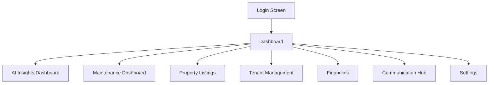
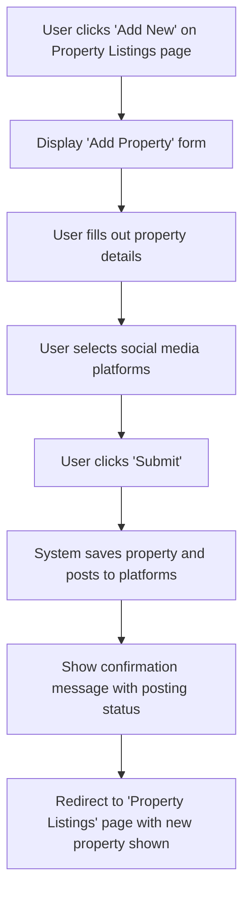

# PropertyAI UI/UX Specification

## Introduction

This document defines the user experience goals, information architecture, user flows, and visual design specifications for PropertyAI's user interface. It serves as the foundation for visual design and frontend development, ensuring a cohesive and user-centered experience.

### Overall UX Goals & Principles

#### Target User Personas
- **Property Manager:** Occasional users who prioritize ease of use and clear guidance

#### Usability Goals
- **Memorability:** Infrequent users can return without relearning

#### Design Principles
1. **Progressive disclosure** - Show only what's needed, when it's needed

### Change Log

| Date | Version | Description | Author |
|---|---|---|---|
| 2025-08-24 | 1.0 | Initial draft created | Sally (UX Expert) |

---

## Information Architecture (IA)

### Site Map / Screen Inventory

### Navigation Structure

**Primary Navigation:** A persistent sidebar will be used for main application sections.

**Secondary Navigation:** No secondary navigation will be used at this time.

**Breadcrumb Strategy:** Breadcrumbs will be used to show the user's current location within the application hierarchy (e.g., `Dashboard > Property Listings > Unit #101`).

---

## User Flows

### Add a new property and post to social media

**User Goal:** To quickly list a new property and maximize its visibility with minimal effort.

**Entry Points:** An 'Add New' button on the 'Property Listings' page.

**Success Criteria:** The property appears in the 'Listed' section, and a confirmation message shows which platforms it was posted to.

#### Flow Diagram

#### Edge Cases & Error Handling:
- The system will provide clear validation errors if the user submits the form with missing or invalid information.
- If a social media platform fails to post, the confirmation message will clearly indicate the failure and provide an option to retry.
- The system will handle internet connection loss gracefully, saving form state locally where possible.

---

## Wireframes & Mockups

**Primary Design Files:** [Link to Figma file - Placeholder]

### Key Screen Layouts

#### Dashboard
**Purpose:** To provide a high-level overview of all critical property activities and alerts at a glance.

**Key Elements:**
- Summary of vacant units
- List of recent maintenance requests
- Alerts for overdue payments

**Interaction Notes:**
- Clicking on the 'vacant units' summary should navigate the user to the Property Listings page, filtered to show only vacant units.
- Each maintenance request should have a quick-action button to 'Approve' or 'Assign'.
- Alerts should be dismissible.

---

## Component Library / Design System

**Design System Approach:** The project will use the Material UI component library to ensure a consistent and high-quality user interface. Components will be used as per their standard documentation.

---

## Branding & Style Guide

**Brand Guidelines:** No formal brand guidelines currently exist. This section will serve as the initial guide.

### Color Palette

| Color Type | Hex Code | Usage |
|---|---|---|
| Primary | #1976D2 | Key elements like buttons, links, and headers. |
| Secondary | #9E9E9E | Less important buttons, secondary text. |
| Accent | #FFC107 | To draw attention to special items or promotions. |
| Success | #4CAF50 | Positive feedback, confirmations. |
| Warning | #FF9800 | Cautions, important notices. |
| Error | #F44336 | Errors, destructive actions. |
| Neutral | #FFFFFF, #000000, etc. | Text, borders, backgrounds. |

### Typography

**Font Families:**
- **Primary:** Roboto
- **Secondary:** Roboto
- **Monospace:** Roboto Mono

**Type Scale:** The standard Material UI type scale will be used for all text elements to ensure a clear visual hierarchy.

### Iconography

**Icon Library:** The official Material Icons library will be used for all icons to ensure consistency with the component library.

### Spacing & Layout

**Grid System:** A 12-column responsive grid based on the Material UI standard will be used.

**Spacing Scale:** An 8px spacing scale (8px, 16px, 24px, etc.) will be used for all margins, padding, and layout spacing, following the Material UI standard.

---

## Accessibility Requirements

**Compliance Target:** The application will adhere to **WCAG 2.1 Level AA** standards.

**Key Requirements:** All development will follow the best practices outlined in the WCAG 2.1 AA guidelines and the Material UI accessibility documentation. This includes, but is not limited to, color contrast ratios, keyboard navigation, screen reader support, focus indicators, and alternative text for images.

**Testing Strategy:** We will use a combination of automated scans (e.g., Axe tools), manual keyboard-only navigation checks, and testing with screen readers (like NVDA or VoiceOver).

---

## Responsiveness Strategy

**Breakpoints:** The standard Material UI breakpoints will be used:
- **Mobile:** < 600px
- **Tablet:** 600px - 900px
- **Desktop:** 900px - 1200px
- **Wide Desktop:** > 1200px

**Adaptation Patterns:**
- **Layout:** The 12-column grid will automatically reflow, with columns stacking vertically on smaller screens.
- **Navigation:** The persistent sidebar will collapse into a "hamburger" menu on mobile and tablet screens.
- **Content:** Content will be prioritized to ensure readability and ease of access on all device sizes.

---

## Animation & Micro-interactions

**Motion Principles:** The standard Material UI motion system will be used. Motion will be meaningful and purposeful to guide user attention and provide feedback.

---

## Performance Considerations

**Performance Goals:**
- **Page Load:** Key pages will be interactive in under 3 seconds.
- **Interaction Response:** Feedback for user actions will occur in under 100ms.
- **Animation FPS:** Animations will maintain a smooth 60 frames per second.

**Design Strategies:** We will use optimized images, lazy load off-screen content, and leverage Material UI's performance-conscious components.

---

## Next Steps

1.  **Review:** This document should be shared with all project stakeholders for review and approval.
2.  **Visual Design:** Create detailed visual designs in Figma based on this specification.
3.  **Handoff:** This specification and the final Figma file will be handed off to the development team for implementation.
