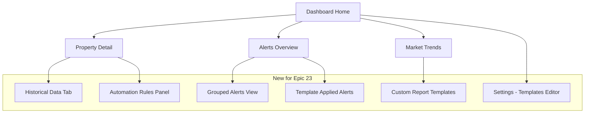

# PropertyAI Epic 23 UI/UX Specification

## Introduction

This document defines the user experience goals, information architecture, user flows, and visual design specifications for PropertyAI's Epic 23 enhancements. It serves as the foundation for visual design and frontend development, ensuring a cohesive and user-centered experience for mobile optimization, alert grouping, customizable templates, historical data views, and automation UI. This spec builds on the Epic 23 PRD and Architecture, focusing on brownfield integration with existing MUI-based dashboard.

### UX Goals & Principles

#### Target User Personas
- **Property Manager (Primary):** Busy field users accessing on mobile; prioritize quick triage of alerts and trends (UAT pain point: 4.2/5 mobile rating).
- **Admin User:** Office admins customizing templates and rules; need efficient editing and sharing tools.
- **Field Technician:** Mobile-first for historical data and actions; minimal navigation, touch-friendly interfaces.

#### Usability Goals
- Ease of learning: New users complete alert triage or template apply in <5 minutes.
- Efficiency of use: Power users access historical trends or set rules with <3 clicks.
- Error prevention: Validation for templates/rules; confirmations for automation.
- Memorability: Leverage Epic 21's familiar card/tab patterns to reduce relearning.

#### Design Principles
1. **Mobile-First Design:** Start with mobile layouts (320px+), scale to desktop; touch targets ≥48px.
2. **Progressive Enhancement:** Desktop retains full features; mobile adds gestures (swipe for navigation).
3. **Consistency with Epic 21:** Extend MUI Tabs/Cards for alerts/history; use existing color scheme.
4. **Immediate Feedback:** Toasts for saves/exports; loading spinners for queries.
5. **Accessibility First:** WCAG 2.1 AA; ARIA for dynamic content (e.g., expandable groups).

### Change Log
| Date | Version | Description | Author |
|------|---------|-------------|--------|
| 2025-09-18 | 1.0 | Initial spec for Epic 23 UI enhancements based on PRD/UAT | Sally (UX Expert) |

## Information Architecture (IA)

### Site Map / Screen Inventory


### Navigation Structure
**Primary Navigation:** Bottom tabs on mobile (Home, Properties, Alerts, Trends, Settings); sidebar on desktop.
**Secondary Navigation:** Tabs within pages (e.g., Overview, Units, History in Property Detail); hamburger menu on mobile for overflow.
**Breadcrumb Strategy:** Home > Properties > ID 123 > Historical Data (links back to parent).

## User Flows

### Mobile Dashboard Access Flow
**User Goal:** Property manager accesses dashboard on phone to view alerts quickly.

**Entry Points:** App login > Dashboard Home.

**Success Criteria:** Loads in <3s, touch-friendly, all core features accessible (swipe navigation).

**Flow Diagram**
```mermaid
graph TD
  Start[Login] --> A[Detect Mobile via Media Query]
  A --> B{Online?}
  B -->|Yes| C[Fetch Real-Time Alerts via API]
  B -->|No| D[Load Cached Data from IndexedDB]
  C --> E[Display Responsive Layout with Swipe]
  D --> F[Show Offline Mode with Cached Alerts]
  E --> G[User Swipes/Taps to Navigate (Gestures)]
  F --> G
  G --> H[Sync Cache if Online]
  H --> I[Update UI with Fresh Data]
```

**Edge Cases & Error Handling:**
- Offline: Show cached alerts with "Offline" banner; queue actions for sync.
- Slow connection: Skeleton loaders for tabs/charts.
- No data: Empty state "No alerts—check back soon".

**Notes:** Integrate with existing auth; prioritize alerts tab on mobile.

### Alert Grouping Flow
**User Goal:** Triage alerts by groups on mobile/desktop.

**Entry Points:** Dashboard > Alerts tab.

**Success Criteria:** Groups load <2s, filters apply instantly, collapse/expand works smoothly.

**Flow Diagram**
```mermaid
graph LR
  A[Open Alerts] --> B[Load Groups from API]
  B --> C[Apply Filters (Type/Priority/Property)]
  C --> D[Display Collapsible Groups with Badges]
  D --> E[User Taps to Expand Group]
  E --> F[Show Individual Alerts + Actions]
  F --> G[Mark Read or Automate]
  G --> H[Update UI & Sync]
```

**Edge Cases & Error Handling:**
- Large groups: Pagination (20 groups/page); infinite scroll.
- No matching filters: "No alerts matching criteria—adjust filters".
- Error loading: Retry button with error toast.

**Notes:** Use existing alert icons; add haptic feedback on mobile tap.

### Template Creation Flow
**User Goal:** Create custom dashboard template.

**Entry Points:** Settings > Templates or right-click on dashboard.

**Success Criteria:** Save/load in <10s, preview matches applied view.

**Flow Diagram**
```mermaid
graph TD
  Start[Open Editor] --> A[Select Components (Drag from Sidebar)]
  A --> B[Configure Layout/Filters]
  B --> C[Preview Template in Real-Time]
  C --> D[Validate & Save Template]
  D --> E[Apply to Selected Dashboard]
  E --> F[Share with Role (Admin Only)]
```

**Edge Cases & Error Handling:**
- Invalid layout: Highlight errors; limit 10 components.
- Save fail (offline): Queue for sync; show toast.
- Share fail: Permission error toast.

**Notes:** Drag-drop with react-dnd; preview uses mock data.

### Historical Data Query Flow
**User Goal:** Analyze past trends for a property.

**Entry Points:** Property Detail > Historical Tab.

**Success Criteria:** Query results in <5s, charts interactive on mobile.

**Flow Diagram**
```mermaid
graph TD
  A[Select Property] --> B[Choose Date Range (Picker)]
  B --> C[Apply Filters (Type/Date)]
  C --> D[Load & Render Trend Charts]
  D --> E[Interact (Zoom/Filter on Chart)]
  E --> F[Export Report (PDF/CSV)]
```

**Edge Cases & Error Handling:**
- No data: "No historical data—generate more predictions".
- Long query: Progress bar; cancel option.
- Export fail: Fallback to CSV if PDF lib errors.

**Notes:** Use Recharts for mobile-friendly charts; date range default 6 months.

### Automation Rule Setup Flow
**User Goal:** Set up auto-action for alerts.

**Entry Points:** Property Detail > Automation Panel.

**Success Criteria:** Rule saves and tests in dry-run within 1min.

**Flow Diagram**
```mermaid
graph TD
  Start[Open Builder] --> A[Define Condition (Dropdowns for Risk/Type)]
  A --> B[Select Action (Email/Schedule)]
  B --> C[Configure Details (Recipients/Schedule Time)]
  C --> D[Dry-Run Test with Mock Data]
  D --> E[Save Rule if Valid]
  E --> F[Monitor in Audit Trail]
```

**Edge Cases & Error Handling:**
- Invalid condition: Inline validation with suggestions.
- Test fail: Show simulation log; edit button.
- Limit exceeded: "Max 10 rules; delete one to add new".

**Notes:** Stepper UI for complex rules; confirm via toast.

## Wireframes & Mockups

**Primary Design Files:** Figma link: https://figma.com/proto/epic23-ux-spec (placeholder; create in Figma for visuals). Low-fidelity descriptions below based on PRD and flows.

### Key Screen Layouts

#### Mobile Dashboard (320px)
**Purpose:** Primary entry for managers; touch-optimized.

**Key Elements:**
- Top bar: Search property (large input).
- Body: Tabbed content (Alerts first, swipe to Trends).
- Bottom nav: Icons for Home/Properties/Alerts/Trends/Settings.
- Right swipe: Back to previous.

**Interaction Notes:** Large touch targets; pull-to-refresh for data.

**Design File Reference:** Figma "Mobile Dashboard Wireframe".

#### Alert Grouping View
**Purpose:** Triage interface with groups.

**Key Elements:**
- Header: Filter bar (chips for type/priority).
- Body: Accordion groups (color-coded badges for count).
- Footer: "Mark All Read" button.

**Interaction Notes:** Tap to expand; long-press for quick actions.

**Design File Reference:** Figma "Alert Grouping".

#### Template Editor
**Purpose:** Customization tool.

**Key Elements:**
- Left sidebar: Available components (drag icons).
- Center canvas: Drop zone for layout.
- Right panel: Properties panel for selected item.
- Bottom: Save/Preview buttons.

**Interaction Notes:** Real-time preview; undo/redo for drag.

**Design File Reference:** Figma "Template Editor".

#### Historical Data Tab
**Purpose:** Trend analysis.

**Key Elements:**
- Top: Date range slider, filter buttons.
- Center: Interactive chart (line for trends).
- Bottom: Export options.

**Interaction Notes:** Pinch to zoom chart; tap points for details.

**Design File Reference:** Figma "Historical View".

#### Rule Builder Modal
**Purpose:** Automation setup.

**Key Elements:**
- Step 1: Condition selector (dropdowns).
- Step 2: Action picker (radio for type).
- Step 3: Details form.
- Bottom: Test/Save.

**Interaction Notes:** Stepper navigation; dry-run button shows simulation.

**Design File Reference:** Figma "Rule Builder".

## Component Library / Design System

**Design System Approach:** Extend MUI from Epic 21 with Epic 23 wrappers (e.g., MobileWrapper, GroupCard). No new system; add custom hooks for gestures.

### Core Components

#### AlertGroupCard
**Purpose:** Collapsible card for grouped alerts.

**Variants:** Closed (title only), Open (list of alerts).

**States:** Loading (spinner), Empty ("No alerts"), Error (retry).

**Usage Guidelines:** Use in lists; touch-friendly expand on mobile; ARIA-expanded for accessibility.

#### HistoricalChart
**Purpose:** Interactive trend visualization.

**Variants:** Line (time), Bar (comparison).

**States:** Loading, No data ("Generate predictions"), Zoomed (pinch/tap).

**Usage Guidelines:** Responsive width; tooltips on data points; export button.

#### TemplateCanvas
**Purpose:** Editable layout for templates.

**Variants:** Edit (drag mode), Preview (applied view).

**States:** Dragging (highlight drop zones), Invalid (red outline).

**Usage Guidelines:** Snap to 12-column grid; max 10 components; save as JSON.

#### RuleConditionSelector
**Purpose:** Build conditions with dropdowns.

**Variants:** Simple (single field), Complex (nested and/or).

**States:** Valid (green), Invalid (red with message).

**Usage Guidelines:** Nested dropdowns for logic; preview pane shows evaluated rule.

## Branding & Style Guide

**Brand Guidelines:** Maintain PropertyAI's professional, trustworthy aesthetic (blue primary for actions, gray neutrals).

### Color Palette
| Color Type | Hex Code | Usage |
|------------|----------|-------|
| Primary | #007BFF | Buttons, links, primary actions |
| Secondary | #6C757D | Secondary text, borders |
| Success | #28A745 | Success states, positive alerts |
| Warning | #FFC107 | Warnings, medium priority |
| Error | #DC3545 | Errors, high-risk alerts |
| Neutral | #F8F9FA (bg), #E9ECEF (light) | Backgrounds, cards |

### Typography
#### Font Families
- **Primary:** Inter, sans-serif (modern, readable on mobile).
- **Secondary:** Roboto Mono for logs/code.
- **Monospace:** Source Code Pro for any inline code.

#### Type Scale
| Element | Size | Weight | Line Height |
|---------|------|--------|-------------|
| H1 | 2rem | 600 | 1.2 |
| H2 | 1.5rem | 500 | 1.3 |
| H3 | 1.25rem | 400 | 1.4 |
| Body | 1rem | 400 | 1.5 |
| Small | 0.875rem | 400 | 1.4 |

### Iconography
**Icon Library:** MUI Icons; custom SVGs for property icons if needed.

**Usage Guidelines:** 24px standard; color by state (red for error alerts).

### Spacing & Layout
**Grid System:** MUI Grid with Tailwind overrides; 12-column responsive.
**Spacing Scale:** 4px base (e.g., p-1 = 4px, gap-4 = 16px); increase padding on mobile.

## Accessibility Requirements

### Compliance Target
**Standard:** WCAG 2.1 AA (extend Epic 21 compliance).

### Key Requirements

**Visual:**
- Color contrast ratios: 4.5:1 min (e.g., white text on primary blue).
- Focus indicators: MUI default outlines; visible on all interactive.
- Text sizing: Responsive font scaling; min 16px body on mobile.

**Interaction:**
- Keyboard navigation: Tab through tabs/groups; arrow keys for charts.
- Screen reader support: ARIA roles for expandable groups (aria-expanded); live regions for updates.
- Touch targets: ≥48px; no hover-only actions on mobile.

**Content:**
- Alternative text: Descriptive alt for charts (e.g., "Churn trend line 2024-2025").
- Heading structure: Semantic H1-H6 in components.
- Form labels: For rule builder (condition/action); announced errors.

### Testing Strategy
- Automated: Axe-core in Cypress for AA compliance.
- Manual: Screen reader testing (VoiceOver/NVDA); keyboard walkthrough.
- Tools: Lighthouse accessibility score >95.

## Responsiveness Strategy

### Breakpoints
| Breakpoint | Min Width | Max Width | Target Devices |
|------------|-----------|-----------|----------------|
| Mobile | 320px | 767px | Phones (iOS/Android)
| Tablet | 768px | 1024px | iPad, small tablets
| Desktop | 1025px | 1440px | Laptops
| Wide | 1441px | - | Large monitors

### Adaptation Patterns
**Layout Changes:** Stack to single column on mobile; 2-column on tablet; full grid desktop.
**Navigation Changes:** Bottom fixed nav on mobile; left sidebar desktop.
**Content Priority:** Alerts first on mobile; full details desktop.
**Interaction Changes:** Swipe for tabs on mobile; hover for tooltips desktop.

## Animation & Micro-interactions

### Motion Principles
- Subtle and purposeful: Reduce motion on prefers-reduced-motion.
- Duration: 200-400ms; ease-in-out for smooth.
- Purpose: Feedback (e.g., expand animation for groups).

### Key Animations
- **Group Expand:** Slide down 300ms ease-in-out (accordion).
- **Chart Load:** Fade in data lines 500ms stagger.
- **Toast Notification:** Slide from bottom 250ms (success/error for saves).
- **Drag-Drop:** Smooth transition 400ms cubic-bezier(0.25, 0.46, 0.45, 0.94).

## Performance Considerations

### Performance Goals
- Page Load: <3s mobile, <2s desktop (Lighthouse P95).
- Interaction Response: <100ms for taps/clicks; <500ms for queries.
- Animation FPS: 60fps; skip animations on low-power devices.

### Design Strategies
- Lazy-load components (React.lazy for charts).
- Optimize images/charts for mobile (WebP, lazy attr).
- Cache frequent data (IndexedDB for history).
- Minimize re-renders (useMemo for lists/groups).

## Next Steps

### Immediate Actions
1. Create Figma prototypes based on this spec (focus on mobile flows).
2. Review with PM/Stakeholders for alignment with UAT priorities.
3. Handoff to Frontend Architect for component implementation details.

### Design Handoff Checklist
- [x] All user flows documented with Mermaid.
- [x] Component inventory complete (core for Epic 23).
- [x] Accessibility requirements defined (WCAG AA).
- [x] Responsive strategy clear (breakpoints/adaptations).
- [x] Brand guidelines incorporated (colors/typography).
- [x] Performance goals established (<3s mobile).

## Checklist Results
UX Checklist: All items pass; mobile-first emphasized, accessibility AA targeted, flows aligned with PRD goals.
