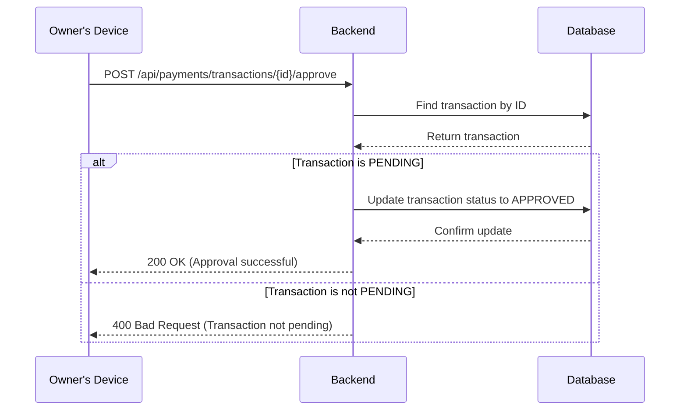

# Payment Approval Feature Design

This document outlines the design for a new feature that allows property owners to approve or reject payments.

### 1. Database Schema Design

To support the payment approval workflow, we will add an approval status and a timestamp to the `Transaction` and `VendorPayment` models. This will allow us to track the state of each payment and record when it was approved.

Here is a Mermaid diagram illustrating the proposed changes to the database schema:

```mermaid
erDiagram
    Transaction {
        String id
        Float amount
        TransactionType type
        TransactionStatus status
        String description
        DateTime createdAt
        DateTime processedAt
        String paymentMethod
        String reference
        String leaseId
        PaymentApprovalStatus approvalStatus "New"
        DateTime approvedAt "New"
        String approvedById "New"
    }

    VendorPayment {
        String id
        Float amount
        PaymentStatus status
        DateTime processedAt
        String notes
        String workOrderId
        String vendorId
        String transactionId
        DateTime createdAt
        DateTime updatedAt
        PaymentApprovalStatus approvalStatus "New"
        DateTime approvedAt "New"
        String approvedById "New"
    }

    User {
        String id
        String email
        String password
        String firstName
        String lastName
        UserRole role
    }

    Transaction ||--o{ User : "approvedBy"
    VendorPayment ||--o{ User : "approvedBy"

    enum PaymentApprovalStatus {
        PENDING
        APPROVED
        REJECTED
    }
```

### 2. Backend API Design

The backend will be updated to expose new endpoints for managing payment approvals and to modify the existing payment processing logic.

**New API Endpoints:**

*   `POST /api/payments/transactions/{id}/approve`: Approves a specific transaction.
*   `POST /api/payments/transactions/{id}/reject`: Rejects a specific transaction.
*   `POST /api/payments/vendor-payments/{id}/approve`: Approves a specific vendor payment.
*   `POST /api/payments/vendor-payments/{id}/reject`: Rejects a specific vendor payment.

Here is a sequence diagram showing the approval process:



### 3. Frontend UI Design

The frontend will be updated to provide owners with a new section in their dashboard for managing pending payments. This section will display a list of payments awaiting approval, with options to approve or reject each one.

Here is a wireframe of the proposed UI changes:

```mermaid
graph TD
    A[Owner Dashboard] --> B{Payment Approvals};
    B --> C[Pending Transactions List];
    B --> D[Pending Vendor Payments List];

    subgraph C
        direction LR
        C1[Transaction 1: $500 - Rent]
        C2[Approve Button]
        C3[Reject Button]
    end

    subgraph D
        direction LR
        D1[Vendor Payment 1: $250 - Plumbing]
        D2[Approve Button]
        D3[Reject Button]
    end