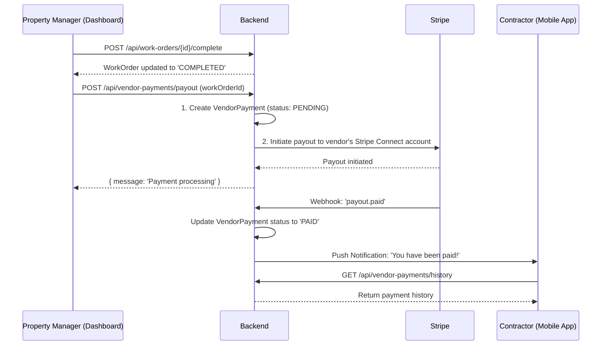

# Architectural Plan: Vendor Payment System

To implement a system for paying vendors, we'll need to make several additions and modifications across the stack, from the database to the frontend. Here is a high-level architectural plan outlining the necessary changes.

### 1. Database Schema (`schema.prisma`)

We need to introduce new models to represent vendor payments and store their payout information securely.

**New Model: `VendorPayment`**

This model will track each payment made to a vendor.

```prisma
model VendorPayment {
  id            String    @id @default(cuid())
  amount        Float
  status        PaymentStatus @default(PENDING)
  processedAt   DateTime?
  notes         String?
  workOrder     WorkOrder @relation(fields: [workOrderId], references: [id])
  workOrderId   String    @unique
  vendor        Vendor    @relation(fields: [vendorId], references: [id])
  vendorId      String
  transactionId String?   // To store the Stripe transaction ID
  createdAt     DateTime  @default(now())
  updatedAt     DateTime  @updatedAt
}

enum PaymentStatus {
  PENDING
  PROCESSING
  PAID
  FAILED
}
```

**Modifications to `Vendor` Model**

We need to store a Stripe Connect account ID for each vendor to facilitate payouts.

```prisma
model Vendor {
  // ... existing fields
  stripeAccountId String? @unique // For Stripe Connect payouts
  payments        VendorPayment[]
}
```

### 2. Backend Architecture

The backend will require new services and API endpoints to handle the vendor payment workflow.

**New Service: `VendorPaymentService`**

This service will encapsulate the business logic for paying vendors.

*   `initiatePayment(workOrderId: string)`: Creates a `VendorPayment` record and initiates the payout process with Stripe.
*   `processStripePayout(vendorId: string, amount: number)`: Communicates with the Stripe API to transfer funds to the vendor's connected account.
*   `handleStripeWebhook(event: Stripe.Event)`: Listens for webhooks from Stripe to update the status of payments (`succeeded`, `failed`, etc.).
*   `getPaymentHistory(vendorId: string)`: Retrieves the payment history for a specific vendor.

**New API Endpoints**

We'll add new routes, likely under `/api/vendor-payments`.

*   `POST /api/vendor-payments/payout`: A protected route for property managers to initiate a payment for a completed work order.
*   `GET /api/vendor-payments/history`: An endpoint for vendors to view their payment history.
*   `POST /api/stripe/vendor-webhooks`: A public endpoint to receive webhooks from Stripe regarding payout status.

### 3. Frontend UI/UX

Both the property manager dashboard and the contractor app will need new interfaces to manage payments.

**Property Manager Dashboard (`dashboard` app)**

*   **Work Order View:** Add a "Pay Vendor" button that becomes active when a work order is marked as "Completed".
*   **Vendor Management Page:** Display a payment history for each vendor, showing all past payments and their statuses.
*   **Financial Dashboard:** Include vendor payments in the overall financial reporting.

**Contractor Mobile App (`ContractorApp`)**

*   **Stripe Connect Onboarding:** A new screen or workflow for contractors to set up their Stripe Connect account. This is a crucial step for them to receive payments.
*   **Payment History Screen:** A new screen where contractors can see a list of their payments, including the amount, status, and related work order.
*   **Work Order Details:** Display the payment status for each completed work order.

### 4. System Flow Diagram

Here is a Mermaid diagram illustrating the vendor payment process:



### Summary of Implementation Steps

1.  **Database:** Update `backend/prisma/schema.prisma` with the new `VendorPayment` model and modifications to the `Vendor` model.
2.  **Backend:**
    *   Create a new `vendorPayment.service.ts` with the logic for Stripe integration and payment processing.
    *   Add new API routes and controllers for vendor payments.
    *   Integrate the payment logic with the work order completion flow.
3.  **Frontend (Dashboard):**
    *   Implement the UI for initiating payments and viewing payment history.
4.  **Frontend (ContractorApp):**
    *   Implement the Stripe Connect onboarding flow.
    *   Build the UI for viewing payment history.